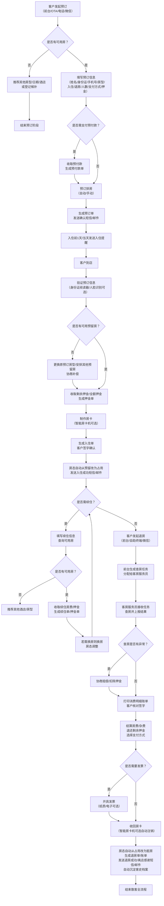

# 酒店管理系统需求文档
## 版本历史
| 版本号 | 发布日期   | 修订人     | 修订内容说明             |
|--------|------------|------------|--------------------------|
| V1.0   | 202X-XX-XX | 张三（需求分析师） | 初始需求文档编写完成     |

---

## 1. 需求概述
### 1.1 项目背景
随着国内旅游业和商务出行的持续增长，单体/小型连锁酒店业务规模扩大，传统手工记账、纸质房卡/登记单管理模式存在效率低下、易出错、数据统计滞后、库存/会员管理混乱等问题。为提升酒店运营效率、优化客户体验、实现精细化管理，现需开发一套**适配10-200间客房的单体或区域型小型连锁酒店的全流程数字化酒店管理系统**。

### 1.2 项目目标
- 覆盖酒店**预订、入住、退房、结算、房态管理、客史档案、库存、会员、报表分析、系统管理**等核心业务场景；
- 实现业务流程的全数字化流转，减少人工操作环节，降低出错率，核心流程（入住、退房）平均耗时压缩至≤3分钟；
- 沉淀客史、经营、库存等核心数据，提供多维度、实时性的统计报表，辅助管理层决策；
- 支持PC端前台/后台操作、移动端（可选PDA/微信助手）查房/退房查房、自助终端（可选）入住/退房/续住功能；
- 预留接口，可对接主流OTA平台（携程、美团、飞猪）、门锁系统、停车场系统、短信/邮件推送平台。

### 1.3 适用范围
- 适用场景：单体商务/经济型/主题酒店、区域型小型连锁酒店（≤5家分店）；
- 适用角色：系统管理员、财务主管、前台主管、前台接待、客房主管、客房服务员、库存管理员、会员专员；
- 扩展可选场景：自助终端、OTA直连、门锁/停车场对接。

---

## 2. 功能模块清单
### 2.1 前台接待模块
#### 2.1.1 散客预订
#### 2.1.2 团队预订
#### 2.1.3 会议/婚宴预订（附加场景模块）
#### 2.1.4 预订查询/修改/取消/确认
#### 2.1.5 预订提醒
#### 2.1.6 预订排房
#### 2.1.7 预留房管理
#### 2.1.8 入住登记
#### 2.1.9 团队入住拆分
#### 2.1.10 换房
#### 2.1.11 续住
#### 2.1.12 退房查房
#### 2.1.13 退房结算
#### 2.1.14 团队退房批量结算
#### 2.1.15 押金管理
#### 2.1.16 账单管理
#### 2.1.17 发票管理
#### 2.1.18 房态查看（基础版：仅查看）
#### 2.1.19 入住人信息验证（对接身份证阅读器/人脸识别接口可选）

### 2.2 房态管理模块
#### 2.2.1 实时房态监控（含状态图例、颜色标识）
#### 2.2.2 房态批量修改
#### 2.2.3 房态手动调整权限（按角色限制）
#### 2.2.4 锁房/解锁管理
#### 2.2.5 维修房/维护房管理（含报修流程、预计恢复时间）
#### 2.2.6 脏房/净房/待查/维修/空置/占用/预留/锁房状态流转规则配置
#### 2.2.7 客房打扫任务生成/分配/接收/完成/退回
#### 2.2.8 查房任务生成/分配/接收/完成/异常上报
#### 2.2.9 房态日志查询

### 2.3 客史档案模块
#### 2.3.1 散客客史建档（自动从预订/入住提取+手动补充）
#### 2.3.2 团队客史建档
#### 2.3.3 客史信息查询/筛选/导出
#### 2.3.4 客史标签管理（手动/自动打标签，如：VIP、长住客、过敏史、投诉客等）
#### 2.3.5 客史消费行为分析（单客/标签客群维度，如：消费金额、房型偏好、入住时段、支付方式偏好）
#### 2.3.6 客史入住/投诉/表扬记录查询
#### 2.3.7 客史合并/拆分（解决重复建档问题）

### 2.4 会员管理模块
#### 2.4.1 会员等级设置（可自定义等级数、升级条件、权益、有效期）
#### 2.4.2 会员注册（前台/自助终端/微信小程序/公众号注册可选）
#### 2.4.3 会员信息查询/修改/冻结/解冻/注销
#### 2.4.4 会员积分管理（积分获取规则设置、积分兑换规则设置、积分明细查询、积分调整、积分兑换操作）
#### 2.4.5 会员优惠券管理（优惠券类型设置、优惠券发放规则、优惠券核销、优惠券查询/统计）
#### 2.4.6 会员专属价设置（房型/时段维度）
#### 2.4.7 会员生日/节日/权益到期提醒
#### 2.4.8 会员消费/积分/权益报告生成

### 2.5 库存管理模块
#### 2.5.1 商品信息管理（商品分类、商品属性、商品条码、采购价/销售价/库存预警阈值设置）
#### 2.5.2 入库管理（采购入库、调拨入库、退货入库、入库单生成/审核/打印/导出）
#### 2.5.3 出库管理（客房领用、前台售卖、调拨出库、报损出库、出库单生成/审核/打印/导出）
#### 2.5.4 库存盘点（盘点计划生成/分配、盘点录入、盘点差异处理、盘点报告生成/导出）
#### 2.5.5 库存查询（实时库存、出入库明细、库存预警查询）
#### 2.5.6 供应商管理（供应商信息、供应商评价、采购记录关联）

### 2.6 财务管理模块
#### 2.6.1 每日营收统计（日结报表生成/审核/打印/导出，含房费、杂费、押金、折扣、支付方式明细）
#### 2.6.2 营收日结
#### 2.6.3 月度/季度/年度营收报表
#### 2.6.4 成本报表（采购成本、库存成本、人工成本关联可选）
#### 2.6.5 利润报表
#### 2.6.6 应收应付管理（应收账款明细/催收、应付账款明细/付款）
#### 2.6.7 发票记录查询/统计
#### 2.6.8 账单审核/冲红/调整权限（按角色限制）
#### 2.6.9 交接班管理（交接班记录生成/审核/打印/导出，含现金、POS机、押金单、发票等交接项）

### 2.7 报表分析模块
#### 2.7.1 经营类报表
- 出租率报表（日/周/月/季/年，含分店/房型/楼层维度）
- 平均房价（ADR）报表
- 每间可售房收入（RevPAR）报表
- 入住率时段分析报表
- 客源结构分析报表（散客/团队/OTA/会员/协议单位等）
#### 2.7.2 库存类报表
- 库存周转率报表
- 滞销品分析报表
#### 2.7.3 会员类报表
- 会员增长报表
- 会员活跃度报表
- 会员转化率报表
#### 2.7.4 自定义报表（报表模板设置、拖拽式字段配置、自定义筛选/排序/图表类型）

### 2.8 系统管理模块
#### 2.8.1 用户管理（用户注册、用户信息修改、用户角色分配、用户冻结/解冻/注销）
#### 2.8.2 角色管理（角色创建、角色权限配置、角色删除/修改）
#### 2.8.3 权限管理（菜单权限、操作权限、数据权限配置，数据权限含分店/楼层/房型维度限制）
#### 2.8.4 系统参数配置（酒店基础信息、房态颜色、账单模板、发票模板、税率、支付方式、OTA接口参数、门锁接口参数等）
#### 2.8.5 数据备份与恢复（自动备份设置、手动备份、数据恢复）
#### 2.8.6 操作日志查询（按用户/角色/时间/操作类型查询）
#### 2.8.7 分店管理（区域型连锁酒店可选，分店创建/修改/删除/信息配置）
#### 2.8.8 协议单位管理（协议单位信息、协议房价、协议结算周期/方式）

### 2.9 可选扩展模块
#### 2.9.1 自助终端模块
- 自助入住
- 自助退房
- 自助续住
- 自助押金支付/退还
- 自助发票打印
- 自助房卡制作（对接智能房卡机）
#### 2.9.2 OTA直连模块
- 携程/美团/飞猪等主流OTA接口对接
- 房型/房价/房态同步（双向同步）
- OTA订单自动接收/排房/确认/取消
- OTA点评查看/回复
#### 2.9.3 智能设备对接模块
- 门锁系统对接（远程开锁、房卡授权、开门记录查询）
- 停车场系统对接（入住人/退房人车牌自动识别、免费停车时长设置、停车费减免）
- 短信/邮件推送平台对接（预订确认/提醒、入住提醒、退房提醒、生日/节日祝福、营销活动推送）
- 人脸识别系统对接（入住人身份验证、VIP识别）
#### 2.9.4 移动端模块
- 微信助手模块（管理层：查看实时经营数据、报表；客房服务员：接收/完成/退回打扫任务、查房任务、上报异常；前台：查看预订/房态、快速处理简单业务）
- PDA模块（客房服务员：同微信助手，支持扫码录入商品领用/归还；查房：支持拍照上传异常）

---

## 3. 用户角色定义
| 角色名称       | 角色描述                                                                 | 核心权限范围                                                                 |
|----------------|--------------------------------------------------------------------------|------------------------------------------------------------------------------|
| 系统管理员     | 负责系统的整体配置、权限分配、数据备份与恢复、操作日志查询，最高权限持有者。 | 系统管理全权限，所有模块的菜单/操作/数据查看权限（可选限制分店维度）       |
| 财务主管       | 负责酒店的财务管理、报表分析、日结/月结/年结审核、发票管理、应收应付管理。 | 财务管理全权限，报表分析全权限，前台接待模块的账单审核/冲红/调整权限，房态查看权限，库存查看权限 |
| 前台主管       | 负责前台团队管理、预订管理、预留房管理、换房/续住/退房审批（权限范围内）、房态调整（权限范围内）。 | 前台接待全权限，房态管理的部分房态调整/锁房解锁权限，客史档案全权限，会员管理全权限 |
| 前台接待       | 负责日常的预订、入住、退房、押金管理、账单管理、房态查看、简单房态调整（如脏房改净房提交申请）。 | 前台接待的基础操作权限，房态查看权限，客史档案查询/建档权限，会员注册/查询/积分兑换权限 |
| 客房主管       | 负责客房团队管理、打扫任务/查房任务分配、维修房申请/审核、异常处理、房态调整（权限范围内，如净房改脏房提交申请/审核后净房确认）。 | 房态管理全权限（除锁房解锁/权限外手动调整），客史档案的入住偏好查看权限，库存管理的客房领用审批权限 |
| 客房服务员     | 负责接收/完成/退回打扫任务/查房任务、上报异常、领取/归还客房用品。       | 房态管理的任务操作权限，库存管理的商品领用申请权限，可选PDA/微信助手操作权限 |
| 库存管理员     | 负责商品信息管理、入库管理、出库管理、库存盘点、供应商管理。             | 库存管理全权限，报表分析的库存类报表权限                                   |
| 会员专员       | 负责会员等级设置、会员营销活动策划、会员信息维护、会员优惠券/积分管理。   | 会员管理全权限，客史档案的标签客群分析权限，报表分析的会员类报表权限       |

---

## 4. 核心业务流程
### 4.1 散客预订-入住-退房核心流程


### 4.2 客房打扫任务流程
```mermaid
flowchart TD
    A[退房完成<br>房态自动改为脏房<br>或客人申请打扫] --> B{系统是否自动分配？}
    B -->|是| C[系统根据服务员排班/工作量/负责楼层自动分配任务]
    B -->|否| D[客房主管手动分配任务]
    C --> E[发送任务提醒<br>（微信/PDA/短信）]
    D --> E
    E --> F[客房服务员接收任务]
    F --> G[客房服务员开始打扫]
    G --> H{是否需要领用客房用品？}
    H -->|是| I[提交客房用品领用申请]
    I --> J{库存管理员/客房主管是否审批？}
    J -->|否| K[驳回申请<br>说明原因]
    K --> H
    J -->|是| L[领取客房用品]
    L --> M
    H -->|否| M[客房服务员完成打扫]
    M --> N{是否需自查？}
    N -->|是| O[客房服务员自查]
    O --> P{自查是否通过？}
    P -->|否| G
    P -->|是| Q[提交打扫完成申请<br>拍照上传可选]
    N -->|否| Q
    Q --> R{系统是否自动验收？}
    R -->|是| S[系统验收通过<br>房态自动改为待查]
    R -->|否| T[客房主管验收任务]
    T --> U{验收是否通过？}
    U -->|否| V[退回任务<br>说明原因/拍照可选]
    V --> G
    U -->|是| S
    S --> W[生成查房任务<br>分配给客房主管/指定查房员]
    W -->