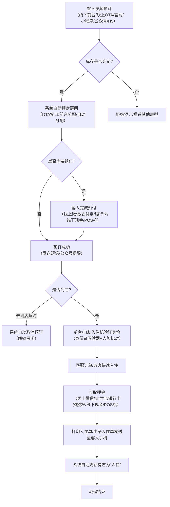
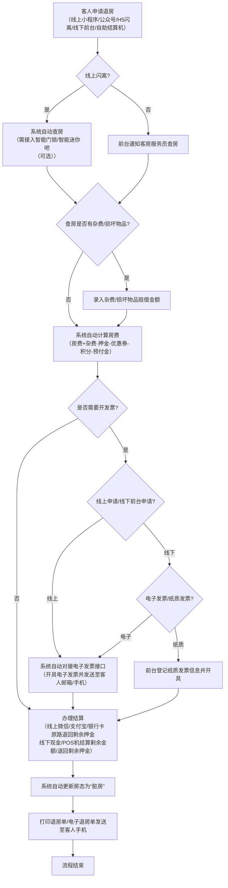

# 酒店管理系统需求文档
**版本号**：V1.0  
**编写日期**：202X年XX月XX日  
**适用范围**：通用型单体/区域连锁经济型、中端酒店（支持10-500间房规模，可按需扩展高端酒店附加功能）

---

## 1. 需求概述
### 1.1 需求背景
传统酒店管理依赖纸质/Excel台账管理房态、预订、财务，存在**房态更新滞后**（导致超卖/空卖）、**多渠道预订数据分散**（需人工核对）、**入住退房效率低**（高峰期排队久）、**库存采购管理混乱**（库存积压/断货）、**财务对账繁琐易错**、**客户信息无法沉淀复用**等问题，严重影响运营效率和客户体验。

### 1.2 项目目标
搭建一套**一体化、全渠道、实时性强**的酒店管理系统，实现以下核心目标：
1. 房态、预订、客人、财务、库存、员工数据集中化、实时化管理
2. 接入主流OTA（携程、美团、飞猪等）、酒店官网/小程序/公众号、线下前台多渠道预订，统一库存管理，自动防超卖
3. 简化客人入住（支持人脸识别、自助机对接、身份证阅读器集成）、退房（支持闪离、自助结算）流程，提升客户满意度
4. 实现采购、入库、领用、盘点全链路库存管理，降低库存成本
5. 自动生成各类财务报表（日结、月结、营收分析、渠道佣金分析等），减少人工对账
6. 沉淀客户画像，支持会员体系、优惠券、积分兑换等营销功能
7. 提供员工权限分级、排班考勤、绩效统计功能，提升内部管理效率

---

## 2. 功能模块清单
本系统包含**12个核心业务模块+1个系统管理模块+1个数据分析模块**，各模块功能如下：

| 模块编号 | 模块名称         | 子模块/功能点                                                                 |
|----------|------------------|------------------------------------------------------------------------------|
| M01      | 房态管理模块     | 实时房态视图（楼层平面图、列表图两种展示）、房态操作（可售、预订、入住、维修、清洁、锁房、脏房/净房切换）、房态操作日志、历史房态查询、房态批量操作 |
| M02      | 预订管理模块     | 线下预订、线上预订（OTA接口同步、官网/小程序/公众号H5对接）、预订查询（多条件筛选、订单编号/客人姓名/手机号/身份证号模糊查询）、预订操作（确认、取消、修改、分配房间、升级房间、取消分配、保留）、预订提醒（到店前1天/2小时短信/公众号提醒，未到店超时自动取消）、超卖预警 |
| M03      | 入住管理模块     | 身份证阅读器集成（自动读取身份信息）、人脸识别对接（公安系统人脸比对、自助入住机人脸识别）、订单匹配入住、散客快速入住、团队批量入住、押金收取（现金、微信/支付宝/银行卡POS机对接）、入住信息修改、换房操作、访客登记、同住人管理、在住客人查询、在住客人服务（叫醒、洗衣、送餐等服务下单与跟踪） |
| M04      | 退房管理模块     | 房费结算（自动计算：房费+杂费-押金-优惠券-积分-预付金）、杂费录入（洗衣、送餐、迷你吧、损坏物品赔偿等）、POS机/微信/支付宝/银行卡结算、闪离（客人线上小程序申请、系统自动结算、押金原路退回）、自助结算机对接、退房提醒（到点前1小时短信/公众号提醒）、发票开具（电子发票对接、纸质发票登记）、退房操作日志、历史退房查询、房间状态自动更新为“脏房” |
| M05      | 会员管理模块     | 会员注册（线下前台、线上小程序/公众号/H5、自助机）、会员等级体系（自定义等级：普通、银卡、金卡、白金卡等，对应不同折扣、积分倍率、权益）、会员积分管理（积分获取规则：消费金额*积分倍率、签到、评价、邀请好友等；积分使用规则：抵房费、换礼品、升级房间；积分查询、积分明细、积分过期提醒）、会员优惠券管理（自定义优惠券类型：满减券、折扣券、免费体验券、专属券；优惠券发放、使用、核销；优惠券过期提醒）、会员画像（消费习惯、入住偏好、入住频率、最近入住时间、累计消费金额等）、会员营销活动（群发营销短信/公众号推送，基于会员画像的精准营销）、会员冻结/解冻/注销 |
| M06      | 迷你吧/客房服务管理模块 | 迷你吧商品管理（商品分类、商品信息录入、库存关联、价格设置）、迷你吧消费录入（客人退房查房时、或客人线上小程序扫码下单）、迷你吧库存预警、迷你吧商品盘点；客房服务项目管理（叫醒、洗衣、送餐、清洁、维修等，自定义项目、价格、预计完成时间）、客房服务下单（前台代客下单、客人线上小程序/公众号/H5下单、自助机下单）、客房服务分配（指定楼层服务员/随机分配、派单提醒）、客房服务状态跟踪（待接单、已接单、服务中、已完成、已取消）、客房服务评价（客人线上小程序/公众号评价、前台代客评价）、客房服务历史查询 |
| M07      | 库存管理模块     | 基础信息管理（仓库分类、仓库信息录入、商品分类、商品信息录入、供应商管理）、采购管理（采购申请、采购审批、采购订单生成、采购订单跟踪、采购收货验收）、入库管理（采购入库、调拨入库、盘盈入库、入库单打印）、出库管理（客房领用、前台领用、行政领用、调拨出库、盘亏出库、出库单打印）、库存盘点（定期盘点、临时盘点、盘点差异处理、盘点报表生成）、库存预警（库存上限/下限设置、库存预警通知）、库存报表（库存流水账、库存明细报表、库存积压/断货报表） |
| M08      | 财务管理模块     | 基础信息管理（费用科目设置、收入科目设置、支付方式设置）、收银管理（前台收银、迷你吧收银、客房服务收银、押金管理、预授权管理、预授权完成/撤销）、对账管理（日结自动生成、日结审核、日结差异处理、OTA渠道对账、线下渠道对账、银行对账单导入与核对）、发票管理（电子发票API对接、纸质发票领用登记、纸质发票开具登记、发票红冲）、营收统计（日/周/月/季/年营收统计、房型营收统计、渠道营收统计、客房服务营收统计、迷你吧营收统计）、成本统计（采购成本统计、人工成本统计、水电杂费统计、其他成本统计）、利润统计（日/周/月/季/年利润统计、房型利润统计、渠道利润统计）、财务报表导出（Excel/PDF格式） |
| M09      | 员工管理模块     | 基础信息管理（员工档案录入、员工照片上传、身份证/银行卡/社保卡等证件上传）、权限管理（角色自定义、角色权限分配、员工角色绑定、操作权限细化到按钮/字段）、排班管理（班次自定义、排班表生成、员工请假/调休/加班申请、请假/调休/加班审批、排班表查询/导出）、考勤管理（打卡方式：指纹打卡、人脸识别打卡、微信/钉钉打卡对接；考勤记录查询、考勤异常处理、考勤报表生成/导出）、绩效统计（自定义绩效指标：入住率、退房率、客户好评率、投诉处理率等；绩效数据自动汇总、绩效报表生成/导出）、员工工资条生成/导出、员工离职管理 |
| M10      | 系统管理模块     | 系统参数设置（酒店基础信息：名称、地址、电话、税号、营业时间等；房型基础信息：房型名称、床型、面积、最大入住人数、基础房价、早餐份数等；房间基础信息：房间编号、所属楼层、所属房型、房间设施等；系统时间设置、自动取消预订时间设置、闪离审核时间设置等）、数据备份与恢复（自动备份：每日/每周/每月定时备份；手动备份；备份数据恢复；备份数据导出）、系统日志管理（操作日志、错误日志、登录日志；日志查询、日志导出、日志清理）、接口管理（OTA接口配置、官网/小程序/公众号H5接口配置、身份证阅读器接口配置、人脸识别接口配置、POS机接口配置、电子发票接口配置、自助机接口配置、微信/支付宝/银行卡支付接口配置） |
| M11      | 自助终端管理模块 | 自助入住机管理（设备绑定、设备状态监控、设备故障报修、设备使用日志）、自助结算机管理（设备绑定、设备状态监控、设备故障报修、设备使用日志）、自助终端参数设置（设备界面自定义、设备营业时间设置、设备押金收取方式设置、设备发票开具设置） |
| M12      | 营销推广模块     | 营销活动管理（自定义活动类型：限时折扣、满房送早餐/服务、邀请好友得积分/优惠券；活动设置、活动发布、活动跟踪、活动效果分析）、酒店官网/小程序/公众号H5页面管理（首页轮播图设置、房型展示页面设置、会员中心页面设置、营销活动页面设置）、评论管理（客人线上小程序/公众号/OTA评论同步、评论审核、评论回复、好评奖励设置）、OTA渠道排名优化建议（基于房态、价格、评论的排名优化建议） |
| M13      | 数据分析模块     | 经营分析仪表盘（实时展示：入住率、平均房价、RevPAR、出租率、今日营收、今日预订数、今日入住数、今日退房数、今日库存预警数等核心指标）、房型分析（房型入住率、房型平均房价、房型RevPAR、房型出租率、房型营收占比）、渠道分析（渠道预订量、渠道入住率、渠道平均房价、渠道RevPAR、渠道营收占比、渠道佣金占比）、客户分析（客户来源、客户性别/年龄分布、客户消费习惯、客户入住偏好、客户流失率、客户复购率）、时间分析（日/周/月/季/年经营趋势、节假日/周末经营分析） |

---

## 3. 用户角色定义
本系统包含**8个核心用户角色**，各角色权限如下：

| 角色编号 | 角色名称   | 角色职责                                                                 | 主要操作权限                                                                 |
|----------|------------|--------------------------------------------------------------------------|------------------------------------------------------------------------------|
| R01      | 系统管理员 | 负责系统的整体配置、数据备份与恢复、权限管理、接口管理、系统日志管理   | 所有模块的配置权限、所有数据的查看/导出权限、系统日志管理权限、数据备份与恢复权限、角色/员工权限分配权限 |
| R02      | 酒店总经理 | 负责查看酒店的整体经营数据、制定经营策略、审批大额采购申请             | 所有数据的查看/导出权限、大额采购审批权限、营销活动审核权限、员工离职审批权限、考勤异常处理权限 |
| R03      | 前厅经理   | 负责前厅部的日常管理、处理客人投诉、审批中等额度采购申请、审核日结     | 房态管理模块全部权限、预订管理模块全部权限、入住管理模块全部权限、退房管理模块全部权限、会员管理模块全部权限、迷你吧/客房服务管理模块的查询/派单/分配权限、财务管理模块的日结审核权限、中等额度采购审批权限、员工管理模块的前厅部排班/请假/调休/加班审批权限、数据分析模块的前厅部相关数据查看权限 |
| R04      | 前台接待员 | 负责线下预订、入住、退房、押金收取、发票开具、客人咨询、投诉初步处理   | 房态管理模块的查询/脏房/净房/锁房/换房权限、预订管理模块的线下预订/查询/确认/取消/修改/分配/取消分配权限、入住管理模块的全部权限（不含同住人批量入住/换房批量操作，需前厅经理授权）、退房管理模块的全部权限（不含闪离批量审核，需前厅经理授权）、会员管理模块的线下注册/查询/优惠券发放/积分查询权限、迷你吧/客房服务管理模块的代客下单/派单权限、财务管理模块的收银权限、营销推广模块的评论回复权限 |
| R05      | 客房部经理 | 负责客房部的日常管理、安排客房清洁/维修、审批客房部员工排班/请假/调休/加班、审核迷你吧/客房服务库存 | 房态管理模块的查询/维修/清洁权限、迷你吧/客房服务管理模块的全部权限、库存管理模块的客房部商品查询/领用审批/盘点权限、员工管理模块的客房部排班/请假/调休/加班审批权限、数据分析模块的客房部相关数据查看权限 |
| R06      | 客房服务员 | 负责房间清洁、迷你吧补充、客房服务执行、退房查房、迷你吧消费初步录入   | 房态管理模块的查询/脏房→净房提交权限、迷你吧/客房服务管理模块的客房服务接单/状态更新/查房权限、库存管理模块的商品领用申请权限、员工管理模块的考勤打卡权限、请假/调休/加班申请权限 |
| R07      | 财务主管   | 负责酒店的整体财务管理、对账、成本控制、财务报表生成、审核小额采购申请 | 财务管理模块的全部权限、库存管理模块的采购审批/采购订单跟踪/入库验收/库存查询权限、营销推广模块的营销活动预算审核权限、数据分析模块的全部财务相关数据查看权限 |
| R08      | 会员/客人  | 负责线上预订、入住登记、闪离申请、服务下单、评价、会员积分/优惠券查看/使用 | 官网/小程序/公众号H5的全部操作权限（不含高级权限设置）、查看个人订单/会员信息/积分/优惠券的权限 |

---

## 4. 核心业务流程
本系统包含**6个核心业务流程**，各流程描述如下：

### 4.1 多渠道预订-分配房间-入住流程


### 4.2 退房-结算-发票开具流程


### 4.3 采购-入库-领用流程
```mermaid
flowchart TD
    A[员工发起采购申请<br>（前台接待员/客房服务员/前厅经理/客房部经理）] --> B{采购金额是否<小额额度?}
    B -->|是| C[财务主管审批]
    B -->|否| D{采购金额是否<中等额度?}
    D -->|是| E[前厅经理/客房部经理审批→财务主管审批]
    D -->|否| F[前厅经理/客房部经理审批→财务主管审批→酒店总经理审批]
    C --> G{审批是否通过?}
    E --> G
    F --> G
    G -->|否| H[退回采购申请]
    G -->|是| I[生成采购订单并发送至供应商]
    I --> J[供应商发货]
    J --> K[财务主管/指定验收人员验收货物]
    K --> L{验收是否合格?}
    L -->|否| M[退回供应商]
