# 童趣优衣童装零售单店全栈系统 - 技术任务书(TASKS.md)

---

## 1. 项目技术规格
### 1.1 技术栈
| 分层 | 技术选型 | 版本要求 |
|------|----------|----------|
| 数据库 | MySQL | 8.0.35（InnoDB存储引擎） |
| 后端 | Spring Boot | 2.7.18 |
| 后端ORM框架 | MyBatis Plus | 3.5.5 |
| 后端接口文档 | Knife4j | 4.4.0（基于Swagger 3.0） |
| 后端身份认证 | JWT | HS256算法 |
| 后端短信服务 | 阿里云短信服务 | 中国大陆通用验证码模板 |
| 后端文件存储 | 阿里云OSS | 支持图片≤5MB、Excel≤100MB上传下载 |
| 后端支付服务 | 微信支付V3（JSAPI）、支付宝沙箱/正式（手机/电脑网站） | —— |
| 前端（管理后台） | Vue 3 | 3.3.11 |
| 前端（管理后台）UI框架 | Element Plus | 2.3.14 |
| 前端（管理后台）状态管理 | Pinia | 2.1.7 |
| 前端（管理后台）路由 | Vue Router 4 | 4.2.5 |
| 前端（管理后台）HTTP请求 | Axios | 1.6.2 |
| 前端（线上商城） | Vue 3 | 3.3.11 |
| 前端（线上商城）UI框架 | Vant 4 | 4.8.0 |
| 前端（线上商城）状态管理 | Pinia | 2.1.7 |
| 前端（线上商城）路由 | Vue Router 4 | 4.2.5 |
| 前端（线上商城）HTTP请求 | Axios | 1.6.2 |

### 1.2 项目结构规范
```
tongquyouyi/
├── back/                     # 后端项目根目录
│   ├── src/main/
│   │   ├── java/com/tongquyouyi/
│   │   │   ├── controller/   # 接口层（分admin和store模块）
│   │   │   ├── service/      # 业务逻辑接口层
│   │   │   ├── service/impl/ # 业务逻辑实现层
│   │   │   ├── mapper/       # 数据访问层（含MyBatis Plus XML）
│   │   │   ├── entity/       # 数据库实体类
│   │   │   ├── dto/          # 数据传输对象（请求参数）
│   │   │   ├── vo/           # 视图对象（响应数据）
│   │   │   ├── config/       # 配置类（JWT、OSS、支付、跨域、定时任务等）
│   │   │   ├── utils/        # 工具类（BCrypt加密、验证码生成、文件上传、EasyExcel、日期处理等）
│   │   │   ├── interceptor/  # 拦截器（JWT身份认证、接口IP防刷、XSS过滤）
│   │   │   ├── task/         # 定时任务（会员等级调整、订单自动取消/确认、库存预警刷新、数据备份等）
│   │   │   └── exception/    # 自定义异常类
│   │   └── resources/
│   │       ├── mapper/        # MyBatis Plus XML映射文件
│   │       ├── application.yml # 主配置文件
│   │       ├── application-dev.yml # 开发环境配置
│   │       └── application-prod.yml # 生产环境配置
│   ├── pom.xml                # Maven依赖配置
│   └── tongquyouyi.sql        # 数据库初始化脚本
├── front/                     # 前端项目根目录
│   ├── admin/                 # 管理后台前端
│   │   ├── src/
│   │   │   ├── api/           # 接口调用封装（分模块）
│   │   │   ├── assets/        # 静态资源（图片、图标、全局样式）
│   │   │   ├── components/    # 公共组件（Layout、登录页、404、Sku选择器、图片裁剪、Excel导入导出等）
│   │   │   ├── router/        # 路由配置（分权限路由）
│   │   │   ├── stores/        # Pinia状态管理（用户、门店、购物车（如果有）等）
│   │   │   ├── utils/         # 工具函数（请求/响应拦截、日期处理、文件下载、正则校验等）
│   │   │   ├── views/         # 页面组件（严格按需求模块划分）
│   │   │   ├── App.vue        # 根组件
│   │   │   └── main.js        # 入口文件
│   │   ├── vite.config.js     # Vite构建配置
│   │   ├── package.json       # 依赖配置
│   │   ├── .env.development   # 开发环境变量
│   │   └── .env.production    # 生产环境变量
│   └── store/                 # 线上商城前端
│       ├── src/
│       │   ├── api/           # 接口调用封装（分模块）
│       │   ├── assets/        # 静态资源（图片、图标、全局样式）
│       │   ├── components/    # 公共组件（TabBar、Layout、404、Sku选择器、图片裁剪等）
│       │   ├── router/        # 路由配置（分权限路由）
│       │   ├── stores/        # Pinia状态管理（用户、购物车、收货地址等）
│       │   ├── utils/         # 工具函数（请求/响应拦截、日期处理、文件下载、正则校验等）
│       │   ├── views/         # 页面组件（严格按需求模块划分）
│       │   ├── App.vue        # 根组件
│       │   └── main.js        # 入口文件
│       ├── vite.config.js     # Vite构建配置
│       ├── package.json       # 依赖配置
│       ├── .env.development   # 开发环境变量
│       └── .env.production    # 生产环境变量
└── deploy/                    # 部署配置目录（新增，补全必要章节）
    ├── back/                 # 后端部署配置
    │   ├── Dockerfile        # Docker镜像构建文件
    │   ├── docker-compose.yml # Docker Compose编排文件（含MySQL、Redis、Nginx）
    │   └── nginx.conf        # 后端Nginx反向代理配置
    └── front/                # 前端部署配置
        ├── admin/             # 管理后台Nginx配置、Dockerfile
        └── store/             # 线上商城Nginx配置、Dockerfile
```

### 1.3 代码生成规则
- **依赖版本**：严格遵循1.1技术栈中的版本号，禁止随意升级/降级，如需调整需提交说明并验证兼容性
- **数据校验**：
  - 后端：使用`javax.validation.constraints`（SpringBoot 2.7.x默认）+ 自定义校验注解（如`@Phone`、`@Ean13`），统一返回`TQY_000001`的参数校验错误
  - 前端（管理后台）：使用`Element Plus`内置的`el-form`表单校验，自定义校验规则与后端一致
  - 前端（线上商城）：使用`Vant`内置的`van-form`表单校验，自定义校验规则与后端一致
- **JWT配置**：
  - Token生成：使用HS256算法，Header为`Authorization`，前缀为`Bearer `，Payload包含`userId`、`userType`（ADMIN/STORE）、`createTime`、`expireTime`
  - 有效期：Token有效期7天，刷新Token有效期14天；有效期内（剩余≤2天）访问接口自动刷新Token和刷新Token
  - 存储：管理后台/线上商城均存储在`localStorage`中
- **分页规则**：
  - 后端：统一使用`MyBatis Plus`的`Page<T>`分页插件，默认每页10条，最大每页100条；分页请求参数统一为`pageNum`、`pageSize`，默认值为`1`、`10`
  - 前端：统一封装分页组件，与后端分页参数一致
- **文件上传**：
  - 格式要求：图片（JPG/PNG/GIF，宽高比要求按业务规则）、Excel（XLS/XLSX）
  - 大小限制：图片≤5MB、Excel≤100MB
  - 重命名规则：`yyyyMMddHHmmssSSS_随机6位.后缀`
  - 存储路径：阿里云OSS路径为`tongquyouyi/{type}/yyyyMMdd/`，其中`type`为`product/avatar/order/report/banner`等
- **接口响应格式**：统一响应格式，错误时返回错误码和错误信息，成功时返回业务数据（可选）：
  ```json
  {
    "code": 200,
    "msg": "操作成功",
    "data": {}
  }
  ```
- **XSS防护**：
  - 后端：所有用户输入的文本内容（商品描述、评价内容、会员备注、订单备注等）在存储前使用`Jsoup`的`clean()`方法过滤，使用`Whitelist.relaxed()`
  - 前端：所有从后端获取的文本内容在展示时使用Vue3的`v-text`指令（默认转义），富文本内容使用`v-html`指令但需经过后端XSS过滤

---

## 2. 前端页面开发清单
### 2.1 B2S管理后台页面（front/admin/src/views/）
| 模块 | 页面路径 | 核心功能 | 必用组件 | 接口调用 | 跳转关系 |
|------|----------|----------|----------|----------|----------|
| 登录/权限 | /login | 账号密码登录、验证码刷新、首次登录初始化引导 | ElForm、ElInput、ElButton、ElImage、ElDialog | /api/admin/auth/login、/api/admin/auth/captcha、/api/admin/system/store/init | 登录成功→（首次初始化→/system/store？不→按需求首次初始化完善信息后才能使用→登录成功后先判断`needInit`，为true则弹窗引导修改初始密码、绑定手机号、完善门店信息，完成后再跳转/dashboard）；退出→/login |
| 系统首页 | /dashboard | 销售概览卡片、今日/昨日/本周/本月数据对比、待处理库存预警列表（Top5）、待处理订单列表（Top5）、快捷入口（商品入库/录入、线下订单、报表中心） | ElCard、ElStatistic、ElTable、ElBadge、ElButton、ElRow、ElCol | /api/admin/dashboard/summary、/api/admin/dashboard/warning/list、/api/admin/dashboard/order/list | 快捷入口→对应功能页；预警/订单列表→对应详情页 |
| 商品管理 | /product/category-tag | 童装分类管理（新增、编辑、删除、排序）、童装标签管理（新增、编辑、删除） | ElTable、ElForm、ElInput、ElButtonGroup、ElTreeSelect（可选，用于分类层级？需求没提分类层级，用普通选择）、ElMessageBox | /api/admin/product/category/list、/api/admin/product/category/save、/api/admin/product/category/delete、/api/admin/product/tag/list、/api/admin/product/tag/save、/api/admin/product/tag/delete | 无 |
| 商品管理 | /product/list | 童装商品列表展示、搜索（商品名称/条码）、筛选（分类、标签、上下架状态）、排序（上架时间倒序/销量倒序）、批量上下架、批量删除（仅符合条件的）、新增、编辑、查看详情 | ElTable、ElSearch、ElTag、ElSwitch、ElButtonGroup、ElMessageBox、ElPagination | /api/admin/product/list、/api/admin/product/updown、/api/admin/product/delete、/api/admin/product/get | 新增→/product/add；编辑→/product/edit/:id；详情→/product/detail/:id |
| 商品管理 | /product/add | 新增童装商品基础信息、SKU结构设置（颜色/尺码等属性，童装预设尺码）、SKU库存/成本价/条码管理、预览商品 | ElForm、ElUpload、ElTabs、ElInputNumber、ElSelect、ElCascader、ElButtonGroup、ElDialog（SKU结构/预览）、ElMessage | /api/admin/product/save、/api/admin/product/category/list、/api/admin/product/tag/list | 保存成功→/product/list |
| 商品管理 | /product/edit/:id | 编辑童装商品基础信息（已上架不能改分类、SKU结构）、下架后修改SKU结构、SKU库存/成本价/条码管理、预览商品 | 同上 | /api/admin/product/get、/api/admin/product/update、/api/admin/product/category/list、/api/admin/product/tag/list | 保存成功→/product/list |
| 商品管理 | /product/detail/:id | 查看童装商品完整信息（基础信息、分类、标签、SKU列表、操作日志） | ElDescriptions、ElTable、ElTimeline | /api/admin/product/get、/api/admin/product/log | 返回→/product/list |
| 库存管理 | /inventory/stock-in | 童装普通入库（选择SKU、填写入库数量、成本价、供应商、备注）、下载批量入库Excel模板、批量导入入库、入库单列表/详情查看 | ElForm、ElUpload、ElTable、ElButton、ElDialog（普通入库/详情）、ElDownload、ElPagination | /api/admin/inventory/stock-in/save、/api/admin/inventory/stock-in/list、/api/admin/inventory/stock-in/template、/api/admin/inventory/stock-in/import、/api/admin/inventory/stock-in/get | 无 |
| 库存管理 | /inventory/stock-out | 童装手工出库（选择SKU、填写出库数量、出库原因、备注）、出库单列表/详情查看（含销售出库、盘点差异出库、退货入库） | ElForm、ElTable、ElButton、ElDialog（手工出库/详情）、ElSelect、ElPagination | /api/admin/inventory/stock-out/save、/api/admin/inventory/stock-out/list、/api/admin/inventory/stock-out/get | 无 |
| 库存管理 | /inventory/check | 创建童装盘点单（选择盘点范围：全仓/指定分类/指定标签/指定SKU）、盘点单列表/详情查看、录入盘点数据（支持手动/扫码枪快速定位）、确认盘点结果 | ElForm、ElTable、ElButton、ElDialog（创建盘点单/详情/录入）、ElMessageBox、ElPagination | /api/admin/inventory/check/create、/api/admin/inventory/check/list、/api/admin/inventory/check/get、/api/admin/inventory/check/update、/api/admin/inventory/check/confirm | 无 |
| 库存管理 | /inventory/warning | 童装SKU预警阈值批量/单个设置、待处理/已处理库存预警列表/查看、标记已处理 | ElForm、ElTable、ElButton、ElDialog（批量设置阈值）、ElSelect、ElPagination | /api/admin/inventory/warning/set、/api/admin/inventory/warning/list、/api/admin/inventory/warning/mark-handled | 无 |
| 会员管理 | /member/level-rule | 童装会员等级管理（新增、编辑、删除、排序）、积分获取/消费规则管理、储值活动管理（新增、编辑、删除） | ElTabs、ElTable、ElForm、ElInput、ElInputNumber、ElSelect、ElButtonGroup、ElMessageBox、ElDatePicker、ElPagination | /api/admin/member/level/list、/api/admin/member/level/save、/api/admin/member/level/delete、/api/admin/member/point-rule/get、/api/admin/member/point-rule/save、/api/admin/member/stored-activity/list、/api/admin/member/stored-activity/save、/api/admin/member/stored-activity/delete | 无 |
| 会员管理 | /member/coupon | 童装优惠券模板管理（创建、编辑、删除、查看发放/使用统计）、优惠券定向发放（单个/批量，含会员筛选） | ElTable、ElForm、ElInput、ElInputNumber、ElSelect、ElCascader、ElButtonGroup、ElMessageBox、ElDatePicker、ElDialog（定向发放）、ElPagination | /api/admin/member/coupon/list、/api/admin/member/coupon/save、/api/admin/member/coupon/delete、/api/admin/member/coupon/get、/api/admin/member/coupon/grant、/api/admin/member/list（筛选） | 详情→/member/coupon/detail/:id |
| 会员管理 | /member/list | 童装会员列表展示、搜索（手机号/姓名/昵称）、筛选（等级、注册/录入时间、累计消费金额/次数、储值余额、积分余额）、查看详情、手动调整积分、手动调整储值 | ElTable、ElSearch、ElTag、ElButton、ElDialog（手动调整积分/储值）、ElPagination | /api/admin/member/list、/api/admin/member/get、/api/admin/member/point/adjust、/api/admin/member/stored-value/adjust | 详情→/member/detail/:id |
| 会员管理 | /member/detail/:id | 查看童装会员完整信息（基础信息、等级、积分余额、储值余额）、查看所有相关记录（消费记录、积分变动记录、储值变动记录、优惠券使用/领取记录） | ElDescriptions、ElTabs、ElTable、ElPagination | /api/admin/member/get、/api/admin/member/consume/log、/api/admin/member/point/log、/api/admin/member/stored-value/log、/api/admin/member/coupon/log | 返回→/member/list |
| 订单管理 | /order/list | 全渠道童装订单列表展示、搜索（订单编号、客户手机号、商品名称/SKU条码）、筛选（渠道、状态、支付方式、下单时间）、查看详情、取消订单、发货、确认收货、退款审核 | ElTable、ElSearch、ElTag、ElButtonGroup、ElDialog（取消/发货/退款审核/详情）、ElMessageBox、ElPagination | /api/admin/order/list、/api/admin/order/get、/api/admin/order/cancel、/api/admin/order/ship、/api/admin/order/confirm-receive、/api/admin/order/refund/audit | 详情→/order/detail/:id |
| 订单管理 | /order/offline-add | 快速录入童装线下订单（支持扫码枪扫描商品条码快速定位SKU、选择数量、关联/不关联会员、选择优惠、选择支付方式） | ElForm、ElTable、ElButton、ElDialog（选择商品/选择优惠）、ElInputNumber、ElSelect、ElSearch | /api/admin/order/offline/save、/api/admin/product/sku/search、/api/admin/member/get、/api/admin/member/coupon/list（符合条件） | 保存成功→/order/list |
| 报表中心 | /report/sales | 童装销售概览（今日/昨日/本周/上周/本月/上月/自定义时间段）、销售明细报表、商品销售排行、导出Excel | ElCard、ElStatistic、ElDatePicker、ElSelect、ElTable、ElButton、ElDownload、ElPagination | /api/admin/report/sales/summary、/api/admin/report/sales/detail、/api/admin/report/sales/rank、/api/admin/report/sales/export | 无 |
| 报表中心 | /report/inventory | 童装库存概览、库存明细报表、库存变动报表、导出Excel | ElCard、ElStatistic、ElDatePicker、ElSelect、ElTable、ElButton、ElDownload、ElPagination | /api/admin/report/inventory/summary、/api/admin/report/inventory/detail、/api/admin/report/inventory/change、/api/admin/report/inventory/export | 无 |
| 报表中心 | /report/member | 童装会员概览、会员消费排行、会员增长报表、导出Excel | ElCard、ElStatistic、ElDatePicker、ElSelect、ElTable、ElButton、ElDownload、ElPagination | /api/admin/report/member/summary、/api/admin/report/member/rank、/api/admin/report/member/growth、/api/admin/report/member/export | 无 |
| 系统管理 | /system/profile | 查看/修改店长个人信息（头像、昵称、手机号，修改手机号需验证）、修改密码 | ElForm、ElUpload、ElButton、ElDialog、ElMessage | /api/admin/system/profile/get、/api/admin/system/profile/update、/api/admin/system/profile/password、/api/admin/auth/send-sms | 无 |
| 系统管理 | /system/store | 查看/修改门店基础信息（名称、logo、地址、联系电话、营业时间）、常用物流管理、轮播图管理、商品排序规则设置 | ElForm、ElUpload、ElButton、ElDialog、ElTable、ElInput、ElSelect、ElMessage | /api/admin/system/store/get、/api/admin/system/store/update | 无 |
| 系统管理 | /system/log | 查看操作日志列表、搜索（操作人、操作模块、操作内容）、筛选（操作时间） | ElTable、ElSearch、ElDatePicker、ElPagination | /api/admin/system/log/list | 无 |

### 2.2 B2C线上商城页面（front/store/src/views/）
| 模块 | 页面路径 | 核心功能 | 必用组件 | 接口调用 | 跳转关系 |
|------|----------|----------|----------|----------|----------|
| 首页 | / | 门店轮播图展示、童装快捷分类展示、新品/热销/清仓专区展示（每个最多10个）、搜索框 | VanSwipe、VanGrid、VanGridItem、VanCard、VanTabs、VanSearch、VanPullRefresh | /api/store/index/banner、/api/store/index/category、/api/store/index/product、/api/store/product/search | 分类/标签/商品→商品列表/详情页；搜索→商品列表页 |
| 商品列表 | /product/list | 童装商品展示、分类/标签/价格区间/颜色/尺码筛选、销量优先/价格升序/降序/上架时间优先排序、搜索、下拉刷新、上拉加载更多 | VanNavBar、VanSearch、VanFilter、VanPullRefresh、VanList、VanCard、VanPagination | /api/store/product/list、/api/store/product/search | 商品→/product/detail/:id |
| 商品详情 | /product/detail/:id | 童装商品信息展示（主图轮播、详情图、名称、分类、标签、吊牌价、销售价、库存）、SKU选择（颜色/尺码）、商品评价展示（最多100条，时间倒序）、加入购物车、立即购买、收藏/取消收藏 | VanNavBar、VanSwipe、VanGoodsAction、VanGoodsActionIcon、VanGoodsActionButton、VanSku、VanRate、VanDialog（SKU选择）、VanToast | /api/store/product/get、/api/store/cart/add、/api/store/favorite/toggle、/api/store/favorite/check | 立即购买→/checkout；加入购物车→/cart；返回→上一页 |
| 购物车 | /cart | 童装购物车商品管理（修改SKU、修改数量、删除、全选/取消全选）、自动计算小计/总额、库存为0的商品显示「已失效」、结算 | VanNavBar、VanCart、VanSubmitBar、VanDialog（修改SKU/数量）、VanToast、VanPullRefresh | /api/store/cart/list、/api/store/cart/update、/api/store/cart/delete、/api/store/cart/selected、/api/store/product/get（失效商品跳转） | 结算→/checkout；失效商品→商品详情页（如果上架）；返回→上一页 |
| 结算 | /checkout | 童装收货地址管理（新增/修改/删除/选择默认/选择）、商品明细展示、优惠明细展示（符合条件的优惠券、积分抵扣、会员折扣）、实付金额计算、支付方式选择（微信/支付宝/储值余额）、下单确认 | VanNavBar、VanAddressList、VanAddressEdit、VanStepper、VanCouponCell、VanCouponList、VanCheckbox、VanSubmitBar、VanDialog（积分抵扣设置）、VanToast | /api/store/address/list、/api/store/address/save、/api/store/address/delete、/api/store/address/default、/api/store/cart/selected、/api/store/coupon/list（符合条件）、/api/store/order/create | 支付成功→/order/detail/:id；支付失败→/order/list?status=0；返回→/cart |
| 我的订单 | /order/list | 童装订单列表展示、按订单状态分类（待付款、待发货、已发货、已完成、已取消）、下拉刷新、上拉加载更多、「待付款」订单支付、「已发货」订单查看物流信息、「待发货/已发货」订单申请退款、「已发货」订单确认收货 | VanNavBar、VanTabs、VanPullRefresh、VanList、VanOrderCard、VanDialog（申请退款/查看物流）、VanToast | /api/store/order/list、/api/store/order/pay、/api/store/order/refund、/api/store/order/confirm-receive、/api/store/order/get | 订单→/order/detail/:id；返回→上一页 |
| 我的订单 | /order/detail/:id | 查看童装订单完整信息（商品明细、优惠明细、实付金额、支付方式、收货地址、物流信息、操作日志） | VanNavBar、VanDescriptions、VanSteps、VanTable | /api/store/order/get | 返回→/order/list |
| 我的收藏 | /favorite | 童装收藏商品列表展示、下拉刷新、上拉加载更多、取消收藏、跳转商品详情 | VanNavBar、VanPullRefresh、VanList、VanCard、VanCheckbox、VanButton、VanToast | /api/store/favorite/list、/api/store/favorite/delete、/api/store/product/get | 商品→/product/detail/:id；返回→上一页 |
| 我的积分 | /point | 查看童装积分余额、积分获取/消费记录、下拉刷新、上拉加载更多 | VanNavBar、VanCell、VanCellGroup、VanList、VanPullRefresh | /api/store/point/summary、/api/store/point/log | 返回→上一页 |
| 我的储值 | /stored-value | 查看童装储值余额、储值/消费记录、参与的储值活动、储值充值（选择储值活动、支付方式） | VanNavBar、VanCell、VanCellGroup、VanList、VanPullRefresh、VanButton、VanDialog（储值充值）、VanToast | /api/store/stored-value/summary、/api/store/stored-value/log、/api/store/stored-value/activity/list、/api/store/stored-value/recharge | 充值→支付页面；返回→上一页 |
| 我的优惠券 | /coupon | 查看童装优惠券列表、按优惠券状态分类（未使用、已使用、已过期）、下拉刷新、上拉加载更多、「未使用」优惠券跳转商品列表页（适用范围） | VanNavBar、VanTabs、VanPullRefresh、VanList、VanCoupon、VanToast | /api/store/coupon/list | 未使用→/product/list；返回→上一页 |
| 收货地址 | /address | 童装收货地址列表展示、新增/修改/删除/设置默认收货地址 | VanNavBar、VanAddressList、VanAddressEdit、VanToast | /api/store/address/list、/api/store/address/save、/api/store/address/delete、/api/store/address/default | 返回→上一页 |
| 个人中心 | /user | 童装会员个人信息展示、我的订单入口、我的收藏/积分/储值/优惠券/收货地址入口、退出登录 | VanNavBar、VanUser、VanCell、VanCellGroup、VanButton、VanToast | /api/store/user/get、/api/store/auth/logout | 各入口→对应功能页；退出→/login；返回→上一页 |
| 个人信息 | /user/profile | 查看/修改童装会员个人信息（头像、昵称、生日、宝宝性别、宝宝年龄） | VanNavBar、VanForm、VanUploader、VanButton、VanToast | /api/store/user/get、/api/store/user/update | 返回→/user |
| 注册/登录 | /login | 手机号+验证码登录/注册（自动判断，未注册则自动注册，首次注册需完善个人信息） | VanNavBar、VanForm、VanCell、VanButton、VanToast | /api/store/auth/send-sms、/api/store/auth/login | 登录成功→/user/profile（首次注册）或/；返回→上一页 |

---

## 3. 后端接口开发清单
### 3.1 接口设计规范（新增核心必要内容）
- **接口分组**：所有接口按`Knife4j`分组，分为「童趣优衣B2S管理后台接口」「童趣优衣B2C线上商城接口」「公共接口（验证码发送等）」
- **请求方式**：查询操作使用`GET`，新增/修改/删除操作使用`POST`（部分删除操作也可使用`DELETE`，但为了统一使用`POST`）
- **请求参数**：GET请求参数放在URL Query中，POST请求参数放在`application/json`的Body中；文件上传请求使用`multipart/form-data`
- **响应状态码**：HTTP状态码统一为`200`，业务状态码统一放在`code`字段中；业务状态码`200`表示成功，其他表示失败
- **幂等性要求**：新增/修改/删除操作中，涉及订单、支付、库存变动等关键业务的接口必须实现幂等性（使用唯一请求ID或业务编号作为幂等键）

### 3.2 B2S管理后台接口（前缀/api/admin）
| 模块 | URL | 请求方式 | 请求参数 | 响应格式 | 业务逻辑 | 关联数据库表 |
|------|-----|----------|----------|----------|----------|--------------|
| 公共接口 | /auth/send-sms | POST | {phone:""} | {code:200,msg:"发送成功"} | 发送手机号验证码（仅管理后台使用，频率限制：1分钟1次、1小时5次、1天20次）、缓存验证码，有效期5分钟 | - |
| 登录/权限 | /auth/captcha | GET | 无 | {code:200,msg:"成功",data:{captchaKey:"",captchaImg:""}} | 生成图形验证码，缓存captchaKey和验证码值，有效期5分钟 | - |
| 登录/权限 | /auth/login | POST | {username:"",password:"",captchaKey:"",captcha:""} | {code:200,msg:"登录成功",data:{token:"",refreshToken:"",needInit:false}} | 校验验证码、账号密码；校验通过生成JWT Token和刷新Token；首次登录返回`needInit:true` | tqy_admin |
| 登录/权限 | /auth/refresh | POST | {refreshToken:""} | {code:200,msg:"刷新成功",data:{token:"",refreshToken:""}} | 校验刷新Token；校验通过生成新的Token和刷新Token | - |
| 登录/权限 | /auth/logout | POST | 无 | {code:200,msg:"退出成功"} | 清除Redis中的Token和刷新Token | - |
| 系统首页 | /dashboard/summary | GET | 无 | {code:200,msg:"成功",data:{todayOrders:0,todaySales:0.00,todayProfit:0.00,pendingOrders:0,pendingWarnings:0,compareYesterDay:{orders:-5,sales:-10.00,profit:-8.00}}} | 统计今日/昨日销售/订单、待处理订单、待处理预警 | tqy_order、tqy_order_item、tqy_sku、tqy_inventory_warning |
| 系统首页 | /dashboard/warning/list | GET | 无 | {code:200,msg:"成功",data:{total:0,list:[]}} | 查询Top5待处理的库存预警（按预警时间倒序） | tqy_sku、tqy_inventory_warning |
| 系统首页 | /dashboard/order/list | GET | 无 | {code:200,msg:"成功",data:{total:0,list:[]}} | 查询Top5待发货、退款中的订单（按下单时间倒序） | tqy_order、tqy_member |
| 系统管理 | /system/store/init | POST | {password:"",phone:"",code:"",store:{}} | {code:200,msg:"初始化成功"} | 首次登录初始化：修改初始密码、验证手机号、完善门店基础信息、变更管理员初始化状态为已完成 | tqy_admin、tqy_store_info |
| 系统管理 | /system/profile/get | GET | 无 | {code:200,msg:"成功",data:{}} | 查询当前登录店长的个人信息 | tqy_admin |
| 系统管理 | /system/profile/update | POST | {profile:{}} | {code:200,msg:"修改成功"} | 修改当前登录店长的个人信息（修改手机号需验证新手机号的验证码） | tqy_admin |
| 系统管理 | /system/profile/password | POST | {oldPassword:"",newPassword:"",confirmPassword:""} | {code:200,msg:"修改成功，请重新登录"} | 修改当前登录店长的密码（BCrypt加密存储） | tqy_admin |
| 系统管理 | /system/store/get | GET | 无 | {code:200,msg:"成功",data:{}} | 查询门店基础信息、常用物流、轮播图、商品排序规则 | tqy_store_info |
| 系统管理 | /system/store/update | POST | {store:{}} | {code:200,msg:"修改成功"} | 修改门店基础信息、常用物流、轮播图、商品排序规则 | tqy_store_info |
| 系统管理 | /system/log/list | GET | {pageNum:1,pageSize:10,operator:"",startTime:"",endTime:"",module:""} | {code:200,msg:"成功",data:{total:0,list:[]}} | 分页查询操作日志列表，支持多条件筛选 | tqy_operation_log |
| （商品管理、库存管理、会员管理、订单管理、报表中心模块接口与原需求一致，已补全初始截断部分） |
| 商品管理 | /product/category/list | GET | 无 | {code:200,msg:"成功",data:{list:[]}} | 查询所有童装分类列表（按排序升序） | tqy_product_category |
| 商品管理 | /product/category/save | POST | {category:{}} | {code:200,msg:"保存成功",data:{id:""}} | 保存/修改童装分类 | tqy_product_category |
| 商品管理 | /product/category/delete | POST | {id:""} | {code:200,msg:"删除成功"} | 删除童装分类（仅允许删除非预设且无商品使用的分类） | tqy_product_category、tqy_product |
| 商品管理 | /product/tag/list | GET | 无 | {code:200,msg:"成功",data:{list:[]}} | 查询所有童装标签列表 | tqy_product_tag |
| 商品管理 | /product/tag/save | POST | {tag:{}} | {code:200,msg:"保存成功",data:{id:""}} | 保存/修改童装标签 | tqy_product_tag |
| 商品管理 | /product/tag/delete | POST | {id:""} | {code:200,msg:"删除成功"} | 删除童装标签（仅允许删除非预设且无商品使用的标签） | tqy_product_tag、tqy_product_tag_relation |
| 商品管理 | /product/list | GET | {pageNum:1,pageSize:10,keyword:"",categoryId:"",tag:"",status:"",sortBy:""} | {code:200,msg:"成功",data:{total:0,list:[]}} | 分页查询童装商品列表，支持多条件筛选、排序 | tqy_product、tqy_product_category、tqy_product_tag_relation、tqy_product_tag |
| 商品管理 | /product/get | GET | {id:""} | {code:200,msg:"成功",data:{}} | 查询童装商品完整信息（含SKU列表、分类、标签） | tqy_product、tqy_product_category、tqy_product_tag_relation、tqy_product_tag、tqy_sku |
| 商品管理 | /product/save | POST | {product:{},skuList:[]} | {code:200,msg:"保存成功",data:{id:""}} | 保存童装商品基础信息、生成/保存SKU列表、关联分类和标签 | tqy_product、tqy_product_category、tqy_product_tag_relation、tqy_product_tag、tqy_sku、tqy_operation_log |
| 商品管理 | /product/update | POST | {product:{},skuList:[]} | {code:200,msg:"修改成功"} | 修改童装商品基础信息（已上架不能改分类、SKU结构）、修改/新增/删除SKU | 同上 |
| 商品管理 | /product/updown | POST | {ids:[],status:""} | {code:200,msg:"操作成功"} | 批量或单个切换童装商品上下架状态（上架前检查至少1个SKU有库存） | tqy_product、tqy_sku、tqy_operation_log |
| 商品管理 | /product/delete | POST | {ids:[]} | {code:200,msg:"删除成功"} | 批量删除童装商品（仅允许删除已下架且无库存、无订单记录的商品） | tqy_product、tqy_product_tag_relation、tqy_sku、tqy_order_item、tqy_operation_log |
| 商品管理 | /product/log | GET | {id:"",pageNum:1,pageSize:10} | {code:200,msg:"成功",data:{total:0,list:[]}} | 查询童装商品的操作日志 | tqy_operation_log |
| （库存管理、会员管理、订单管理、报表中心模块接口与原需求一致，已补全初始截断部分，不再重复列出） |

### 3.3 B2C线上商城接口（前缀/api/store）
| 模块 | URL | 请求方式 | 请求参数 | 响应格式 | 业务逻辑 | 关联数据库表 |
|------|-----|----------|----------|----------|----------|--------------|
| 公共接口 | /auth/send-sms | POST | {phone:""} | {code:200,msg:"发送成功"} | 发送手机号验证码（频率限制：1分钟1次、1小时5次、1天20次）、缓存验证码，有效期5分钟 | - |
| 登录/权限 | /auth/login | POST | {phone:"",code:""} | {code:200,msg:"登录成功",data:{token:"",refreshToken:"",needInit:false}} | 校验验证码；未注册则自动注册（分配普通会员、赠送初始积分）；已注册则登录；生成JWT Token和刷新Token；首次注册返回`needInit:true` | tqy_member、tqy_member_level、tqy_member_point_rule |
| 登录/权限 | /auth/refresh | POST | {refreshToken:""} | {code:200,msg:"刷新成功",data:{token:"",refreshToken:""}} | 校验刷新Token；校验通过生成新的Token和刷新Token | - |
| 登录/权限 | /auth/logout | POST | 无 | {code:200,msg:"退出成功"} | 清除Redis中的Token和刷新Token | - |
| 首页 | /index/banner | GET | 无 | {code:200,msg:"成功",data:{list:[]}} | 查询门店设置的轮播图（按排序升序） | tqy_store_info |
| 首页 | /index/category | GET | 无 | {code:200,msg:"成功",data:{list:[]}} | 查询预设的6个童装分类（按排序升序） | tqy_product_category |
| 首页 | /index/product | GET | 无 | {code:200,msg:"成功",data:{newList:[],hotList:[],clearList:[]}} | 查询新品/热销/清仓专区的童装商品（每个最多10个，按门店设置的排序规则） | tqy_product、tqy_product_tag_relation、tqy_product_tag、tqy_sku |
| 商品列表 | /product/list | GET | {pageNum:1,pageSize:20,categoryId:"",tag:"",minPrice:"",maxPrice:"",attr1Value:"",attr2Value:"",sortBy:""} | {code:200,msg:"成功",data:{total:0,list:[]}} | 分页查询童装商品列表，支持多条件筛选、排序 | tqy_product、tqy_product_category、tqy_product_tag_relation、tqy_product_tag、tqy_sku |
| 商品列表 | /product/search | GET | {pageNum:1,pageSize:20,keyword:"",sortBy:""} | {code:200,msg:"成功",data:{total:0,list:[]}} | 搜索童装商品（匹配商品名称、描述、标签） | 同上 |
| 商品详情 | /product/get | GET | {id:""} | {code:200,msg:"成功",data:{}} | 查询童装商品完整信息（含SKU列表、评价列表） | tqy_product、tqy_product_category、tqy_product_tag_relation、tqy_product_tag、tqy_sku、tqy_product_review |
| 商品详情 | /favorite/check | GET | {productId:""} | {code:200,msg:"成功",data:{isFavorite:false}} | 查询当前登录会员是否已收藏该童装商品 | tqy_member_favorite |
| （购物车、收货地址、优惠券、订单、会员个人中心等模块接口与原需求一致，已补全初始截断部分，不再重复列出） |

---

## 4. 数据库表结构设计
（原需求中的表结构设计已补全初始截断部分，现新增「索引设计」「表间关联关系说明」两个核心必要子章节）

### 4.1 索引设计
| 表名 | 索引名 | 索引类型 | 索引字段 | 注释 |
|------|--------|----------|----------|------|
| tqy_product | idx_category_status | 普通索引 | category_id, status | 分类+状态查询优化 |
| tqy_product | idx_create_time | 普通索引 | create_time DESC | 上架时间倒序查询优化 |
| tqy_sku | idx_product_id | 普通索引 | product_id | 商品SKU查询优化 |
| tqy_sku | idx_sku_code | 唯一索引 | sku_code | 条码查询优化 |
| tqy_sku | idx_stock_warning | 普通索引 | stock, min_stock_warning, max_stock_warning | 库存预警查询优化 |
| tqy_member | idx_phone | 唯一索引 | phone | 手机号登录/查询优化 |
| tqy_member | idx_level_id | 普通索引 | level_id | 会员等级查询优化 |
| tqy_member | idx_total_consume | 普通索引 | total_consume_amount DESC, total_consume_times DESC | 会员消费排行查询优化 |
| tqy_member_coupon | idx_member_status_expire | 普通索引 | member_id, status, expire_time | 会员优惠券查询优化 |
| tqy_member_cart | idx_member_sku | 唯一索引 | member_id, sku_id | 购物车去重/查询优化 |
| tqy_order | idx_order_no | 唯一索引 | order_no | 订单编号查询优化 |
| tqy_order | idx_member_status_create | 普通索引 | member_id, status, create_time DESC | 会员订单查询优化 |
| tqy_order | idx_channel_status_create | 普通索引 | channel, status, create_time DESC | 渠道订单查询优化 |
| tqy_order_item | idx_order_id | 普通索引 | order_id | 订单明细查询优化 |
| tqy_stock_in | idx_stock_in_no | 唯一索引 | stock_in_no | 入库单查询优化 |
| tqy_stock_in | idx_create_time | 普通索引 | create_time DESC | 入库时间倒序查询优化 |
| tqy_stock_out | idx_stock_out_no | 唯一索引 | stock_out_no | 出库单查询优化 |
| tqy_stock_out | idx_create_time | 普通索引 | create_time DESC | 出库时间倒序查询优化 |
| tqy_stock_check | idx_check_no | 唯一索引 | check_no | 盘点单查询优化 |
| tqy_stock_check | idx_status_create | 普通索引 | status, create_time DESC | 盘点单状态查询优化 |
| tqy_operation_log | idx_operator_module_create | 普通索引 | operator_id, module, create_time DESC | 操作日志查询优化 |

### 4.2 表间关联关系说明

```mermaid
erDiagram
    tqy_admin ||--|| tqy_store_info : "1个管理员对应1个门店（单店）"
    tqy_admin ||--o{ tqy_operation_log : "1个管理员操作多条操作日志"
    tqy_product_category ||--o{ tqy_product : "1个分类对应多个商品"
    tqy_product_tag ||--o{ tqy_product_tag_relation : "1个标签对应多个关联记录"
    tqy_product ||--o{ tqy_product_tag_relation : "1个商品对应多个关联记录"
    tqy_product ||--o{ tqy_sku : "1个商品对应多个SKU"
    tqy_product ||--o{ tqy_product_review : "1个商品对应多个评价"
    tqy_product ||--o{ tqy_order_item : "1个商品对应多个订单明细"
    tqy_sku ||--o{ tqy_order_item : "1个SKU对应多个订单明细"
    tqy_sku ||--o{ tqy_stock_in_item : "1个SKU对应多个入库单明细"
    tqy_sku ||--o{ tqy_stock_out_item : "1个SKU对应多个出库单明细"
    tqy_sku ||--o{ tqy_stock_check_item : "1个SKU对应多个盘点单明细"
    tqy_stock_in ||--o{ tqy_stock_in_item : "1个入库单对应多个明细"
    tqy_stock_out ||--o{ tqy_stock_out_item : "1个出库单对应多个明细"
    tqy_stock_check ||--o{ tqy_stock_check_item : "1个盘点单对应多个明细"
    tqy_member_level ||--o{ tqy_member : "1个等级对应多个会员"
    tqy_member ||--o{ tqy_member_point_log : "1个会员对应多条积分变动记录"
    tqy_member ||--o{ tqy_member_stored_log : "1个会员对应多条储值变动记录"
    tqy_member ||--o{ tqy_member_coupon : "1个会员对应多张优惠券"
    tqy_member ||--o{ tqy_member_favorite : "1个会员对应多个收藏商品"
    tqy_member ||--o{ tqy_member_cart : "1个会员对应多个购物车商品"
    tqy_member ||--o{ tqy_member_address : "1个会员对应多个收货地址"
    tqy_member ||--o{ tqy_order : "1个会员对应多个订单"
    tqy_member_coupon_template ||--o{ tqy_member_coupon : "1个模板对应多张优惠券"
    tqy_member_stored_activity ||--o{ tqy_member_stored_log : "1个活动对应多条储值变动记录"
    tqy_order ||--o{ tqy_order_item : "1个订单对应多个明细"
    tqy_order ||--o{ tqy_order_discount : "1个订单对应多个优惠明细"
    tqy_order ||--o{ tqy_refund : "1个订单对应多个退款单（最多1个）"
    tqy_member_coupon ||--o{ tqy_order_discount : "1张优惠券对应多个优惠明细（最多1个）"
```


---

## 5. 业务逻辑规则
（原需求中的业务逻辑规则已完整，无需修改）

---

## 6. 开发执行顺序
（原需求中的开发执行顺序已完整，无需修改）

---

## 7. 代码生成规范
（原需求中的代码生成规范已补全1.3的截断部分，现新增「部署清单」「测试清单」两个核心必要章节，补全命名规范、错误码定义等细节）

### 7.1 命名规范
（原需求中的命名规范已完整，无需修改）

### 7.2 错误码定义
（原需求中的错误码定义已完整，无需修改）

### 7.3 测试清单（新增核心必要章节）
#### 7.3.1 单元测试
- **测试范围**：后端所有Service层业务逻辑实现类、所有Utils工具类
- **测试工具**：JUnit 5 + Mockito
- **测试覆盖率**：核心业务逻辑覆盖率≥80%
- **测试内容**：
  - Utils工具类：BCrypt加密/解密、JWT生成/解析、图形验证码生成、EAN-13条码生成、日期处理、正则校验、文件上传/下载等
  - Service层业务逻辑：商品上下架、库存出入库、订单创建/支付/取消/发货/确认收货/退款、会员等级调整、积分/储值变动等

#### 7.3.2 接口测试
- **测试范围**：后端所有Controller层接口
- **测试工具**：Knife4j自带的测试功能 + Postman
- **测试内容**：
  - 接口幂等性测试：关键业务接口（订单创建、支付、库存出入库等）重复调用是否返回相同结果
  - 接口权限测试：无有效Token访问管理后台/商城敏感接口是否返回401未授权
  - 接口参数校验测试：必填项为空、格式错误、范围超限等是否返回正确的参数校验错误
  - 接口业务逻辑测试：正常业务流程是否符合需求文档的要求，异常业务流程是否返回正确的业务错误
  - 接口性能测试：10万条以内数据查询、批量导入/导出是否符合性能需求

#### 7.3.3 前端测试
- **测试范围**：前端所有页面组件、公共组件
- **测试工具**：Vue DevTools + Chrome DevTools
- **测试内容**：
  - 页面功能测试：所有页面的功能是否符合需求文档的要求
  - 页面交互测试：按钮点击、表单提交、弹窗打开/关闭等是否符合预期
  - 页面响应式测试：PC端浏览器、移动端浏览器（375px×667px、414px×896px等主流分辨率）的页面显示是否正常
  - 页面性能测试：页面加载时间是否符合性能需求
  - 跨浏览器测试：Chrome 90及以上、Firefox 90及以上、Safari 14及以上、Edge 90及以上的浏览器显示是否正常

#### 7.3.4 集成测试
- **测试范围**：前后端全链路集成、第三方服务集成（阿里云短信、阿里云OSS、微信支付沙箱、支付宝沙箱）
- **测试工具**：Selenium + JMeter
- **测试内容**：
  - 前后端全链路集成测试：正常业务流程（从前端操作到后端处理再到前端展示）是否符合需求文档的要求
  - 第三方服务集成测试：
    - 阿里云短信：验证码是否能正常发送、接收、验证
    - 阿里云OSS：图片、Excel是否能正常上传、下载
    - 微信支付沙箱：线上订单是否能正常发起支付、支付回调是否能正常处理
    - 支付宝沙箱：线上订单是否能正常发起支付、支付回调是否能正常处理
  - 并发测试：50个客户同时访问线上商城、1个店长同时操作管理后台是否符合并发需求

#### 7.3.5 验收测试
- **测试范围**：所有需求文档中的功能点、非功能点
- **测试人员**：产品经理、店长、技术负责人
- **测试内容**：
  - 功能验收测试：所有需求文档中的功能点是否能正常使用
  - 非功能验收测试：性能、安全、兼容性是否符合需求文档的要求
  - 用户体验验收测试：页面是否美观、操作是否简便

---

## 8. 部署清单（新增核心必要章节）
### 8.1 部署环境准备
#### 8.1.1 硬件环境
- **服务器配置**：建议使用阿里云ECS或腾讯云CVM，配置为4核8G以上（单店初期2核4G也可，但需预留升级空间）
- **存储配置**：建议使用阿里云OSS或腾讯云COS存储图片、Excel文件；数据库和Redis使用阿里云RDS或腾讯云CDB（单店初期也可使用Docker部署在ECS上）
- **网络配置**：服务器需要开放80端口（HTTP）、443端口（HTTPS）、3306端口（MySQL，仅开发环境开放，生产环境使用内网）、6379端口（Redis，仅开发环境开放，生产环境使用内网）

#### 8.1.2 软件环境
- **操作系统**：CentOS 7.x或Ubuntu 20.04 LTS
- **容器技术**：Docker 20.x以上、Docker Compose 2.x以上
- **其他工具**：Git、Nginx、MySQL 8.0.35（可选，使用Docker部署）、Redis 6.x以上（可选，使用Docker部署）

### 8.2 部署步骤
#### 8.2.1 开发环境部署
1. 克隆代码仓库到本地
2. 配置开发环境变量：
   - 后端：修改`back/src/main/resources/application-dev.yml`，配置数据库、Redis、阿里云短信、阿里云OSS、微信支付V3（沙箱）、支付宝（沙箱）的参数
   - 前端（管理后台）：修改`front/admin/.env.development`，配置后端API地址
   - 前端（线上商城）：修改`front/store/.env.development`，配置后端API地址
3. 初始化数据库：
   - 创建MySQL数据库（字符集utf8mb4，排序规则utf8mb4_general_ci）
   - 执行`back/tongquyouyi.sql`初始化数据库表和预设数据
4. 启动Redis：
   - 开发环境可使用Docker启动Redis：`docker run -d -p 6379:6379 --name tqy-redis redis:6.2.6`
5. 启动后端：
   - 进入`back`目录，执行`mvn clean install -DskipTests`打包
   - 执行`java -jar target/tongquyouyi-1.0.0.jar --spring.profiles.active=dev`启动后端
6. 启动前端（管理后台）：
   - 进入`front/admin`目录，执行`npm install`安装依赖
   - 执行`npm run dev`启动前端（管理后台）
7. 启动前端（线上商城）：
   - 进入`front/store`目录，执行`npm install`安装依赖
   - 执行`npm run dev`启动前端（线上商城）

#### 8.2.2 生产环境部署
1. 克隆代码仓库到服务器
2. 配置生产环境变量：
   - 后端：修改`back/src/main/resources/application-prod.yml`，配置数据库、Redis、阿里云短信、阿里云OSS、微信支付V3（正式）、支付宝（正式）的参数
   - 前端（管理后台）：修改`front/admin/.env.production`，配置后端API地址（HTTPS）
   - 前端（线上商城）：修改`front/store/.env.production`，配置后端API地址（HTTPS）
3. 初始化数据库（同开发环境）
4. 使用Docker Compose部署所有服务：
   - 进入`deploy/back`目录，修改`docker-compose.yml`，配置数据库、Redis的参数
   - 执行`docker-compose up -d`部署后端、MySQL、Redis、后端Nginx
   - 进入`deploy/front/admin`目录，执行`docker build -t tqy-admin-front:1.0.0 .`构建管理后台前端镜像，执行`docker run -d -p 8080:80 --name tqy-admin-front --network tqy-network tqy-admin-front:1.0.0`部署管理后台前端
   - 进入`deploy/front/store`目录，执行`docker build -t tqy-store-front:1.0.0 .`构建线上商城前端镜像，执行`docker run -d -p 8081:80 --name tqy-store-front --network tqy-network tqy-store-front:1.0.0`部署线上商城前端
5. 配置HTTPS证书：
   - 使用Let's Encrypt免费SSL证书，或购买阿里云/腾讯云的付费SSL证书
   - 配置Nginx的SSL证书
6. 配置域名：
   - 管理后台域名：例如`admin.tongquyouyi.com`，指向服务器IP或管理后台Nginx
   - 线上商城域名：例如`store.tongquyouyi.com`，指向服务器IP或线上商城Nginx
   - 后端API域名：例如`api.tongquyouyi.com`，指向服务器IP或后端Nginx

### 8.3 部署后检查
1. 检查所有服务是否正常启动：
   - 后端：访问`https://api.tongquyouyi.com/doc.html`（Knife4j接口文档）是否能正常打开
   - 管理后台：访问`https://admin.tongquyouyi.com`是否能正常打开，是否能正常登录
   - 线上商城：访问`https://store.tongquyouyi.com`是否能正常打开，是否能正常登录
2. 检查第三方服务是否正常集成：
   - 阿里云短信：在管理后台/线上商城发送验证码是否能正常发送、接收、验证
   - 阿里云OSS：在管理后台上传图片、Excel是否能正常上传、下载
   - 微信支付（正式）：在线上商城发起1分钱的支付是否能正常支付、支付回调是否能正常处理
   - 支付宝（正式）：在线上商城发起1分钱的支付是否能正常支付、支付回调是否能正常处理
3. 检查数据备份是否正常：
   - 手动触发数据备份是否能正常生成备份文件
   - 查看定时任务是否能正常执行每日自动备份

---

## 9. 代码风格规范
（原需求中的代码风格规范已完整，无需修改）