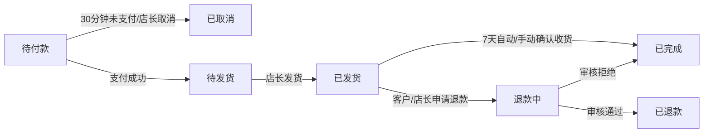
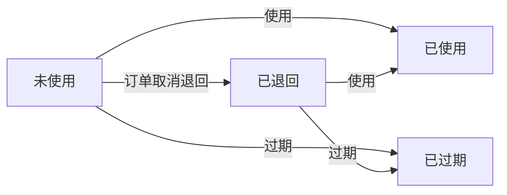

# 童趣优衣童装零售单店全栈系统 - 技术任务书(TASKS.md)

---

## 1. 项目技术规格
### 1.1 技术栈
| 分层 | 技术选型 | 版本要求 |
|------|----------|----------|
| 数据库 | MySQL | 8.0.35（InnoDB存储引擎） |
| 后端 | Spring Boot | 2.7.18 |
| 后端ORM框架 | MyBatis Plus | 3.5.5 |
| 后端接口文档 | Knife4j | 4.4.0（基于Swagger 3.0） |
| 后端身份认证 | JWT | HS256算法 |
| 后端短信服务 | 阿里云短信服务 | 中国大陆通用验证码模板 |
| 后端文件存储 | 阿里云OSS | 支持图片≤5MB、Excel≤100MB上传下载 |
| 后端支付服务 | 微信支付V3（JSAPI）、支付宝沙箱/正式（手机/电脑网站） | —— |
| 前端（管理后台） | Vue 3 | 3.3.11 |
| 前端（管理后台）UI框架 | Element Plus | 2.3.14 |
| 前端（管理后台）状态管理 | Pinia | 2.1.7 |
| 前端（管理后台）路由 | Vue Router 4 | 4.2.5 |
| 前端（管理后台）HTTP请求 | Axios | 1.6.2 |
| 前端（线上商城） | Vue 3 | 3.3.11 |
| 前端（线上商城）UI框架 | Vant 4 | 4.8.0 |
| 前端（线上商城）状态管理 | Pinia | 2.1.7 |
| 前端（线上商城）路由 | Vue Router 4 | 4.2.5 |
| 前端（线上商城）HTTP请求 | Axios | 1.6.2 |

### 1.2 项目结构规范
```
tongquyouyi/
├── back/                     # 后端项目根目录
│   ├── src/main/
│   │   ├── java/com/tongquyouyi/
│   │   │   ├── controller/   # 接口层（分admin和store模块）
│   │   │   ├── service/      # 业务逻辑接口层
│   │   │   ├── service/impl/ # 业务逻辑实现层
│   │   │   ├── mapper/       # 数据访问层（含MyBatis Plus XML）
│   │   │   ├── entity/       # 数据库实体类
│   │   │   ├── dto/          # 数据传输对象（请求参数）
│   │   │   ├── vo/           # 视图对象（响应数据）
│   │   │   ├── config/       # 配置类（JWT、OSS、支付、跨域、定时任务等）
│   │   │   ├── utils/        # 工具类（BCrypt加密、验证码生成、文件上传、EasyExcel、日期处理等）
│   │   │   ├── interceptor/  # 拦截器（JWT身份认证、接口IP防刷、XSS过滤）
│   │   │   ├── task/         # 定时任务（会员等级调整、订单自动取消/确认、库存预警刷新、数据备份等）
│   │   │   └── exception/    # 自定义异常类
│   │   └── resources/
│   │       ├── mapper/        # MyBatis Plus XML映射文件
│   │       ├── application.yml # 主配置文件
│   │       ├── application-dev.yml # 开发环境配置
│   │       └── application-prod.yml # 生产环境配置
│   ├── pom.xml                # Maven依赖配置
│   └── tongquyouyi.sql        # 数据库初始化脚本
├── front/                     # 前端项目根目录
│   ├── admin/                 # 管理后台前端
│   │   ├── src/
│   │   │   ├── api/           # 接口调用封装（分模块）
│   │   │   ├── assets/        # 静态资源（图片、图标、全局样式）
│   │   │   ├── components/    # 公共组件（Layout、登录页、404、Sku选择器、图片裁剪、Excel导入导出等）
│   │   │   ├── router/        # 路由配置（分权限路由）
│   │   │   ├── stores/        # Pinia状态管理（用户、门店、购物车（如果有）等）
│   │   │   ├── utils/         # 工具函数（请求/响应拦截、日期处理、文件下载、正则校验等）
│   │   │   ├── views/         # 页面组件（严格按需求模块划分）
│   │   │   ├── App.vue        # 根组件
│   │   │   └── main.js        # 入口文件
│   │   ├── vite.config.js     # Vite构建配置
│   │   ├── package.json       # 依赖配置
│   │   ├── .env.development   # 开发环境变量
│   │   └── .env.production    # 生产环境变量
│   └── store/                 # 线上商城前端
│       ├── src/
│       │   ├── api/           # 接口调用封装（分模块）
│       │   ├── assets/        # 静态资源（图片、图标、全局样式）
│       │   ├── components/    # 公共组件（TabBar、Layout、404、Sku选择器、图片裁剪等）
│       │   ├── router/        # 路由配置（分权限路由）
│       │   ├── stores/        # Pinia状态管理（用户、购物车、收货地址等）
│       │   ├── utils/         # 工具函数（请求/响应拦截、日期处理、文件下载、正则校验等）
│       │   ├── views/         # 页面组件（严格按需求模块划分）
│       │   ├── App.vue        # 根组件
│       │   └── main.js        # 入口文件
│       ├── vite.config.js     # Vite构建配置
│       ├── package.json       # 依赖配置
│       ├── .env.development   # 开发环境变量
│       └── .env.production    # 生产环境变量
└── deploy/                    # 部署配置目录
    ├── back/                 # 后端部署配置
    │   ├── Dockerfile        # Docker镜像构建文件
    │   ├── docker-compose.yml # Docker Compose编排文件（含MySQL、Redis、Nginx）
    │   └── nginx.conf        # 后端Nginx反向代理配置
    └── front/                # 前端部署配置
        ├── admin/             # 管理后台Nginx配置、Dockerfile
        └── store/             # 线上商城Nginx配置、Dockerfile
```

### 1.3 代码生成规则
- **依赖版本**：严格遵循1.1技术栈中的版本号，禁止随意升级/降级，如需调整需提交说明并验证兼容性
- **数据校验**：
  - 后端：使用`javax.validation.constraints`（SpringBoot 2.7.x默认）+ 自定义校验注解（如`@Phone`、`@Ean13`），统一返回`TQY_000001`的参数校验错误
  - 前端（管理后台）：使用`Element Plus`内置的`el-form`表单校验，自定义校验规则与后端一致
  - 前端（线上商城）：使用`Vant`内置的`van-form`表单校验，自定义校验规则与后端一致
- **JWT配置**：
  - Token生成：使用HS256算法，Header为`Authorization`，前缀为`Bearer `，Payload包含`userId`、`userType`（ADMIN/STORE）、`createTime`、`expireTime`
  - 有效期：Token有效期7天，刷新Token有效期14天；有效期内（剩余≤2天）访问接口自动刷新Token和刷新Token
  - 存储：管理后台/线上商城均存储在`localStorage`中
- **分页规则**：
  - 后端：统一使用`MyBatis Plus`的`Page<T>`分页插件，默认每页10条，最大每页100条；分页请求参数统一为`pageNum`、`pageSize`，默认值为`1`、`10`
  - 前端：统一封装分页组件，与后端分页参数一致
- **文件上传**：
  - 格式要求：图片（JPG/PNG/GIF，宽高比要求按业务规则）、Excel（XLS/XLSX）
  - 大小限制：图片≤5MB、Excel≤100MB
  - 重命名规则：`yyyyMMddHHmmssSSS_随机6位.后缀`
  - 存储路径：阿里云OSS路径为`tongquyouyi/{type}/yyyyMMdd/`，其中`type`为`product/avatar/order/report/banner`等
- **接口响应格式**：统一响应格式，错误时返回错误码和错误信息，成功时返回业务数据（可选）：
  ```json
  {
    "code": 200,
    "msg": "操作成功",
    "data": {}
  }
  ```
- **XSS防护**：
  - 后端：所有用户输入的文本内容（商品描述、评价内容、会员备注、订单备注等）在存储前使用`Jsoup`的`clean()`方法过滤，使用`Whitelist.relaxed()`
  - 前端：所有从后端获取的文本内容在展示时使用Vue3的`v-text`指令（默认转义），富文本内容使用`v-html`指令但需经过后端XSS过滤

---

## 2. 前端页面开发清单
### 2.1 B2S管理后台页面（front/admin/src/views/）
| 模块 | 页面路径 | 核心功能 | 必用组件 | 接口调用 | 跳转关系 |
|------|----------|----------|----------|----------|----------|
| 登录/权限 | /login | 账号密码登录、验证码刷新、首次登录初始化引导 | ElForm、ElInput、ElButton、ElImage、ElDialog | /api/admin/auth/login、/api/admin/auth/captcha、/api/admin/system/store/init | 登录成功→（首次初始化→弹窗引导修改初始密码、绑定手机号、完善门店信息→完成后跳转/dashboard）；退出→/login |
| 系统首页 | /dashboard | 销售概览卡片、今日/昨日/本周/本月数据对比、待处理库存预警列表（Top5）、待处理订单列表（Top5）、快捷入口（商品入库/录入、线下订单、报表中心） | ElCard、ElStatistic、ElTable、ElBadge、ElButton、ElRow、ElCol | /api/admin/dashboard/summary、/api/admin/dashboard/warning/list、/api/admin/dashboard/order/list | 快捷入口→对应功能页；预警/订单列表→对应详情页 |
| 商品管理 | /product/category-tag | 童装分类管理（新增、编辑、删除、排序）、童装标签管理（新增、编辑、删除） | ElTable、ElForm、ElInput、ElButtonGroup、ElMessageBox | /api/admin/product/category/list、/api/admin/product/category/save、/api/admin/product/category/delete、/api/admin/product/tag/list、/api/admin/product/tag/save、/api/admin/product/tag/delete | 无 |
| 商品管理 | /product/list | 童装商品列表展示、搜索（商品名称/条码）、筛选（分类、标签、上下架状态）、排序（上架时间倒序/销量倒序）、批量上下架、批量删除（仅符合条件的）、新增、编辑、查看详情 | ElTable、ElSearch、ElTag、ElSwitch、ElButtonGroup、ElMessageBox、ElPagination | /api/admin/product/list、/api/admin/product/updown、/api/admin/product/delete、/api/admin/product/get | 新增→/product/add；编辑→/product/edit/:id；详情→/product/detail/:id |
| 商品管理 | /product/add | 新增童装商品基础信息、SKU结构设置（颜色/尺码等属性，童装预设尺码）、SKU库存/成本价/条码管理、预览商品 | ElForm、ElUpload、ElTabs、ElInputNumber、ElSelect、ElButtonGroup、ElDialog（SKU结构/预览）、ElMessage | /api/admin/product/save、/api/admin/product/category/list、/api/admin/product/tag/list | 保存成功→/product/list |
| 商品管理 | /product/edit/:id | 编辑童装商品基础信息（已上架不能改分类、SKU结构）、下架后修改SKU结构、SKU库存/成本价/条码管理、预览商品 | 同上 | /api/admin/product/get、/api/admin/product/update、/api/admin/product/category/list、/api/admin/product/tag/list | 保存成功→/product/list |
| 商品管理 | /product/detail/:id | 查看童装商品完整信息（基础信息、分类、标签、SKU列表、操作日志） | ElDescriptions、ElTable、ElTimeline | /api/admin/product/get、/api/admin/product/log | 返回→/product/list |
| 库存管理 | /inventory/stock-in | 童装普通入库（选择SKU、填写入库数量、成本价、供应商、备注）、下载批量入库Excel模板、批量导入入库、入库单列表/详情查看 | ElForm、ElUpload、ElTable、ElButton、ElDialog（普通入库/详情）、ElDownload、ElPagination | /api/admin/inventory/stock-in/save、/api/admin/inventory/stock-in/list、/api/admin/inventory/stock-in/template、/api/admin/inventory/stock-in/import、/api/admin/inventory/stock-in/get | 无 |
| 库存管理 | /inventory/stock-out | 童装手工出库（选择SKU、填写出库数量、出库原因、备注）、出库单列表/详情查看（含销售出库、盘点差异出库、退货入库） | ElForm、ElTable、ElButton、ElDialog（手工出库/详情）、ElSelect、ElPagination | /api/admin/inventory/stock-out/save、/api/admin/inventory/stock-out/list、/api/admin/inventory/stock-out/get | 无 |
| 库存管理 | /inventory/check | 创建童装盘点单（选择盘点范围：全仓/指定分类/指定标签/指定SKU）、盘点单列表/详情查看、录入盘点数据（支持手动/扫码枪快速定位）、确认盘点结果 | ElForm、ElTable、ElButton、ElDialog（创建盘点单/详情/录入）、ElMessageBox、ElPagination | /api/admin/inventory/check/create、/api/admin/inventory/check/list、/api/admin/inventory/check/get、/api/admin/inventory/check/update、/api/admin/inventory/check/confirm | 无 |
| 库存管理 | /inventory/warning | 童装SKU预警阈值批量/单个设置、待处理/已处理库存预警列表/查看、标记已处理 | ElForm、ElTable、ElButton、ElDialog（批量设置阈值）、ElSelect、ElPagination | /api/admin/inventory/warning/set、/api/admin/inventory/warning/list、/api/admin/inventory/warning/mark-handled | 无 |
| 会员管理 | /member/level-rule | 童装会员等级管理（新增、编辑、删除、排序）、积分获取/消费规则管理、储值活动管理（新增、编辑、删除） | ElTabs、ElTable、ElForm、ElInput、ElInputNumber、ElSelect、ElButtonGroup、ElMessageBox、ElDatePicker、ElPagination | /api/admin/member/level/list、/api/admin/member/level/save、/api/admin/member/level/delete、/api/admin/member/point-rule/get、/api/admin/member/point-rule/save、/api/admin/member/stored-activity/list、/api/admin/member/stored-activity/save、/api/admin/member/stored-activity/delete | 无 |
| 会员管理 | /member/coupon | 童装优惠券模板管理（创建、编辑、删除、查看发放/使用统计）、优惠券定向发放（单个/批量，含会员筛选） | ElTable、ElForm、ElInput、ElInputNumber、ElSelect、ElCascader、ElButtonGroup、ElMessageBox、ElDatePicker、ElDialog（定向发放）、ElPagination | /api/admin/member/coupon/list、/api/admin/member/coupon/save、/api/admin/member/coupon/delete、/api/admin/member/coupon/get、/api/admin/member/coupon/grant、/api/admin/member/list（筛选） | 详情→/member/coupon/detail/:id |
| 会员管理 | /member/list | 童装会员列表展示、搜索（手机号/姓名/昵称）、筛选（等级、注册/录入时间、累计消费金额/次数、储值余额、积分余额）、查看详情、手动调整积分、手动调整储值 | ElTable、ElSearch、ElTag、ElButton、ElDialog（手动调整积分/储值）、ElPagination | /api/admin/member/list、/api/admin/member/get、/api/admin/member/point/adjust、/api/admin/member/stored-value/adjust | 详情→/member/detail/:id |
| 会员管理 | /member/detail/:id | 查看童装会员完整信息（基础信息、等级、积分余额、储值余额）、查看所有相关记录（消费记录、积分变动记录、储值变动记录、优惠券使用/领取记录） | ElDescriptions、ElTabs、ElTable、ElPagination | /api/admin/member/get、/api/admin/member/consume/log、/api/admin/member/point/log、/api/admin/member/stored-value/log、/api/admin/member/coupon/log | 返回→/member/list |
| 订单管理 | /order/list | 全渠道童装订单列表展示、搜索（订单编号、客户手机号、商品名称/SKU条码）、筛选（渠道、状态、支付方式、下单时间）、查看详情、取消订单、发货、确认收货、退款审核 | ElTable、ElSearch、ElTag、ElButtonGroup、ElDialog（取消/发货/退款审核/详情）、ElMessageBox、ElPagination | /api/admin/order/list、/api/admin/order/get、/api/admin/order/cancel、/api/admin/order/ship、/api/admin/order/confirm-receive、/api/admin/order/refund/audit | 详情→/order/detail/:id |
| 订单管理 | /order/offline-add | 快速录入童装线下订单（支持扫码枪扫描商品条码快速定位SKU、选择数量、关联/不关联会员、选择优惠、选择支付方式） | ElForm、ElTable、ElButton、ElDialog（选择商品/选择优惠）、ElInputNumber、ElSelect、ElSearch | /api/admin/order/offline/save、/api/admin/product/sku/search、/api/admin/member/get、/api/admin/member/coupon/list（符合条件） | 保存成功→/order/list |
| 报表中心 | /report/sales | 童装销售概览（今日/昨日/本周/上周/本月/上月/自定义时间段）、销售明细报表、商品销售排行、导出Excel | ElCard、ElStatistic、ElDatePicker、ElSelect、ElTable、ElButton、ElDownload、ElPagination | /api/admin/report/sales/summary、/api/admin/report/sales/detail、/api/admin/report/sales/rank、/api/admin/report/sales/export | 无 |
| 报表中心 | /report/inventory | 童装库存概览、库存明细报表、库存变动报表、导出Excel | ElCard、ElStatistic、ElDatePicker、ElSelect、ElTable、ElButton、ElDownload、ElPagination | /api/admin/report/inventory/summary、/api/admin/report/inventory/detail、/api/admin/report/inventory/change、/api/admin/report/inventory/export | 无 |
| 报表中心 | /report/member | 童装会员概览、会员消费排行、会员增长报表、导出Excel | ElCard、ElStatistic、ElDatePicker、ElSelect、ElTable、ElButton、ElDownload、ElPagination | /api/admin/report/member/summary、/api/admin/report/member/rank、/api/admin/report/member/growth、/api/admin/report/member/export | 无 |
| 系统管理 | /system/profile | 查看/修改店长个人信息（头像、昵称、手机号，修改手机号需验证）、修改密码 | ElForm、ElUpload、ElButton、ElDialog、ElMessage | /api/admin/system/profile/get、/api/admin/system/profile/update、/api/admin/system/profile/password、/api/admin/auth/send-sms | 无 |
| 系统管理 | /system/store | 查看/修改门店基础信息（名称、logo、地址、联系电话、营业时间）、常用物流管理、轮播图管理、商品排序规则设置 | ElForm、ElUpload、ElButton、ElDialog、ElTable、ElInput、ElSelect、ElMessage | /api/admin/system/store/get、/api/admin/system/store/update | 无 |
| 系统管理 | /system/log | 查看操作日志列表、搜索（操作人、操作模块、操作内容）、筛选（操作时间） | ElTable、ElSearch、ElDatePicker、ElPagination | /api/admin/system/log/list | 无 |

### 2.2 B2C线上商城页面（front/store/src/views/）
| 模块 | 页面路径 | 核心功能 | 必用组件 | 接口调用 | 跳转关系 |
|------|----------|----------|----------|----------|----------|
| 首页 | / | 门店轮播图展示、童装快捷分类展示、新品/热销/清仓专区展示（每个最多10个）、搜索框 | VanSwipe、VanGrid、VanGridItem、VanCard、VanTabs、VanSearch、VanPullRefresh | /api/store/index/banner、/api/store/index/category、/api/store/index/product、/api/store/product/search | 分类/标签/商品→商品列表/详情页；搜索→商品列表页 |
| 商品列表 | /product/list | 童装商品展示、分类/标签/价格区间/颜色/尺码筛选、销量优先/价格升序/降序/上架时间优先排序、搜索、下拉刷新、上拉加载更多 | VanNavBar、VanSearch、VanFilter、VanPullRefresh、VanList、VanCard、VanPagination | /api/store/product/list、/api/store/product/search | 商品→/product/detail/:id |
| 商品详情 | /product/detail/:id | 童装商品信息展示（主图轮播、详情图、名称、分类、标签、吊牌价、销售价、库存）、SKU选择（颜色/尺码）、商品评价展示（最多100条，时间倒序）、加入购物车、立即购买、收藏/取消收藏 | VanNavBar、VanSwipe、VanGoodsAction、VanGoodsActionIcon、VanGoodsActionButton、VanSku、VanRate、VanDialog（SKU选择）、VanToast | /api/store/product/get、/api/store/cart/add、/api/store/favorite/toggle、/api/store/favorite/check | 立即购买→/checkout；加入购物车→/cart；返回→上一页 |
| 购物车 | /cart | 童装购物车商品管理（修改SKU、修改数量、删除、全选/取消全选）、自动计算小计/总额、库存为0的商品显示「已失效」、结算 | VanNavBar、VanCart、VanSubmitBar、VanDialog（修改SKU/数量）、VanToast、VanPullRefresh | /api/store/cart/list、/api/store/cart/update、/api/store/cart/delete、/api/store/cart/selected、/api/store/product/get（失效商品跳转） | 结算→/checkout；失效商品→商品详情页（如果上架）；返回→上一页 |
| 结算 | /checkout | 童装收货地址管理（新增/修改/删除/选择默认/选择）、商品明细展示、优惠明细展示（符合条件的优惠券、积分抵扣、会员折扣）、实付金额计算、支付方式选择（微信/支付宝/储值余额）、下单确认 | VanNavBar、VanAddressList、VanAddressEdit、VanStepper、VanCouponCell、VanCouponList、VanCheckbox、VanSubmitBar、VanDialog（积分抵扣设置）、VanToast | /api/store/address/list、/api/store/address/save、/api/store/address/delete、/api/store/address/default、/api/store/cart/selected、/api/store/coupon/list（符合条件）、/api/store/order/create | 支付成功→/order/detail/:id；支付失败→/order/list?status=0；返回→/cart |
| 我的订单 | /order/list | 童装订单列表展示、按订单状态分类（待付款、待发货、已发货、已完成、已取消）、下拉刷新、上拉加载更多、「待付款」订单支付、「已发货」订单查看物流信息、「待发货/已发货」订单申请退款、「已发货」订单确认收货 | VanNavBar、VanTabs、VanPullRefresh、VanList、VanOrderCard、VanDialog（申请退款/查看物流）、VanToast | /api/store/order/list、/api/store/order/pay、/api/store/order/refund、/api/store/order/confirm-receive、/api/store/order/get | 订单→/order/detail/:id；返回→上一页 |
| 我的订单 | /order/detail/:id | 查看童装订单完整信息（商品明细、优惠明细、实付金额、支付方式、收货地址、物流信息、操作日志） | VanNavBar、VanDescriptions、VanSteps、VanTable | /api/store/order/get | 返回→/order/list |
| 我的收藏 | /favorite | 童装收藏商品列表展示、下拉刷新、上拉加载更多、取消收藏、跳转商品详情 | VanNavBar、VanPullRefresh、VanList、VanCard、VanCheckbox、VanButton、VanToast | /api/store/favorite/list、/api/store/favorite/delete、/api/store/product/get | 商品→/product/detail/:id；返回→上一页 |
| 我的积分 | /point | 查看童装积分余额、积分获取/消费记录、下拉刷新、上拉加载更多 | VanNavBar、VanCell、VanCellGroup、VanList、VanPullRefresh | /api/store/point/summary、/api/store/point/log | 返回→上一页 |
| 我的储值 | /stored-value | 查看童装储值余额、储值/消费记录、参与的储值活动、储值充值（选择储值活动、支付方式） | VanNavBar、VanCell、VanCellGroup、VanList、VanPullRefresh、VanButton、VanDialog（储值充值）、VanToast | /api/store/stored-value/summary、/api/store/stored-value/log、/api/store/stored-value/activity/list、/api/store/stored-value/recharge | 充值→支付页面；返回→上一页 |
| 我的优惠券 | /coupon | 查看童装优惠券列表、按优惠券状态分类（未使用、已使用、已过期）、下拉刷新、上拉加载更多、「未使用」优惠券跳转商品列表页（适用范围） | VanNavBar、VanTabs、VanPullRefresh、VanList、VanCoupon、VanToast | /api/store/coupon/list | 未使用→/product/list；返回→上一页 |
| 收货地址 | /address | 童装收货地址列表展示、新增/修改/删除/设置默认收货地址 | VanNavBar、VanAddressList、VanAddressEdit、VanToast | /api/store/address/list、/api/store/address/save、/api/store/address/delete、/api/store/address/default | 返回→上一页 |
| 个人中心 | /user | 童装会员个人信息展示、我的订单入口、我的收藏/积分/储值/优惠券/收货地址入口、退出登录 | VanNavBar、VanUser、VanCell、VanCellGroup、VanButton、VanToast | /api/store/user/get、/api/store/auth/logout | 各入口→对应功能页；退出→/login；返回→上一页 |
| 个人信息 | /user/profile | 查看/修改童装会员个人信息（头像、昵称、生日、宝宝性别、宝宝年龄） | VanNavBar、VanForm、VanUploader、VanButton、VanToast | /api/store/user/get、/api/store/user/update | 返回→/user |
| 注册/登录 | /login | 手机号+验证码登录/注册（自动判断，未注册则自动注册，首次注册需完善个人信息） | VanNavBar、VanForm、VanCell、VanButton、VanToast | /api/store/auth/send-sms、/api/store/auth/login | 登录成功→/user/profile（首次注册）或/；返回→上一页 |

---

## 3. 后端接口开发清单
### 3.1 接口设计规范
- **接口分组**：所有接口按`Knife4j`分组，分为「童趣优衣B2S管理后台接口」「童趣优衣B2C线上商城接口」「公共接口（验证码发送等）」
- **请求方式**：查询操作使用`GET`，新增/修改/删除操作使用`POST`（部分删除操作也可使用`DELETE`，但为了统一使用`POST`）
- **请求参数**：GET请求参数放在URL Query中，POST请求参数放在`application/json`的Body中；文件上传请求使用`multipart/form-data`
- **响应状态码**：HTTP状态码统一为`200`，业务状态码统一放在`code`字段中；业务状态码`200`表示成功，其他表示失败
- **幂等性要求**：新增/修改/删除操作中，涉及订单、支付、库存变动等关键业务的接口必须实现幂等性（使用唯一请求ID或业务编号作为幂等键）

### 3.2 B2S管理后台接口（前缀/api/admin）
| 模块 | URL | 请求方式 | 请求参数 | 响应格式 | 业务逻辑 | 关联数据库表 |
|------|-----|----------|----------|----------|----------|--------------|
| 公共接口 | /auth/send-sms | POST | {phone:""} | {code:200,msg:"发送成功"} | 发送手机号验证码（仅管理后台使用，频率限制：1分钟1次、1小时5次、1天20次）、缓存验证码，有效期5分钟 | - |
| 登录/权限 | /auth/captcha | GET | 无 | {code:200,msg:"成功",data:{captchaKey:"",captchaImg:""}} | 生成图形验证码，缓存captchaKey和验证码值，有效期5分钟 | - |
| 登录/权限 | /auth/login | POST | {username:"",password:"",captchaKey:"",captcha:""} | {code:200,msg:"登录成功",data:{token:"",refreshToken:"",needInit:false}} | 校验验证码、账号密码；校验通过生成JWT Token和刷新Token；首次登录返回`needInit:true` | tqy_admin |
| 登录/权限 | /auth/refresh | POST | {refreshToken:""} | {code:200,msg:"刷新成功",data:{token:"",refreshToken:""}} | 校验刷新Token；校验通过生成新的Token和刷新Token | - |
| 登录/权限 | /auth/logout | POST | 无 | {code:200,msg:"退出成功"} | 清除Redis中的Token和刷新Token | - |
| 系统首页 | /dashboard/summary | GET | 无 | {code:200,msg:"成功",data:{todayOrders:0,todaySales:0.00,todayProfit:0.00,pendingOrders:0,pendingWarnings:0,compareYesterDay:{orders:-5,sales:-10.00,profit:-8.00}}} | 统计今日/昨日销售/订单、待处理订单、待处理预警 | tqy_order、tqy_order_item、tqy_sku、tqy_inventory_warning |
| 系统首页 | /dashboard/warning/list | GET | 无 | {code:200,msg:"成功",data:{total:0,list:[]}} | 查询Top5待处理的库存预警（按预警时间倒序） | tqy_sku、tqy_inventory_warning |
| 系统首页 | /dashboard/order/list | GET | 无 | {code:200,msg:"成功",data:{total:0,list:[]}} | 查询Top5待发货、退款中的订单（按下单时间倒序） | tqy_order、tqy_member |
| 系统管理 | /system/store/init | POST | {password:"",phone:"",code:"",store:{}} | {code:200,msg:"初始化成功"} | 首次登录初始化：修改初始密码、验证手机号、完善门店基础信息、变更管理员初始化状态为已完成 | tqy_admin、tqy_store_info |
| 系统管理 | /system/profile/get | GET | 无 | {code:200,msg:"成功",data:{}} | 查询当前登录店长的个人信息 | tqy_admin |
| 系统管理 | /system/profile/update | POST | {profile:{}} | {code:200,msg:"修改成功"} | 修改当前登录店长的个人信息（修改手机号需验证新手机号的验证码） | tqy_admin |
| 系统管理 | /system/profile/password | POST | {oldPassword:"",newPassword:"",confirmPassword:""} | {code:200,msg:"修改成功，请重新登录"} | 修改当前登录店长的密码（BCrypt加密存储） | tqy_admin |
| 系统管理 | /system/store/get | GET | 无 | {code:200,msg:"成功",data:{}} | 查询门店基础信息、常用物流、轮播图、商品排序规则 | tqy_store_info |
| 系统管理 | /system/store/update | POST | {store:{}} | {code:200,msg:"修改成功"} | 修改门店基础信息、常用物流、轮播图、商品排序规则 | tqy_store_info |
| 系统管理 | /system/log/list | GET | {pageNum:1,pageSize:10,operator:"",startTime:"",endTime:"",module:""} | {code:200,msg:"成功",data:{total:0,list:[]}} | 分页查询操作日志列表，支持多条件筛选 | tqy_operation_log |
| 商品管理 | /product/category/list | GET | 无 | {code:200,msg:"成功",data:{list:[]}} | 查询所有童装分类列表（按排序升序） | tqy_product_category |
| 商品管理 | /product/category/save | POST | {category:{}} | {code:200,msg:"保存成功",data:{id:""}} | 保存/修改童装分类 | tqy_product_category |
| 商品管理 | /product/category/delete | POST | {id:""} | {code:200,msg:"删除成功"} | 删除童装分类（仅允许删除非预设且无商品使用的分类） | tqy_product_category、tqy_product |
| 商品管理 | /product/tag/list | GET | 无 | {code:200,msg:"成功",data:{list:[]}} | 查询所有童装标签列表 | tqy_product_tag |
| 商品管理 | /product/tag/save | POST | {tag:{}} | {code:200,msg:"保存成功",data:{id:""}} | 保存/修改童装标签 | tqy_product_tag |
| 商品管理 | /product/tag/delete | POST | {id:""} | {code:200,msg:"删除成功"} | 删除童装标签（仅允许删除非预设且无商品使用的标签） | tqy_product_tag、tqy_product_tag_relation |
| 商品管理 | /product/list | GET | {pageNum:1,pageSize:10,keyword:"",categoryId:"",tag:"",status:"",sortBy:""} | {code:200,msg:"成功",data:{total:0,list:[]}} | 分页查询童装商品列表，支持多条件筛选、排序 | tqy_product、tqy_product_category、tqy_product_tag_relation、tqy_product_tag |
| 商品管理 | /product/get | GET | {id:""} | {code:200,msg:"成功",data:{}} | 查询童装商品完整信息（含SKU列表、分类、标签） | tqy_product、tqy_product_category、tqy_product_tag_relation、tqy_product_tag、tqy_sku |
| 商品管理 | /product/save | POST | {product:{},skuList:[]} | {code:200,msg:"保存成功",data:{id:""}} | 保存童装商品基础信息、生成/保存SKU列表、关联分类和标签 | tqy_product、tqy_product_category、tqy_product_tag_relation、tqy_product_tag、tqy_sku、tqy_operation_log |
| 商品管理 | /product/update | POST | {product:{},skuList:[]} | {code:200,msg:"修改成功"} | 修改童装商品基础信息（已上架不能改分类、SKU结构）、修改/新增/删除SKU | 同上 |
| 商品管理 | /product/updown | POST | {ids:[],status:""} | {code:200,msg:"操作成功"} | 批量或单个切换童装商品上下架状态（上架前检查至少1个SKU有库存） | tqy_product、tqy_sku、tqy_operation_log |
| 商品管理 | /product/delete | POST | {ids:[]} | {code:200,msg:"删除成功"} | 批量删除童装商品（仅允许删除已下架且无库存、无订单记录的商品） | tqy_product、tqy_product_tag_relation、tqy_sku、tqy_order_item、tqy_operation_log |
| 商品管理 | /product/log | GET | {id:"",pageNum:1,pageSize:10} | {code:200,msg:"成功",data:{total:0,list:[]}} | 查询童装商品的操作日志 | tqy_operation_log |
| 商品管理 | /product/sku/search | GET | {keyword:""} | {code:200,msg:"成功",data:{list:[]}} | 搜索童装SKU（匹配商品名称、SKU条码、属性值） | tqy_product、tqy_sku |
| 库存管理 | /inventory/stock-in/save | POST | {stockIn:{},stockInItemList:[]} | {code:200,msg:"入库成功",data:{stockInNo:""}} | 生成入库单（编号RK-YYYYMMDD-XXX）、增加对应SKU的库存、保存操作日志 | tqy_stock_in、tqy_stock_in_item、tqy_sku、tqy_operation_log |
| 库存管理 | /inventory/stock-in/list | GET | {pageNum:1,pageSize:10,keyword:"",startTime:"",endTime:""} | {code:200,msg:"成功",data:{total:0,list:[]}} | 分页查询入库单列表 | tqy_stock_in、tqy_admin |
| 库存管理 | /inventory/stock-in/get | GET | {id:""} | {code:200,msg:"成功",data:{}} | 查询入库单完整信息（含入库明细） | tqy_stock_in、tqy_stock_in_item、tqy_admin |
| 库存管理 | /inventory/stock-in/template | GET | 无 | 二进制流（Excel文件） | 下载批量入库Excel模板 | - |
| 库存管理 | /inventory/stock-in/import | POST | {file:""} | {code:200,msg:"导入成功，成功X条，失败X条",data:{failList:[]}} | 批量导入入库单、校验数据格式、处理成功/失败数据 | 同普通入库 |
| 库存管理 | /inventory/stock-out/save | POST | {stockOut:{},stockOutItemList:[]} | {code:200,msg:"出库成功",data:{stockOutNo:""}} | 生成手工出库单（编号CK-YYYYMMDD-XXX）、减少对应SKU的库存（检查库存是否充足）、保存操作日志 | tqy_stock_out、tqy_stock_out_item、tqy_sku、tqy_operation_log |
| 库存管理 | /inventory/stock-out/list | GET | {pageNum:1,pageSize:10,keyword:"",startTime:"",endTime:"",type:""} | {code:200,msg:"成功",data:{total:0,list:[]}} | 分页查询出库单列表（支持按类型筛选：销售、手工、盘点差异、退货） | tqy_stock_out、tqy_admin |
| 库存管理 | /inventory/stock-out/get | GET | {id:""} | {code:200,msg:"成功",data:{}} | 查询出库单完整信息（含出库明细） | tqy_stock_out、tqy_stock_out_item、tqy_admin |
| 库存管理 | /inventory/check/create | POST | {check:{}} | {code:200,msg:"创建成功",data:{checkNo:""}} | 生成盘点单（编号PD-YYYYMMDD-XXX）、根据盘点范围生成盘点明细（显示系统库存，实际库存为空）、保存操作日志 | tqy_stock_check、tqy_stock_check_item、tqy_sku、tqy_operation_log |
| 库存管理 | /inventory/check/update | POST | {check:{},checkItemList:[]} | {code:200,msg:"修改成功"} | 修改盘点单的盘点明细（录入实际库存） | tqy_stock_check、tqy_stock_check_item |
| 库存管理 | /inventory/check/confirm | POST | {id:""} | {code:200,msg:"确认成功"} | 核对系统库存与实际库存的差异、生成盘点差异入库/出库单、调整对应SKU的库存、变更盘点单状态为已完成、保存操作日志 | 同盘点创建+库存出入库 |
| 库存管理 | /inventory/check/list | GET | {pageNum:1,pageSize:10,keyword:"",startTime:"",endTime:"",status:""} | {code:200,msg:"成功",data:{total:0,list:[]}} | 分页查询盘点单列表 | tqy_stock_check、tqy_admin |
| 库存管理 | /inventory/check/get | GET | {id:""} | {code:200,msg:"成功",data:{}} | 查询盘点单完整信息（含盘点明细） | tqy_stock_check、tqy_stock_check_item、tqy_admin |
| 库存管理 | /inventory/warning/set | POST | {skuList:[],minStock:"",maxStock:""} | {code:200,msg:"设置成功"} | 批量或单个设置SKU的最低/最高库存预警阈值 | tqy_sku |
| 库存管理 | /inventory/warning/list | GET | {pageNum:1,pageSize:10,type:"",categoryId:"",tag:""} | {code:200,msg:"成功",data:{total:0,list:[]}} | 分页查询库存预警列表（支持按类型筛选：缺货、积压） | tqy_sku、tqy_product |
| 库存管理 | /inventory/warning/mark-handled | POST | {ids:[]} | {code:200,msg:"标记成功"} | 批量标记库存预警为已处理 | tqy_sku |
| 会员管理 | /member/level/list | GET | 无 | {code:200,msg:"成功",data:{list:[]}} | 查询所有会员等级列表（按排序升序） | tqy_member_level |
| 会员管理 | /member/level/save | POST | {level:{}} | {code:200,msg:"保存成功",data:{id:""}} | 保存/修改会员等级（普通会员不可删除、不可修改升级条件） | tqy_member_level |
| 会员管理 | /member/level/delete | POST | {id:""} | {code:200,msg:"删除成功"} | 删除会员等级（仅允许删除非普通会员且无会员使用的等级） | tqy_member_level、tqy_member |
| 会员管理 | /member/point-rule/get | GET | 无 | {code:200,msg:"成功",data:{}} | 查询积分获取/消费规则 | tqy_member_point_rule |
| 会员管理 | /member/point-rule/save | POST | {rule:{}} | {code:200,msg:"保存成功"} | 保存/修改积分获取/消费规则 | tqy_member_point_rule |
| 会员管理 | /member/stored-activity/list | GET | {status:""} | {code:200,msg:"成功",data:{list:[]}} | 查询所有储值活动列表（支持按状态筛选：未开始、进行中、已结束） | tqy_member_stored_activity |
| 会员管理 | /member/stored-activity/save | POST | {activity:{}} | {code:200,msg:"保存成功",data:{id:""}} | 保存/修改储值活动（有效期内不可设置重复的储值金额，已结束的活动不可修改） | tqy_member_stored_activity |
| 会员管理 | /member/stored-activity/delete | POST | {id:""} | {code:200,msg:"删除成功"} | 删除储值活动（仅允许删除未开始的活动） | tqy_member_stored_activity |
| 会员管理 | /member/coupon/list | GET | {pageNum:1,pageSize:10,keyword:"",status:""} | {code:200,msg:"成功",data:{total:0,list:[]}} | 查询所有优惠券模板列表（支持按状态筛选） | tqy_member_coupon_template |
| 会员管理 | /member/coupon/save | POST | {template:{}} | {code:200,msg:"保存成功",data:{id:""}} | 保存/修改优惠券模板、生成优惠券实例 | tqy_member_coupon_template、tqy_member_coupon |
| 会员管理 | /member/coupon/delete | POST | {id:""} | {code:200,msg:"删除成功"} | 删除优惠券模板（仅允许删除未开始的模板） | tqy_member_coupon_template、tqy_member_coupon |
| 会员管理 | /member/coupon/get | GET | {id:""} | {code:200,msg:"成功",data:{}} | 查询优惠券模板完整信息（含发放/使用统计） | tqy_member_coupon_template |
| 会员管理 | /member/coupon/grant | POST | {templateId:"",memberIds:[]} | {code:200,msg:"发放成功"} | 定向为单个/批量会员发放优惠券 | tqy_member_coupon_template、tqy_member_coupon |
| 会员管理 | /member/list | GET | {pageNum:1,pageSize:10,keyword:"",levelId:"",startTime:"",endTime:"",minConsume:"",maxConsume:""} | {code:200,msg:"成功",data:{total:0,list:[]}} | 分页查询会员列表，支持多条件筛选 | tqy_member、tqy_member_level |
| 会员管理 | /member/get | GET | {id:""} | {code:200,msg:"成功",data:{}} | 查询会员完整信息（含等级、积分、储值、最近5条消费记录） | tqy_member、tqy_member_level |
| 会员管理 | /member/consume/log | GET | {memberId:"",pageNum:1,pageSize:10} | {code:200,msg:"成功",data:{total:0,list:[]}} | 查询会员的消费记录 | tqy_order、tqy_order_item |
| 会员管理 | /member/point/adjust | POST | {memberId:"",adjustPoint:"",reason:""} | {code:200,msg:"调整成功"} | 手动调整会员积分、保存积分变动记录、保存操作日志 | tqy_member、tqy_member_point_log、tqy_operation_log |
| 会员管理 | /member/point/log | GET | {memberId:"",pageNum:1,pageSize:10} | {code:200,msg:"成功",data:{total:0,list:[]}} | 查询会员的积分变动记录 | tqy_member_point_log |
| 会员管理 | /member/stored-value/adjust | POST | {memberId:"",adjustAmount:"",payType:"",reason:""} | {code:200,msg:"调整成功"} | 手动调整会员储值余额、保存储值变动记录、保存操作日志 | tqy_member、tqy_member_stored_log、tqy_operation_log |
| 会员管理 | /member/stored-value/log | GET | {memberId:"",pageNum:1,pageSize:10} | {code:200,msg:"成功",data:{total:0,list:[]}} | 查询会员的储值变动记录 | tqy_member_stored_log |
| 会员管理 | /member/coupon/log | GET | {memberId:"",pageNum:1,pageSize:10} | {code:200,msg:"成功",data:{total:0,list:[]}} | 查询会员的优惠券使用/领取记录 | tqy_member_coupon |
| 订单管理 | /order/list | GET | {pageNum:1,pageSize:10,keyword:"",startTime:"",endTime:"",status:"",payType:"",channel:""} | {code:200,msg:"成功",data:{total:0,list:[]}} | 分页查询全渠道订单列表，支持多条件筛选 | tqy_order、tqy_member |
| 订单管理 | /order/get | GET | {id:""} | {code:200,msg:"成功",data:{}} | 查询订单完整信息（含商品明细、优惠明细、操作日志） | tqy_order、tqy_order_item、tqy_order_discount、tqy_operation_log |
| 订单管理 | /order/cancel | POST | {id:"",reason:""} | {code:200,msg:"取消成功"} | 取消订单（仅允许取消待付款、已付款未发货的线上订单）、原路返还积分/优惠券/储值余额、生成退款单（如已付款）、保存操作日志 | tqy_order、tqy_order_discount、tqy_member、tqy_member_coupon、tqy_member_point_log、tqy_member_stored_log、tqy_refund、tqy_operation_log |
| 订单管理 | /order/ship | POST | {id:"",logisticsName:"",trackingNo:""} | {code:200,msg:"发货成功"} | 发货（仅允许处理待发货的线上订单）、变更订单状态为已发货、生成销售出库单、保存操作日志 | tqy_order、tqy_stock_out、tqy_stock_out_item、tqy_sku、tqy_operation_log |
| 订单管理 | /order/confirm-receive | POST | {id:""} | {code:200,msg:"确认收货成功"} | 确认收货（仅允许处理已发货超过7天的线上订单）、变更订单状态为已完成、发放积分（如有）、确认结算、保存操作日志 | tqy_order、tqy_member、tqy_member_point_rule、tqy_member_point_log、tqy_operation_log |
| 订单管理 | /order/refund/audit | POST | {id:"",auditResult:"",auditOpinion:""} | {code:200,msg:"审核成功"} | 审核退款申请（仅允许处理退款中的订单）、审核通过则原路返还、生成退货入库单、变更订单状态为已退款；审核拒绝则变更订单状态为已完成；保存操作日志 | 同取消订单+库存入库 |
| 订单管理 | /order/offline/save | POST | {order:{},orderItemList:[]} | {code:200,msg:"录入成功",data:{orderNo:""}} | 快速录入线下订单（编号XD-YYYYMMDD-XXX）、关联会员（如有）、计算优惠/实付金额、生成销售出库单、保存操作日志 | tqy_order、tqy_order_item、tqy_order_discount、tqy_member、tqy_member_level、tqy_member_coupon、tqy_member_point_rule、tqy_member_point_log、tqy_member_stored_log、tqy_stock_out、tqy_stock_out_item、tqy_sku、tqy_operation_log |
| 订单管理 | /order/log | GET | {id:"",pageNum:1,pageSize:10} | {code:200,msg:"成功",data:{total:0,list:[]}} | 查询订单的操作日志 | tqy_operation_log |
| 报表中心 | /report/sales/summary | GET | {startTime:"",endTime:""} | {code:200,msg:"成功",data:{}} | 统计指定时间段的销售概览 | tqy_order、tqy_order_item、tqy_sku |
| 报表中心 | /report/sales/detail | GET | {pageNum:1,pageSize:10,startTime:"",endTime:""} | {code:200,msg:"成功",data:{total:0,list:[]}} | 查询指定时间段的销售明细报表 | tqy_order、tqy_order_item、tqy_member |
| 报表中心 | /report/sales/rank | GET | {startTime:"",endTime:"",sortBy:"",categoryId:"",tag:""} | {code:200,msg:"成功",data:{list:[]}} | 查询指定时间段的商品销售排行 | tqy_order、tqy_order_item、tqy_product、tqy_product_category、tqy_product_tag |
| 报表中心 | /report/sales/export | GET | {startTime:"",endTime:""} | 二进制流（Excel文件） | 导出指定时间段的销售明细报表Excel | 同销售明细 |
| 报表中心 | /report/inventory/summary | GET | 无 | {code:200,msg:"成功",data:{}} | 统计当前的库存概览 | tqy_sku、tqy_inventory_warning |
| 报表中心 | /report/inventory/detail | GET | {pageNum:1,pageSize:10,categoryId:"",tag:"",hasStock:"",warningType:""} | {code:200,msg:"成功",data:{total:0,list:[]}} | 查询库存明细报表 | tqy_sku、tqy_product |
| 报表中心 | /report/inventory/change | GET | {pageNum:1,pageSize:10,startTime:"",endTime:"",type:""} | {code:200,msg:"成功",data:{total:0,list:[]}} | 查询指定时间段的库存变动报表 | tqy_stock_in、tqy_stock_in_item、tqy_stock_out、tqy_stock_out_item |
| 报表中心 | /report/inventory/export | GET | {startTime:"",endTime:"",type:""} | 二进制流（Excel文件） | 导出指定时间段的库存变动报表Excel | 同库存变动 |
| 报表中心 | /report/member/summary | GET | 无 | {code:200,msg:"成功",data:{}} | 统计当前的会员概览 | tqy_member、tqy_member_level |
| 报表中心 | /report/member/rank | GET | {startTime:"",endTime:"",sortBy:"",levelId:""} | {code:200,msg:"成功",data:{list:[]}} | 查询指定时间段的会员消费排行 | tqy_member、tqy_member_level、tqy_order |
| 报表中心 | /report/member/growth | GET | {startTime:"",endTime:"",groupBy:""} | {code:200,msg:"成功",data:{list:[]}} | 查询指定时间段的会员增长报表 | tqy_member |
| 报表中心 | /report/member/export | GET | {startTime:"",endTime:"",groupBy:""} | 二进制流（Excel文件） | 导出指定时间段的会员增长报表Excel | 同会员增长 |

### 3.3 B2C线上商城接口（前缀/api/store）
| 模块 | URL | 请求方式 | 请求参数 | 响应格式 | 业务逻辑 | 关联数据库表 |
|------|-----|----------|----------|----------|----------|--------------|
| 公共接口 | /auth/send-sms | POST | {phone:""} | {code:200,msg:"发送成功"} | 发送手机号验证码（频率限制：1分钟1次、1小时5次、1天20次）、缓存验证码，有效期5分钟 | - |
| 登录/权限 | /auth/login | POST | {phone:"",code:""} | {code:200,msg:"登录成功",data:{token:"",refreshToken:"",needInit:false}} | 校验验证码；未注册则自动注册（分配普通会员、赠送初始积分）；已注册则登录；生成JWT Token和刷新Token；首次注册返回`needInit:true` | tqy_member、tqy_member_level、tqy_member_point_rule |
| 登录/权限 | /auth/refresh | POST | {refreshToken:""} | {code:200,msg:"刷新成功",data:{token:"",refreshToken:""}} | 校验刷新Token；校验通过生成新的Token和刷新Token | - |
| 登录/权限 | /auth/logout | POST | 无 | {code:200,msg:"退出成功"} | 清除Redis中的Token和刷新Token | - |
| 首页 | /index/banner | GET | 无 | {code:200,msg:"成功",data:{list:[]}} | 查询门店设置的轮播图（按排序升序） | tqy_store_info |
| 首页 | /index/category | GET | 无 | {code:200,msg:"成功",data:{list:[]}} | 查询预设的6个童装分类（按排序升序） | tqy_product_category |
| 首页 | /index/product | GET | 无 | {code:200,msg:"成功",data:{newList:[],hotList:[],clearList:[]}} | 查询新品/热销/清仓专区的童装商品（每个最多10个，按门店设置的排序规则） | tqy_product、tqy_product_tag_relation、tqy_product_tag、tqy_sku |
| 商品列表 | /product/list | GET | {pageNum:1,pageSize:20,categoryId:"",tag:"",minPrice:"",maxPrice:"",attr1Value:"",attr2Value:"",sortBy:""} | {code:200,msg:"成功",data:{total:0,list:[]}} | 分页查询童装商品列表，支持多条件筛选、排序 | tqy_product、tqy_product_category、tqy_product_tag_relation、tqy_product_tag、tqy_sku |
| 商品列表 | /product/search | GET | {pageNum:1,pageSize:20,keyword:"",sortBy:""} | {code:200,msg:"成功",data:{total:0,list:[]}} | 搜索童装商品（匹配商品名称、描述、标签） | 同上 |
| 商品详情 | /product/get | GET | {id:""} | {code:200,msg:"成功",data:{}} | 查询童装商品完整信息（含SKU列表、评价列表） | tqy_product、tqy_product_category、tqy_product_tag_relation、tqy_product_tag、tqy_sku、tqy_product_review |
| 商品详情 | /favorite/check | GET | {productId:""} | {code:200,msg:"成功",data:{isFavorite:false}} | 查询当前登录会员是否已收藏该童装商品 | tqy_member_favorite |
| 商品详情 | /favorite/toggle | POST | {productId:""} | {code:200,msg:"操作成功"} | 收藏/取消收藏商品 | tqy_member_favorite |
| 购物车 | /cart/add | POST | {skuId:"",quantity:""} | {code:200,msg:"加入成功"} | 加入购物车（检查库存是否充足，已存在则增加数量） | tqy_member_cart、tqy_sku |
| 购物车 | /cart/list | GET | 无 | {code:200,msg:"成功",data:{list:[]}} | 查询当前登录会员的购物车列表（含商品、SKU信息） | tqy_member_cart、tqy_product、tqy_sku |
| 购物车 | /cart/update | POST | {id:"",skuId:"",quantity:""} | {code:200,msg:"修改成功"} | 修改购物车商品的SKU或数量（检查库存是否充足） | 同上 |
| 购物车 | /cart/delete | POST | {ids:[]} | {code:200,msg:"删除成功"} | 删除购物车商品 | tqy_member_cart |
| 购物车 | /cart/selected | POST | {ids:[]} | {code:200,msg:"操作成功"} | 全选/取消全选购物车商品 | tqy_member_cart |
| 收货地址 | /address/list | GET | 无 | {code:200,msg:"成功",data:{list:[]}} | 查询当前登录会员的收货地址列表（默认地址排第一） | tqy_member_address |
| 收货地址 | /address/save | POST | {address:{}} | {code:200,msg:"保存成功",data:{id:""}} | 保存/修改收货地址（最多保存5个，设置默认则取消其他地址的默认） | tqy_member_address |
| 收货地址 | /address/delete | POST | {id:""} | {code:200,msg:"删除成功"} | 删除收货地址 | tqy_member_address |
| 收货地址 | /address/default | POST | {id:""} | {code:200,msg:"设置成功"} | 设置默认收货地址 | tqy_member_address |
| 优惠券 | /coupon/list | GET | {status:"",orderAmount:""} | {code:200,msg:"成功",data:{list:[]}} | 查询当前登录会员的优惠券列表（支持按状态筛选，或按订单金额筛选符合条件的） | tqy_member_coupon、tqy_member_coupon_template |
| 订单 | /order/create | POST | {addressId:"",cartIds:[],couponId:"",usePoint:"",pointAmount:"",payType:""} | {code:200,msg:"创建成功",data:{orderNo:"",payParams:{}}} | 创建订单（编号DD-YYYYMMDD-XXX，线上订单）、计算优惠/实付金额、关联会员、冻结优惠券/积分/储值余额、调用支付接口返回支付参数 | tqy_order、tqy_order_item、tqy_order_discount、tqy_member、tqy_member_level、tqy_member_coupon、tqy_member_point_rule、tqy_member_address、tqy_sku |
| 订单 | /order/list | GET | {pageNum:1,pageSize:20,status:""} | {code:200,msg:"成功",data:{total:0,list:[]}} | 查询当前登录会员的订单列表（按状态分类） | tqy_order、tqy_order_item |
| 订单 | /order/get | GET | {id:""} | {code:200,msg:"成功",data:{}} | 查询订单完整信息（含商品明细、优惠明细、物流信息） | tqy_order、tqy_order_item、tqy_order_discount、tqy_member_address |
| 订单 | /order/pay | POST | {id:"",payType:""} | {code:200,msg:"发起支付成功",data:{payParams:{}}} | 重新发起订单支付（仅允许处理待付款的订单） | tqy_order、tqy_member |
| 订单 | /order/refund | POST | {id:"",reason:""} | {code:200,msg:"申请成功"} | 申请退款（仅允许处理待发货、已发货未确认收货的订单）、变更订单状态为退款中 | tqy_order |
| 订单 | /order/confirm-receive | POST | {id:""} | {code:200,msg:"确认收货成功"} | 手动确认收货（仅允许处理已发货的订单） | 同管理后台 |
| 收藏 | /favorite/list | GET | {pageNum:1,pageSize:20} | {code:200,msg:"成功",data:{total:0,list:[]}} | 查询当前登录会员的收藏商品列表 | tqy_member_favorite、tqy_product、tqy_sku |
| 收藏 | /favorite/delete | POST | {ids:[]} | {code:200,msg:"删除成功"} | 删除收藏商品 | tqy_member_favorite |
| 积分 | /point/summary | GET | 无 | {code:200,msg:"成功",data:{}} | 查询当前登录会员的积分余额 | tqy_member |
| 积分 | /point/log | GET | {pageNum:1,pageSize:20} | {code:200,msg:"成功",data:{total:0,list:[]}} | 查询当前登录会员的积分变动记录 | tqy_member_point_log |
| 储值 | /stored-value/summary | GET | 无 | {code:200,msg:"成功",data:{}} | 查询当前登录会员的储值余额 | tqy_member |
| 储值 | /stored-value/log | GET | {pageNum:1,pageSize:20} | {code:200,msg:"成功",data:{total:0,list:[]}} | 查询当前登录会员的储值变动记录 | tqy_member_stored_log |
| 储值 | /stored-value/activity/list | GET | 无 | {code:200,msg:"成功",data:{list:[]}} | 查询所有进行中的储值活动 | tqy_member_stored_activity |
| 储值 | /stored-value/recharge | POST | {activityId:"",payType:""} | {code:200,msg:"发起充值成功",data:{payParams:{}}} | 发起储值充值、调用支付接口返回支付参数 | tqy_member_stored_activity、tqy_member |
| 用户 | /user/get | GET | 无 | {code:200,msg:"成功",data:{}} | 查询当前登录会员的个人信息 | tqy_member |
| 用户 | /user/update | POST | {user:{}} | {code:200,msg:"修改成功"} | 修改当前登录会员的个人信息 | tqy_member |

---

## 4. 数据库表结构设计
### 4.1 公共表
| 表名 | 字段名 | 数据类型 | 约束 | 默认值 | 注释 |
|------|--------|----------|------|--------|------|
| tqy_admin | id | BIGINT | PRIMARY KEY, AUTO_INCREMENT | - | 管理员ID |
| | username | VARCHAR(20) | NOT NULL, UNIQUE | - | 账号（6-20位字母/数字） |
| | password | VARCHAR(100) | NOT NULL | - | 密码（BCrypt加密） |
| | nickname | VARCHAR(20) | NULL | - | 昵称 |
| | avatar | VARCHAR(255) | NULL | - | 头像URL |
| | phone | VARCHAR(11) | NOT NULL, UNIQUE | - | 手机号 |
| | is_initialized | TINYINT(1) | NOT NULL | 0 | 是否首次初始化（0否1是） |
| | create_time | DATETIME | NOT NULL | CURRENT_TIMESTAMP | 创建时间 |
| | update_time | DATETIME | NOT NULL | CURRENT_TIMESTAMP ON UPDATE CURRENT_TIMESTAMP | 更新时间 |
| tqy_store_info | id | BIGINT | PRIMARY KEY, AUTO_INCREMENT | - | 门店ID（仅1条记录） |
| | name | VARCHAR(50) | NOT NULL | - | 门店名称 |
| | logo | VARCHAR(255) | NULL | - | 门店logo URL |
| | address | VARCHAR(100) | NOT NULL | - | 门店地址 |
| | contact_phone | VARCHAR(20) | NOT NULL | - | 联系电话 |
| | business_hours | VARCHAR(20) | NOT NULL | - | 营业时间（如09:00-21:00） |
| | common_logistics | TEXT | NOT NULL | - | 常用物流（JSON数组） |
| | banners | TEXT | NULL | - | 轮播图（JSON数组） |
| | product_sort_rule | VARCHAR(20) | NOT NULL | 'sales_desc' | 商品排序规则（sales_desc销量倒序、price_asc价格升序、price_desc价格降序、create_time_desc上架时间倒序） |
| | create_time | DATETIME | NOT NULL | CURRENT_TIMESTAMP | 创建时间 |
| | update_time | DATETIME | NOT NULL | CURRENT_TIMESTAMP ON UPDATE CURRENT_TIMESTAMP | 更新时间 |
| tqy_operation_log | id | BIGINT | PRIMARY KEY, AUTO_INCREMENT | - | 操作日志ID |
| | operator_id | BIGINT | NOT NULL---

## 4. 数据库表结构设计（续）
### 4.1 公共表（续）
| 表名 | 字段名 | 数据类型 | 约束 | 默认值 | 注释 |
|------|--------|----------|------|--------|------|
| tqy_operation_log | operator_id | BIGINT | NOT NULL | - | 操作人ID |
| | operator_name | VARCHAR(20) | NOT NULL | - | 操作人姓名/昵称 |
| | module | VARCHAR(50) | NOT NULL | - | 操作模块（LOGIN/商品/库存/会员/订单/报表/系统） |
| | content | VARCHAR(255) | NOT NULL | - | 操作内容 |
| | ip | VARCHAR(50) | NULL | - | 操作IP |
| | create_time | DATETIME | NOT NULL | CURRENT_TIMESTAMP | 创建时间 |

### 4.2 童装商品管理表
| 表名 | 字段名 | 数据类型 | 约束 | 默认值 | 注释 |
|------|--------|----------|------|--------|------|
| tqy_product_category | id | BIGINT | PRIMARY KEY, AUTO_INCREMENT | - | 童装分类ID |
| | name | VARCHAR(30) | NOT NULL, UNIQUE | - | 童装分类名称（预设：新生儿装、婴儿装、幼童装、中大童装、配饰） |
| | sort | INT | NOT NULL | 0 | 排序（升序，数值越小越靠前） |
| | is_preset | TINYINT(1) | NOT NULL | 1 | 是否预设分类（0否1是） |
| | create_time | DATETIME | NOT NULL | CURRENT_TIMESTAMP | 创建时间 |
| | update_time | DATETIME | NOT NULL | CURRENT_TIMESTAMP ON UPDATE CURRENT_TIMESTAMP | 更新时间 |
| tqy_product_tag | id | BIGINT | PRIMARY KEY, AUTO_INCREMENT | - | 童装标签ID |
| | name | VARCHAR(30) | NOT NULL, UNIQUE | - | 童装标签名称（预设：新品、热销、清仓、联名） |
| | is_preset | TINYINT(1) | NOT NULL | 1 | 是否预设标签（0否1是） |
| | create_time | DATETIME | NOT NULL | CURRENT_TIMESTAMP | 创建时间 |
| tqy_product | id | BIGINT | PRIMARY KEY, AUTO_INCREMENT | - | 童装商品ID |
| | name | VARCHAR(50) | NOT NULL | - | 童装商品名称 |
| | main_image | VARCHAR(255) | NOT NULL | - | 商品主图URL（1:1） |
| | detail_images | TEXT | NULL | - | 商品详情图URL（JSON数组，最多10张） |
| | category_id | BIGINT | NOT NULL | - | 童装分类ID |
| | description | TEXT | NULL | - | 商品描述（富文本，≤5000字符，XSS过滤） |
| | tag_price | DECIMAL(10,2) | NOT NULL | 0.01 | 吊牌价（≥0.01元） |
| | sale_price | DECIMAL(10,2) | NOT NULL | 0.01 | 销售价（≥0.01元且≤吊牌价） |
| | status | TINYINT(1) | NOT NULL | 0 | 上下架状态（0下架1上架） |
| | create_time | DATETIME | NOT NULL | CURRENT_TIMESTAMP | 创建时间 |
| | update_time | DATETIME | NOT NULL | CURRENT_TIMESTAMP ON UPDATE CURRENT_TIMESTAMP | 更新时间 |
| tqy_product_tag_relation | id | BIGINT | PRIMARY KEY, AUTO_INCREMENT | - | 童装商品标签关联ID |
| | product_id | BIGINT | NOT NULL | - | 童装商品ID |
| | tag_id | BIGINT | NOT NULL | - | 童装标签ID |
| tqy_sku | id | BIGINT | PRIMARY KEY, AUTO_INCREMENT | - | 童装SKU ID |
| | product_id | BIGINT | NOT NULL | - | 童装商品ID |
| | attr1_name | VARCHAR(30) | NULL | '颜色' | 属性1名称（默认颜色，支持自定义） |
| | attr1_value | VARCHAR(30) | NULL | - | 属性1值（如红色、蓝色） |
| | attr2_name | VARCHAR(30) | NULL | '尺码' | 属性2名称（默认尺码，支持自定义） |
| | attr2_value | VARCHAR(30) | NULL | - | 属性2值（预设童装尺码：59、66、73、80、90、100、110、120、130、140、150、160） |
| | sku_code | VARCHAR(50) | NULL, UNIQUE | - | SKU条码（EAN-13或自定义） |
| | stock | INT | NOT NULL | 0 | 当前库存（≥0整数） |
| | cost_price | DECIMAL(10,2) | NOT NULL | 0.01 | 成本价（≥0.01元，用于利润计算） |
| | min_stock_warning | INT | NOT NULL | 10 | 最低库存预警阈值（≥0整数） |
| | max_stock_warning | INT | NULL | - | 最高库存预警阈值（≥最低库存整数） |
| | create_time | DATETIME | NOT NULL | CURRENT_TIMESTAMP | 创建时间 |
| | update_time | DATETIME | NOT NULL | CURRENT_TIMESTAMP ON UPDATE CURRENT_TIMESTAMP | 更新时间 |
| tqy_product_review | id | BIGINT | PRIMARY KEY, AUTO_INCREMENT | - | 童装商品评价ID |
| | product_id | BIGINT | NOT NULL | - | 童装商品ID |
| | sku_id | BIGINT | NULL | - | 童装SKU ID |
| | content | VARCHAR(500) | NOT NULL | - | 评价内容（XSS过滤） |
| | star | TINYINT(1) | NOT NULL | 5 | 评价星级（1-5） |
| | is_anonymous | TINYINT(1) | NOT NULL | 1 | 是否匿名（0否1是） |
| | create_time | DATETIME | NOT NULL | CURRENT_TIMESTAMP | 创建时间 |

### 4.3 童装库存管理表
| 表名 | 字段名 | 数据类型 | 约束 | 默认值 | 注释 |
|------|--------|----------|------|--------|------|
| tqy_stock_in | id | BIGINT | PRIMARY KEY, AUTO_INCREMENT | - | 入库单ID |
| | stock_in_no | VARCHAR(20) | NOT NULL, UNIQUE | - | 入库单编号（RK-YYYYMMDD-XXX） |
| | type | VARCHAR(20) | NOT NULL | 'NORMAL' | 入库类型（NORMAL普通、IMPORT批量、CHECK盘点差异） |
| | supplier | VARCHAR(50) | NULL | - | 供应商 |
| | remark | VARCHAR(200) | NULL | - | 入库备注（XSS过滤） |
| | operator_id | BIGINT | NOT NULL | - | 操作人ID |
| | operator_name | VARCHAR(20) | NOT NULL | - | 操作人姓名 |
| | create_time | DATETIME | NOT NULL | CURRENT_TIMESTAMP | 创建时间 |
| tqy_stock_in_item | id | BIGINT | PRIMARY KEY, AUTO_INCREMENT | - | 入库单明细ID |
| | stock_in_id | BIGINT | NOT NULL | - | 入库单ID |
| | sku_id | BIGINT | NOT NULL | - | 童装SKU ID |
| | sku_name | VARCHAR(100) | NOT NULL | - | SKU名称快照（商品名+属性组合） |
| | quantity | INT | NOT NULL | 1 | 入库数量（≥1整数） |
| | cost_price | DECIMAL(10,2) | NOT NULL | 0.01 | 入库成本价 |
| tqy_stock_out | id | BIGINT | PRIMARY KEY, AUTO_INCREMENT | - | 出库单ID |
| | stock_out_no | VARCHAR(20) | NOT NULL, UNIQUE | - | 出库单编号（CK-YYYYMMDD-XXX） |
| | type | VARCHAR(20) | NOT NULL | 'SALE' | 出库类型（SALE销售、MANUAL手工、CHECK盘点差异、RETURN退货） |
| | reason | VARCHAR(200) | NULL | - | 出库原因（仅手工/退货出库需要，XSS过滤） |
| | remark | VARCHAR(200) | NULL | - | 出库备注（XSS过滤） |
| | operator_id | BIGINT | NOT NULL | - | 操作人ID |
| | operator_name | VARCHAR(20) | NOT NULL | - | 操作人姓名 |
| | create_time | DATETIME | NOT NULL | CURRENT_TIMESTAMP | 创建时间 |
| tqy_stock_out_item | id | BIGINT | PRIMARY KEY, AUTO_INCREMENT | - | 出库单明细ID |
| | stock_out_id | BIGINT | NOT NULL | - | 出库单ID |
| | sku_id | BIGINT | NOT NULL | - | 童装SKU ID |
| | sku_name | VARCHAR(100) | NOT NULL | - | SKU名称快照 |
| | quantity | INT | NOT NULL | 1 | 出库数量（≥1整数） |
| | cost_price | DECIMAL(10,2) | NOT NULL | 0.01 | 出库成本价 |
| tqy_stock_check | id | BIGINT | PRIMARY KEY, AUTO_INCREMENT | - | 盘点单ID |
| | check_no | VARCHAR(20) | NOT NULL, UNIQUE | - | 盘点单编号（PD-YYYYMMDD-XXX） |
| | scope | VARCHAR(20) | NOT NULL | 'ALL' | 盘点范围（ALL全仓、CATEGORY指定分类、TAG指定标签、SKU指定SKU） |
| | scope_value | TEXT | NULL | - | 盘点范围值（JSON数组） |
| | status | TINYINT(1) | NOT NULL | 0 | 盘点状态（0待盘点1已完成） |
| | operator_id | BIGINT | NOT NULL | - | 操作人ID |
| | operator_name | VARCHAR(20) | NOT NULL | - | 操作人姓名 |
| | create_time | DATETIME | NOT NULL | CURRENT_TIMESTAMP | 创建时间 |
| | update_time | DATETIME | NOT NULL | CURRENT_TIMESTAMP ON UPDATE CURRENT_TIMESTAMP | 更新时间 |
| tqy_stock_check_item | id | BIGINT | PRIMARY KEY, AUTO_INCREMENT | - | 盘点单明细ID |
| | check_id | BIGINT | NOT NULL | - | 盘点单ID |
| | sku_id | BIGINT | NOT NULL | - | 童装SKU ID |
| | sku_name | VARCHAR(100) | NOT NULL | - | SKU名称快照 |
| | system_stock | INT | NOT NULL | 0 | 系统库存 |
| | actual_stock | INT | NULL | - | 实际库存 |
| | difference | INT | NULL | - | 差异数量（actual_stock - system_stock） |

### 4.4 童装会员管理表
| 表名 | 字段名 | 数据类型 | 约束 | 默认值 | 注释 |
|------|--------|----------|------|--------|------|
| tqy_member_level | id | BIGINT | PRIMARY KEY, AUTO_INCREMENT | - | 童装会员等级ID |
| | name | VARCHAR(10) | NOT NULL, UNIQUE | - | 等级名称（预设：普通会员、银卡会员、金卡会员、钻石会员） |
| | upgrade_condition_type | VARCHAR(20) | NOT NULL | 'AMOUNT' | 升级条件类型（AMOUNT累计消费金额、TIMES累计消费次数） |
| | upgrade_condition_value | DECIMAL(10,2) | NOT NULL | 0.01 | 升级条件值（普通会员不可修改） |
| | discount | DECIMAL(3,1) | NOT NULL | 10.0 | 折扣权益（0.1-10.0，普通会员默认10.0） |
| | point_rate | DECIMAL(3,1) | NOT NULL | 1.0 | 积分倍率（1.0-10.0，普通会员默认1.0） |
| | exclusive_coupon_template_id | BIGINT | NULL | - | 专属优惠券模板ID |
| | sort | INT | NOT NULL | 0 | 排序（升序，等级越高排序越大） |
| | is_preset | TINYINT(1) | NOT NULL | 1 | 是否预设等级（0否1是） |
| | create_time | DATETIME | NOT NULL | CURRENT_TIMESTAMP | 创建时间 |
| | update_time | DATETIME | NOT NULL | CURRENT_TIMESTAMP ON UPDATE CURRENT_TIMESTAMP | 更新时间 |
| tqy_member_point_rule | id | BIGINT | PRIMARY KEY, AUTO_INCREMENT | - | 积分规则ID（仅1条记录） |
| | consume_per_yuan_point | INT | NOT NULL | 1 | 每消费1元获取N积分（≥0整数） |
| | birthday_gift_point | INT | NULL | - | 生日赠送积分（≥0整数） |
| | register_gift_point | INT | NOT NULL | 100 | 注册赠送积分（≥0整数） |
| | point_per_hundred_yuan | DECIMAL(10,2) | NOT NULL | 1.00 | 100积分抵扣N元（≥0.01元） |
| | max_deduct_ratio | DECIMAL(3,2) | NOT NULL | 0.20 | 单次订单最高抵扣比例（0.00-1.00，默认0.20） |
| | point_validity_type | VARCHAR(20) | NOT NULL | 'PERMANENT' | 积分有效期类型（PERMANENT永久、MONTHS自获取之日起N个月） |
| | point_validity_months | INT | NULL | - | 积分有效期月数（≥1整数，仅MONTHS类型需要） |
| | create_time | DATETIME | NOT NULL | CURRENT_TIMESTAMP | 创建时间 |
| | update_time | DATETIME | NOT NULL | CURRENT_TIMESTAMP ON UPDATE CURRENT_TIMESTAMP | 更新时间 |
| tqy_member_stored_activity | id | BIGINT | PRIMARY KEY, AUTO_INCREMENT | - | 储值活动ID |
| | stored_amount | DECIMAL(10,2) | NOT NULL | 0.01 | 储值金额（≥0.01元） |
| | gift_amount | DECIMAL(10,2) | NOT NULL | 0.01 | 赠送金额（≥0.01元） |
| | gift_point | INT | NULL | 0 | 赠送积分（≥0整数） |
| | start_time | DATETIME | NULL | - | 活动开始时间 |
| | end_time | DATETIME | NULL | - | 活动结束时间 |
| | status | TINYINT(1) | NOT NULL | 0 | 活动状态（0未开始1进行中2已结束，自动切换） |
| | create_time | DATETIME | NOT NULL | CURRENT_TIMESTAMP | 创建时间 |
| | update_time | DATETIME | NOT NULL | CURRENT_TIMESTAMP ON UPDATE CURRENT_TIMESTAMP | 更新时间 |
| tqy_member_coupon_template | id | BIGINT | PRIMARY KEY, AUTO_INCREMENT | - | 优惠券模板ID |
| | name | VARCHAR(30) | NOT NULL | - | 优惠券名称（≤30字符） |
| | type | VARCHAR(20) | NOT NULL | 'FULL_REDUCTION' | 优惠券类型（FULL_REDUCTION满减券、DISCOUNT折扣券、NO_THRESHOLD无门槛券） |
| | full_reduction_amount | DECIMAL(10,2) | NULL | - | 满减金额（仅满减券需要，≥0.01元） |
| | discount_rate | DECIMAL(3,1) | NULL | - | 折扣率（仅折扣券需要，0.1-10.0） |
| | no_threshold_amount | DECIMAL(10,2) | NULL | - | 无门槛金额（仅无门槛券需要，≥0.01元） |
| | use_threshold | DECIMAL(10,2) | NULL | 0.01 | 使用门槛（仅满减/折扣券需要，≥0.01元） |
| | scope_type | VARCHAR(20) | NOT NULL | 'ALL' | 适用范围类型（ALL全仓、CATEGORY指定分类、TAG指定标签、SKU指定SKU） |
| | scope_value | TEXT | NULL | - | 适用范围值（JSON数组） |
| | validity_type | VARCHAR(20) | NOT NULL | 'FIXED' | 有效期类型（FIXED固定日期、DAYS自领取之日起N天） |
| | validity_start_time | DATETIME | NULL | - | 有效期开始时间（仅固定日期需要） |
| | validity_end_time | DATETIME | NULL | - | 有效期结束时间（仅固定日期需要） |
| | validity_days | INT | NULL | 7 | 有效期天数（仅自领取之日起N天需要，≥1整数） |
| | grant_count | INT | NOT NULL | 1 | 发放数量（≥1整数） |
| | per_limit | INT | NOT NULL | 1 | 每人限领数量（主动领取限制，≥1整数） |
| | grant_type | VARCHAR(20) | NOT NULL | 'ACTIVE' | 领取方式（ACTIVE主动领取、DIRECT定向发放） |
| | status | TINYINT(1) | NOT NULL | 0 | 模板状态（0未开始1进行中2已结束3已暂停，自动切换） |
| | create_time | DATETIME | NOT NULL | CURRENT_TIMESTAMP | 创建时间 |
| | update_time | DATETIME | NOT NULL | CURRENT_TIMESTAMP ON UPDATE CURRENT_TIMESTAMP | 更新时间 |
| tqy_member | id | BIGINT | PRIMARY KEY, AUTO_INCREMENT | - | 童装会员ID |
| | phone | VARCHAR(11) | NOT NULL, UNIQUE | - | 中国大陆11位有效手机号 |
| | nickname | VARCHAR(20) | NULL | - | 昵称（≤20字符） |
| | real_name | VARCHAR(20) | NULL | - | 真实姓名（≤20字符） |
| | avatar | VARCHAR(255) | NULL | - | 头像URL |
| | birthday | DATE | NULL | - | 家长生日 |
| | baby_gender | VARCHAR(10) | NULL | '保密' | 宝宝性别（男/女/保密） |
| | baby_age_range | VARCHAR(20) | NULL | - | 宝宝年龄范围（0-6个月/7-12个月/1-2岁/3-5岁/6-8岁/9-12岁/13-16岁） |
| | level_id | BIGINT | NOT NULL | - | 童装会员等级ID |
| | point_balance | INT | NOT NULL | 0 | 积分余额（≥0整数） |
| | stored_balance | DECIMAL(10,2) | NOT NULL | 0.00 | 储值余额（≥0.00元） |
| | total_consume_amount | DECIMAL(10,2) | NOT NULL | 0.00 | 累计消费金额（≥0.00元） |
| | total_consume_times | INT | NOT NULL | 0 | 累计消费次数（≥0整数） |
| | last_consume_time | DATETIME | NULL | - | 最后消费时间 |
| | register_channel | VARCHAR(20) | NOT NULL | 'OFFLINE' | 注册渠道（ONLINE线上/OFFLINE线下） |
| | create_time | DATETIME | NOT NULL | CURRENT_TIMESTAMP | 创建时间 |
| | update_time | DATETIME | NOT NULL | CURRENT_TIMESTAMP ON UPDATE CURRENT_TIMESTAMP | 更新时间 |
| tqy_member_point_log | id | BIGINT | PRIMARY KEY, AUTO_INCREMENT | - | 积分变动记录ID |
| | member_id | BIGINT | NOT NULL | - | 童装会员ID |
| | adjust_point | INT | NOT NULL | 0 | 调整积分（正增加负减少） |
| | after_balance | INT | NOT NULL | 0 | 调整后余额（≥0整数） |
| | type | VARCHAR(20) | NOT NULL | 'CONSUME' | 变动类型（CONSUME消费获取/EXCHANGE消费抵扣/REGISTER注册赠送/BIRTHDAY生日赠送/ADJUST手动调整/COUPON优惠券赠送/RETURN退款返还） |
| | related_type | VARCHAR(20) | NULL | - | 关联业务类型（ORDER订单/COUPON优惠券） |
| | related_id | BIGINT | NULL | - | 关联业务ID |
| | reason | VARCHAR(200) | NOT NULL | - | 变动原因（XSS过滤） |
| | create_time | DATETIME | NOT NULL | CURRENT_TIMESTAMP | 创建时间 |
| tqy_member_stored_log | id | BIGINT | PRIMARY KEY, AUTO_INCREMENT | - | 储值变动记录ID |
| | member_id | BIGINT | NOT NULL | - | 童装会员ID |
| | adjust_amount | DECIMAL(10,2) | NOT NULL | 0.00 | 调整金额（正增加负减少） |
| | gift_amount | DECIMAL(10,2) | NULL | 0.00 | 赠送金额 |
| | gift_point | INT | NULL | 0 | 赠送积分 |
| | after_balance | DECIMAL(10,2) | NOT NULL | 0.00 | 调整后余额（≥0.00元） |
| | type | VARCHAR(20) | NOT NULL | 'RECHARGE' | 变动类型（RECHARGE充值/CONSUME消费抵扣/ADJUST手动调整/REFUND退款返还） |
| | related_type | VARCHAR(20) | NULL | - | 关联业务类型（ORDER订单/STORED_ACTIVITY储值活动） |
| | related_id | BIGINT | NULL | - | 关联业务ID |
| | pay_type | VARCHAR(20) | NULL | - | 支付方式（仅充值需要：CASH现金/WECHAT微信/ALIPAY支付宝/BANK_CARD银行卡/OTHER其他） |
| | reason | VARCHAR(200) | NULL | - | 变动原因（XSS过滤） |
| | operator_id | BIGINT | NULL | - | 操作人ID（仅线下/手动调整需要） |
| | operator_name | VARCHAR(20) | NULL | - | 操作人姓名 |
| | create_time | DATETIME | NOT NULL | CURRENT_TIMESTAMP | 创建时间 |
| tqy_member_coupon | id | BIGINT | PRIMARY KEY, AUTO_INCREMENT | - | 优惠券实例ID |
| | template_id | BIGINT | NOT NULL | - | 优惠券模板ID |
| | member_id | BIGINT | NOT NULL | - | 童装会员ID |
| | status | TINYINT(1) | NOT NULL | 0 | 优惠券状态（0未使用1已使用2已过期3已退回，自动切换过期状态） |
| | receive_time | DATETIME | NOT NULL | CURRENT_TIMESTAMP | 领取时间 |
| | use_time | DATETIME | NULL | - | 使用时间 |
| | expire_time | DATETIME | NOT NULL | - | 过期时间 |
| | order_id | BIGINT | NULL | - | 使用订单ID |
| | grant_type | VARCHAR(20) | NOT NULL | 'ACTIVE' | 领取方式（同模板） |
| | operator_id | BIGINT | NULL | - | 操作人ID（仅定向发放需要） |
| | operator_name | VARCHAR(20) | NULL | - | 操作人姓名 |
| | create_time | DATETIME | NOT NULL | CURRENT_TIMESTAMP | 创建时间 |
| | update_time | DATETIME | NOT NULL | CURRENT_TIMESTAMP ON UPDATE CURRENT_TIMESTAMP | 更新时间 |
| tqy_member_favorite | id | BIGINT | PRIMARY KEY, AUTO_INCREMENT | - | 收藏商品ID |
| | member_id | BIGINT | NOT NULL | - | 童装会员ID |
| | product_id | BIGINT | NOT NULL | - | 童装商品ID |
| | create_time | DATETIME | NOT NULL | CURRENT_TIMESTAMP | 创建时间 |
| tqy_member_cart | id | BIGINT | PRIMARY KEY, AUTO_INCREMENT | - | 购物车商品ID |
| | member_id | BIGINT | NOT NULL | - | 童装会员ID |
| | product_id | BIGINT | NOT NULL | - | 童装商品ID |
| | sku_id | BIGINT | NOT NULL | - | 童装SKU ID |
| | quantity | INT | NOT NULL | 1 | 数量（≥1整数） |
| | is_selected | TINYINT(1) | NOT NULL | 1 | 是否选中（0否1是） |
| | create_time | DATETIME | NOT NULL | CURRENT_TIMESTAMP | 创建时间 |
| | update_time | DATETIME | NOT NULL | CURRENT_TIMESTAMP ON UPDATE CURRENT_TIMESTAMP | 更新时间 |
| tqy_member_address | id | BIGINT | PRIMARY KEY, AUTO_INCREMENT | - | 收货地址ID |
| | member_id | BIGINT | NOT NULL | - | 童装会员ID |
| | consignee | VARCHAR(20) | NOT NULL | - | 收货人（≤20字符） |
| | phone | VARCHAR(11) | NOT NULL | - | 联系电话 |
| | province | VARCHAR(20) | NOT NULL | - | 省份 |
| | city | VARCHAR(20) | NOT NULL | - | 城市 |
| | district | VARCHAR(20) | NOT NULL | - | 区县 |
| | detail_address | VARCHAR(100) | NOT NULL | - | 详细地址（≤100字符） |
| | is_default | TINYINT(1) | NOT NULL | 0 | 是否默认地址（0否1是，一个会员仅能有1个默认地址） |
| | create_time | DATETIME | NOT NULL | CURRENT_TIMESTAMP | 创建时间 |
| | update_time | DATETIME | NOT NULL | CURRENT_TIMESTAMP ON UPDATE CURRENT_TIMESTAMP | 更新时间 |

### 4.5 童装订单管理表
| 表名 | 字段名 | 数据类型 | 约束 | 默认值 | 注释 |
|------|--------|----------|------|--------|------|
| tqy_order | id | BIGINT | PRIMARY KEY, AUTO_INCREMENT | - | 童装订单ID |
| | order_no | VARCHAR(20) | NOT NULL, UNIQUE | - | 订单编号（DD-线上/XD-线下+YYYYMMDD-XXX） |
| | channel | VARCHAR(20) | NOT NULL | 'ONLINE' | 订单渠道（ONLINE线上/OFFLINE线下） |
| | member_id | BIGINT | NULL | - | 童装会员ID（非会员线下订单为空） |
| | total_product_amount | DECIMAL(10,2) | NOT NULL | 0.01 | 商品小计总额（≥0.01元） |
| | member_discount_amount | DECIMAL(10,2) | NOT NULL | 0.00 | 会员折扣金额 |
| | coupon_discount_amount | DECIMAL(10,2) | NOT NULL | 0.00 | 优惠券折扣金额 |
| | point_deduct_amount | DECIMAL(10,2) | NOT NULL | 0.00 | 积分抵扣金额 |
| | point_deduct_count | INT | NOT NULL | 0 | 积分抵扣数量 |
| | actual_pay_amount | DECIMAL(10,2) | NOT NULL | 0.01 | 实付金额（≥0.01元） |
| | stored_pay_amount | DECIMAL(10,2) | NOT NULL | 0.00 | 储值支付金额 |
| | third_pay_amount | DECIMAL(10,2) | NOT NULL | 0.00 | 第三方支付金额 |
| | pay_type | VARCHAR(20) | NULL | - | 支付方式（CASH现金/WECHAT微信/ALIPAY支付宝/BANK_CARD银行卡/STORED储值余额/OTHER其他） |
| | pay_time | DATETIME | NULL | - | 支付时间 |
| | status | TINYINT(1) | NOT NULL | 0 | 订单状态（0待付款1待发货2已发货3已完成4已取消5退款中6已退款，自动切换待付款超时取消、已发货超时确认收货） |
| | cancel_reason | VARCHAR(200) | NULL | - | 取消原因（XSS过滤） |
| | cancel_time | DATETIME | NULL | - | 取消时间 |
| | consignee | VARCHAR(20) | NULL | - | 收货人（仅线上订单需要） |
| | consignee_phone | VARCHAR(11) | NULL | - | 联系电话（仅线上订单需要） |
| | full_address | VARCHAR(200) | NULL | - | 完整收货地址（仅线上订单需要） |
| | logistics_name | VARCHAR(30) | NULL | - | 物流名称（仅已发货/已完成线上订单需要，从常用物流选择或自定义） |
| | tracking_no | VARCHAR(50) | NULL | - | 运单号（仅已发货/已完成线上订单需要） |
| | ship_time | DATETIME | NULL | - | 发货时间 |
| | confirm_receive_time | DATETIME | NULL | - | 确认收货时间 |
| | auto_confirm_time | DATETIME | NULL | - | 自动确认收货时间（已发货后7天） |
| | remark | VARCHAR(200) | NULL | - | 订单备注（XSS过滤） |
| | operator_id | BIGINT | NULL | - | 操作人ID（仅线下订单/后台操作需要） |
| | operator_name | VARCHAR(20) | NULL | - | 操作人姓名 |
| | create_time | DATETIME | NOT NULL | CURRENT_TIMESTAMP | 创建时间 |
| | update_time | DATETIME | NOT NULL | CURRENT_TIMESTAMP ON UPDATE CURRENT_TIMESTAMP | 更新时间 |
| tqy_order_item | id | BIGINT | PRIMARY KEY, AUTO_INCREMENT | - | 订单明细ID |
| | order_id | BIGINT | NOT NULL | - | 童装订单ID |
| | product_id | BIGINT | NOT NULL | - | 童装商品ID |
| | sku_id | BIGINT | NOT NULL | - | 童装SKU ID |
| | product_name | VARCHAR(50) | NOT NULL | - | 商品名称快照 |
| | main_image | VARCHAR(255) | NOT NULL | - | 商品主图快照 |
| | sku_attr1_name | VARCHAR(30) | NULL | - | SKU属性1名称快照 |
| | sku_attr1_value | VARCHAR(30) | NULL | - | SKU属性1值快照 |
| | sku_attr2_name | VARCHAR(30) | NULL | - | SKU属性2名称快照 |
| | sku_attr2_value | VARCHAR(30) | NULL | - | SKU属性2值快照 |
| | tag_price | DECIMAL(10,2) | NOT NULL | 0.01 | 吊牌价快照 |
| | sale_price | DECIMAL(10,2) | NOT NULL | 0.01 | 销售价快照 |
| | cost_price | DECIMAL(10,2) | NOT NULL | 0.01 | 成本价快照 |
| | quantity | INT | NOT NULL | 1 | 数量（≥1整数） |
| | subtotal | DECIMAL(10,2) | NOT NULL | 0.01 | 小计（≥0.01元） |
| | create_time | DATETIME | NOT NULL | CURRENT_TIMESTAMP | 创建时间 |
| tqy_order_discount | id | BIGINT | PRIMARY KEY, AUTO_INCREMENT | - | 订单优惠明细ID |
| | order_id | BIGINT | NOT NULL | - | 童装订单ID |
| | type | VARCHAR(20) | NOT NULL | 'MEMBER_DISCOUNT' | 优惠类型（MEMBER_DISCOUNT会员折扣/COUPON优惠券/POINT_DEDUCT积分抵扣） |
| | related_id | BIGINT | NULL | - | 关联业务ID（优惠券ID） |
| | discount_amount | DECIMAL(10,2) | NOT NULL | 0.00 | 优惠金额 |
| | discount_point | INT | NULL | 0 | 优惠积分（仅积分抵扣需要） |
| | create_time | DATETIME | NOT NULL | CURRENT_TIMESTAMP | 创建时间 |
| tqy_refund | id | BIGINT | PRIMARY KEY, AUTO_INCREMENT | - | 退款单ID |
| | refund_no | VARCHAR(20) | NOT NULL, UNIQUE | - | 退款单编号（TK-YYYYMMDD-XXX） |
| | order_id | BIGINT | NOT NULL, UNIQUE | - | 童装订单ID（一个订单最多对应一个退款单） |
| | member_id | BIGINT | NULL | - | 童装会员ID |
| | refund_amount | DECIMAL(10,2) | NOT NULL | 0.01 | 退款总金额 |
| | stored_refund_amount | DECIMAL(10,2) | NOT NULL | 0.00 | 储值退款金额 |
| | third_refund_amount | DECIMAL(10,2) | NOT NULL | 0.00 | 第三方退款金额 |
| | refund_reason | VARCHAR(200) | NOT NULL | - | 退款原因（XSS过滤） |
| | apply_time | DATETIME | NOT NULL | CURRENT_TIMESTAMP | 申请时间 |
| | audit_result | TINYINT(1) | NULL | - | 审核结果（0拒绝1通过） |
| | audit_opinion | VARCHAR(200) | NULL | - | 审核意见（XSS过滤） |
| | audit_time | DATETIME | NULL | - | 审核时间 |
| | operator_id | BIGINT | NULL | - | 操作人ID |
| | operator_name | VARCHAR(20) | NULL | - | 操作人姓名 |
| | status | TINYINT(1) | NOT NULL | 0 | 退款状态（0待审核1审核通过待退款2退款成功3审核拒绝） |
| | create_time | DATETIME | NOT NULL | CURRENT_TIMESTAMP | 创建时间 |
| | update_time | DATETIME | NOT NULL | CURRENT_TIMESTAMP ON UPDATE CURRENT_TIMESTAMP | 更新时间 |

---

## 5. 业务逻辑规则
### 5.1 核心业务流程
#### 5.1.1 童装商品上下架流程
1. **上架前检查**：商品必须有至少1个SKU的库存≥1，且商品主图、分类、吊牌价、销售价已填写完整
2. **上架操作**：店长点击「上架」按钮，系统二次确认后变更商品状态为「上架」，线上商城实时可见
3. **下架操作**：店长点击「下架」按钮，系统二次确认后变更商品状态为「下架」，线上商城不可见（不影响已下单未发货的订单）
4. **特殊情况处理**：已上架商品的某个SKU库存变为0时，线上商城该SKU自动显示「已售罄」，不可加入购物车/购买，但商品本身仍可见

#### 5.1.2 全渠道童装订单流程
**线上订单流程**：
1. 客户选择商品→加入购物车/立即购买→填写收货地址→选择优惠/支付方式→提交订单（生成订单号，状态「待付款」，冻结优惠券/积分/储值余额）
2. 「待付款」状态保留30分钟，30分钟未支付自动取消（解冻资源）
3. 客户支付成功→系统解冻资源→扣除积分/优惠券/储值余额→生成支付记录→订单状态变更为「待发货」
4. 店长点击「发货」→填写物流信息→系统生成销售出库单→减少对应SKU库存→订单状态变更为「已发货」
5. 「已发货」状态超过7天自动确认收货；客户也可手动确认收货→订单状态变更为「已完成」→发放消费积分→确认结算

**线下订单流程**：
1. 店长扫描/选择商品SKU→选择数量→关联/不关联会员→选择优惠/支付方式→提交订单（生成订单号，状态「已付款」，关联会员则扣除积分/优惠券/储值余额）
2. 系统自动生成销售出库单→减少对应SKU库存→确认结算

#### 5.1.3 童装库存盘点流程
1. 店长选择盘点范围（全仓/指定分类/指定标签/指定SKU）→创建盘点单（状态「待盘点」，生成盘点明细，显示系统库存）
2. 店长录入/扫码枪扫描录入每个SKU的实际库存→系统自动计算差异
3. 店长核对差异→点击「确认盘点结果」→系统二次确认后生成「盘点差异入库单」（差异>0）或「盘点差异出库单」（差异<0）→调整对应SKU库存→盘点单状态变更为「已完成」

#### 5.1.4 童装会员等级自动调整流程
1. 系统每日凌晨2点自动触发等级调整任务
2. 遍历所有会员→计算累计消费金额/次数（根据会员等级的升级条件类型）
3. 若会员满足更高等级的升级条件→调整会员等级→发放该等级的专属优惠券（若有）→发送短信通知（可选）
4. **规则限制**：仅支持等级升级，不支持自动降级

### 5.2 数据校验规则
#### 5.2.1 童装商品管理校验
- 商品名称：必填，2-50字符，不可包含特殊字符（如<、>、&等，XSS过滤）
- 商品主图：必填，1张，JPG/PNG，≤5MB，宽高比1:1（误差≤5%）
- 商品吊牌价：必填，≥0.01元，保留2位小数
- 商品销售价：必填，≥0.01元且≤吊牌价，保留2位小数
- SKU库存：必填，≥0整数
- SKU成本价：必填，≥0.01元，保留2位小数

#### 5.2.2 童装会员管理校验
- 手机号：必填，中国大陆11位有效手机号（正则匹配^1[3-9]\d{9}$）
- 储值活动储值金额：同一有效期内不可设置重复的储值金额
- 积分调整：调整后余额≥0，必填调整原因
- 优惠券发放数量：≥1整数，每人限领数量≥1整数

#### 5.2.3 童装订单管理校验
- 线上订单待付款取消：仅允许取消「待付款」「已付款未发货」状态的订单
- 手工出库数量：≤对应SKU的当前库存
- 退款申请：仅允许「待发货」「已发货未确认收货」状态的订单申请

### 5.3 状态流转规则
#### 5.3.1 童装订单状态流转


#### 5.3.2 童装优惠券状态流转


### 5.4 异常处理规则
1. **库存不足异常**：
   - 线上加入购物车/购买：返回提示「所选SKU库存不足，请选择其他SKU或联系店长补货」
   - 手工出库/批量导入入库/出库：返回具体错误行及原因「SKU XXX库存不足，当前库存为X」
2. **支付超时异常**：
   - 线上订单30分钟未支付：自动取消订单，解冻优惠券/积分/储值余额，发送短信通知（可选）
3. **退款失败异常**：
   - 第三方支付退款失败：记录日志，变更退款状态为「审核通过待退款」，通知店长处理
4. **文件上传失败异常**：
   - 返回具体原因：「文件格式不正确，请上传JPG/PNG格式的图片」「文件大小超限，请上传≤5MB的图片」「网络连接失败，请稍后再试」
5. **数据导出失败异常**：
   - 返回提示「导出失败，请稍后再试或联系管理员」，记录日志

---

## 6. 开发执行顺序
阶段1：数据库设计与初始化，阶段任务：1. 创建童趣优衣MySQL数据库（字符集utf8mb4，排序规则utf8mb4_general_ci）；2. 初始化所有业务表和公共表（含索引设计）；3. 插入预设数据（童装预设分类：新生儿装、婴儿装、幼童装、中大童装、配饰；童装预设标签：新品、热销、清仓、联名；预设会员等级：普通会员、银卡会员、金卡会员、钻石会员；预设积分规则；预设门店信息；预设管理员账号：admin/初始密码：Tqy@2024），依赖阶段：无
阶段2：后端项目底座搭建，阶段任务：1. 初始化SpringBoot 2.7.18项目（back目录）；2. 配置核心依赖（MyBatis Plus 3.5.5、Knife4j 4.4.0、JWT、阿里云OSS、阿里云短信、微信支付V3 SDK、支付宝SDK、MySQL 8.0驱动、Redis驱动、EasyExcel）；3. 配置公共环境（数据库、Redis、JWT、跨域、文件上传、支付、定时任务线程池）；4. 开发公共工具类（BCrypt加密、JWT生成/解析、图形验证码生成、EAN-13条码生成、日期处理、正则校验、文件上传/下载、EasyExcel导入/导出、阿里云短信发送、微信/支付宝支付参数生成/回调处理）；5. 开发公共拦截器（JWT身份认证、接口IP防刷、XSS过滤）；6. 开发公共响应类和全局异常处理类；7. 配置Knife4j接口文档（分组：童趣优衣B2S管理后台、童趣优衣B2C线上商城）；8. 开发定时任务框架（Spring Task），先实现基础任务，依赖阶段：阶段1
阶段3：前端项目底座搭建，阶段任务：1. 初始化管理后台Vue3项目（front/admin目录，Vite 5+Element Plus 2.3.14+Pinia 2.1.7+Vue Router 4.2.5+Axios 1.6.2）；2. 初始化线上商城Vue3项目（front/store目录，Vite 5+Vant 4.8.0+Pinia 2.1.7+Vue Router 4.2.5+Axios 1.6.2）；3. 配置公共环境（开发/生产环境变量、跨域代理、路由权限拦截器、Axios请求/响应拦截器、日期格式化插件）；4. 开发公共组件（管理后台：Layout布局、登录页布局、404页面、二次确认弹窗、图片裁剪上传组件、Excel导入导出组件、童装Sku选择器组件；线上商城：TabBar底部导航、Layout布局、404页面、图片裁剪上传组件、童装Sku选择器组件）；5. 开发Pinia状态管理（管理后台：用户信息、门店信息状态；线上商城：用户信息、购物车、收货地址状态）；6. 开发基础公共样式（全局重置、响应式布局适配），依赖阶段：无
阶段4：公共模块开发（B2S+B2C），阶段任务：1. 管理后台登录/权限模块（接口、页面：账号密码登录、验证码刷新、退出登录、权限拦截、首次登录初始化引导）；2. 线上商城登录/权限模块（接口、页面：手机号+验证码发送/登录、退出登录、权限拦截）；3. 管理后台系统管理模块（接口、页面：个人信息查看/修改、密码修改、门店基础信息查看/修改、常用物流管理、轮播图管理、商品排序规则设置、操作日志查看/搜索/筛选）；4. 文件上传接口和组件联调，依赖阶段：阶段2、阶段3
阶段5：童装商品管理模块开发（B2S优先，再B2C），阶段任务：1. 童装分类/标签管理（B2S接口、页面：新增、编辑、删除、排序）；2. 童装商品基础信息管理（B2S接口、页面：新增、编辑、删除、上下架、搜索/筛选、批量操作、查看详情）；3. 童装SKU管理（B2S接口、页面：SKU结构设置、库存/成本价/条码管理、童装预设尺码适配）；4. 童装商品评价管理（B2S接口、页面：手动添加、删除、查看）；5. 童装商品展示模块（B2C接口、页面：首页轮播图/快捷分类/专区、商品列表页（筛选/排序/搜索）、商品详情页（SKU选择/加入购物车/立即购买/收藏）），依赖阶段：阶段4
阶段6：童装库存管理模块开发（B2S），阶段任务：1. 童装普通入库（接口、页面：选择SKU、填写入库数量、成本价、供应商、备注）；2. 童装批量入库（接口、页面：下载批量入库Excel模板、批量导入入库、查看导入结果）；3. 童装手工出库（接口、页面：选择SKU、填写出库数量、出库原因、备注）；4. 童装库存单管理（接口、页面：入库单/出库单列表/详情查看）；5. 童装盘点管理（接口、页面：创建盘点单、录入盘点数据（含扫码枪适配）、确认盘点结果、盘点单列表/详情查看）；6. 童装库存预警管理（接口、页面：预警阈值批量/单个设置、待处理/已处理库存预警列表/查看、标记已处理），依赖阶段：阶段5
阶段7：童装会员管理模块开发（B2S优先，再B2C），阶段任务：1. 童装会员等级/权益/积分规则/储值活动/优惠券模板管理（B2S接口、页面）；2. 童装会员注册/录入/查询/统计（B2S接口、页面）；3. 童装会员积分/储值手动调整（B2S接口、页面）；4. 童装优惠券定向发放（B2S接口、页面：单个/批量发放，含会员筛选）；5. 童装会员个人中心相关（B2C接口、页面：个人信息查看/修改、我的积分/储值/优惠券、收货地址管理），依赖阶段：阶段4
阶段8：童装订单管理模块开发（B2S优先，再B2C），阶段任务：1. 全渠道童装订单统一管理（B2S接口、页面：订单列表/详情、取消、发货、确认收货、退款审核、搜索/筛选）；2. 童装线下订单快速录入（B2S接口、页面：扫码枪适配、选择商品/优惠/支付方式）；3. 童装购物车模块（B2C接口、页面：加入购物车、修改SKU/数量、删除、全选/取消全选、结算）；4. 童装订单创建/支付/查询/申请退款/确认收货（B2C接口、页面：优惠计算、支付方式选择、物流信息查看）；5. 定时任务开发（订单自动取消、已发货超时确认收货、库存预警刷新、数据备份、会员等级调整、优惠券自动过期），依赖阶段：阶段6、阶段7
阶段9：童装报表中心模块开发（B2S），阶段任务：1. 童装销售报表（接口、页面：销售概览、销售明细报表、商品销售排行、导出Excel）；2. 童装库存报表（接口、页面：库存概览、库存明细报表、库存变动报表、导出Excel）；3. 童装会员报表（接口、页面：会员概览、会员消费排行、会员增长报表、导出Excel），依赖阶段：阶段8
阶段10：系统联调与测试，阶段任务：1. B2S管理后台全模块联调；2. B2C线上商城全模块联调；3. 全渠道数据同步联调；4. 性能测试（页面加载、并发查询、数据导出）；5. 安全测试（身份认证、密码加密、接口防刷、SQL注入/XSS过滤）；6. 修复测试发现的bug；7. 编写部署文档，依赖阶段：阶段9

---

## 7. 代码生成规范
### 7.1 命名规范
#### 7.1.1 后端命名规范
- **项目包名**：`com.tongquyouyi`
- **实体类名**：`Tqy` + 业务名称（驼峰），如`TqyProduct`、`TqySku`、`TqyMember`
- **控制器类名**：
  - 管理后台：`TqyAdmin` + 业务名称 + `Controller`，如`TqyAdminProductController`
  - 线上商城：`TqyStore` + 业务名称 + `Controller`，如`TqyStoreProductController`
- **业务逻辑接口名**：`Tqy` + 业务名称 + `Service`，如`TqyProductService`
- **业务逻辑实现类名**：`Tqy` + 业务名称 + `ServiceImpl`，如`TqyProductServiceImpl`
- **数据访问层接口名**：`Tqy` + 业务名称 + `Mapper`，如`TqyProductMapper`
- **请求参数DTO类名**：`Tqy` + 业务名称 + `Req`，如`TqyProductSaveReq`
- **响应数据VO类名**：`Tqy` + 业务名称 + `Resp`，如`TqyProductListResp`
- **接口URL前缀**：
  - 管理后台：`/api/admin`
  - 线上商城：`/api/store`
- **接口URL**：小写字母 + 下划线分隔，如`/api/admin/product/save`、`/api/store/product/list`
- **表名**：`tqy` + 下划线分隔的业务名称，如`tqy_product`、`tqy_sku`、`tqy_member`
- **字段名**：小写字母 + 下划线分隔，如`product_name`、`sku_code`、`member_id`

#### 7.1.2 前端命名规范
- **页面组件路径/文件名**：小写字母 + 中划线分隔，如`front/admin/src/views/product/list.vue`
- **业务组件路径/文件名**：大写字母开头的驼峰，如`front/admin/src/components/ProductSkuDialog.vue`
- **变量名/函数名**：小写字母开头的驼峰，如`productList`、`handleSaveProduct`
- **常量名**：大写字母 + 下划线分隔，如`PRODUCT_STATUS_ON`、`PRODUCT_STATUS_OFF`
- **Pinia状态管理文件名**：小写字母 + 中划线分隔，如`front/admin/src/stores/user.ts`
- **Pinia状态管理函数名**：`use` + 业务名称 + `Store`，如`useUserStore`
- **接口调用封装文件名**：小写字母 + 中划线分隔，如`front/admin/src/api/product.ts`

### 7.2 错误码定义
错误码前缀为**TQY**（童趣优衣缩写），共6位，前3位为模块标识，后3位为具体错误标识：
| 模块标识 | 模块名称 | 示例错误码 | 示例错误信息 |
|----------|----------|------------|--------------|
| 000 | 公共模块 | TQY_000001 | 参数校验失败 |
| | | TQY_000002 | 系统异常 |
| | | TQY_000003 | 未授权访问 |
| | | TQY_000004 | 文件上传失败 |
| | | TQY_000005 | 文件下载失败 |
| 001 | 管理后台登录/权限 | TQY_001001 | 账号不存在 |
| | | TQY_001002 | 密码错误 |
| | | TQY_001003 | 验证码失效 |
| | | TQY_001004 | 账号已锁定 |
| 002 | 童装商品管理 | TQY_002001 | 商品库存不足，不可上架 |
| | | TQY_002002 | 已上架商品不可修改分类/SKU结构 |
| | | TQY_002003 | 仅允许删除已下架且无库存、无订单记录的商品 |
| | | TQY_002004 | SKU库存不足 |
| 003 | 童装库存管理 | TQY_003001 | SKU库存不足 |
| | | TQY_003002 | 仅允许修改「待盘点」状态的盘点单 |
| | | TQY_003003 | 仅允许确认「待盘点」状态的盘点单 |
| | | TQY_003004 | 批量导入入库失败，请检查数据格式 |
| 004 | 童装会员管理 | TQY_004001 | 手机号已注册 |
| | | TQY_004002 | 储值余额不足 |
| | | TQY_004003 | 普通会员不可删除/修改升级条件 |
| | | TQY_004004 | 积分余额不足 |
| | | TQY_004005 | 积分抵扣比例超过系统设置的最高比例 |
| | | TQY_004006 | 优惠券已使用/已过期/已退回 |
| | | TQY_004007 | 同一有效期内不可设置重复的储值金额 |
| 005 | 童装订单管理 | TQY_005001 | 订单状态不允许操作 |
| | | TQY_005002 | 优惠券已使用/已过期/已退回 |
| | | TQY_005003 | 积分抵扣比例超过系统设置的最高比例 |
| | | TQY_005004 | 储值余额不足 |
| | | TQY_005005 | 订单已付款，不可取消（除非已发货未确认收货的线上订单） |
| 006 | 支付模块 | TQY_006001 | 支付失败 |
| | | TQY_006002 | 退款失败 |
| | | TQY_006003 | 支付超时 |
| | | TQY_006004 | 支付签名验证失败 |

---

## 8. 测试清单
### 8.1 单元测试
- **测试范围**：后端所有Service层业务逻辑实现类、所有Utils工具类
- **测试工具**：JUnit 5 + Mockito
- **测试覆盖率**：核心业务逻辑覆盖率≥80%
- **测试内容**：
  - Utils工具类：BCrypt加密/解密、JWT生成/解析、图形验证码生成、EAN-13条码生成、日期处理、正则校验、文件上传/下载模拟
  - Service层业务逻辑：商品上下架、库存出入库、订单创建/支付/取消/发货/确认收货/退款、会员等级调整、积分/储值变动

### 8.2 接口测试
- **测试范围**：后端所有Controller层接口
- **测试工具**：Knife4j自带的测试功能 + Postman
- **测试内容**：
  - 接口幂等性测试：关键业务接口（订单创建、支付、库存出入库等）重复调用是否返回相同结果
  - 接口权限测试：无有效Token访问管理后台/商城敏感接口是否返回401未授权
  - 接口参数校验测试：必填项为空、格式错误、范围超限等是否返回正确的参数校验错误
  - 接口业务逻辑测试：正常业务流程是否符合需求文档的要求，异常业务流程是否返回正确的业务错误
  - 接口性能测试：10万条以内数据查询、批量导入/导出是否符合性能需求

### 8.3 前端测试
- **测试范围**：前端所有页面组件、公共组件
- **测试工具**：Vue DevTools + Chrome DevTools
- **测试内容**：
  - 页面功能测试：所有页面的功能是否符合需求文档的要求
  - 页面交互测试：按钮点击、表单提交、弹窗打开/关闭等是否符合预期
  - 页面响应式测试：PC端浏览器、移动端浏览器（375px×667px、414px×896px等主流分辨率）的页面显示是否正常
  - 页面性能测试：页面加载时间是否符合性能需求
  - 跨浏览器测试：Chrome 90及以上、Firefox 90及以上、Safari 14及以上、Edge 90及以上的浏览器显示是否正常

### 8.4 集成测试
- **测试范围**：前后端全链路集成、第三方服务集成（阿里云短信、阿里云OSS、微信支付沙箱、支付宝沙箱）
- **测试工具**：Selenium + JMeter
- **测试内容**：
  - 前后端全链路集成测试：正常业务流程（从前端操作到后端处理再到前端展示）是否符合需求文档的要求
  - 第三方服务集成测试：
    - 阿里云短信：验证码是否能正常发送、接收、验证
    - 阿里云OSS：图片、Excel是否能正常上传、下载
    - 微信支付沙箱：线上订单是否能正常发起支付、支付回调是否能正常处理
    - 支付宝沙箱：线上订单是否能正常发起支付、支付回调是否能正常处理
  - 并发测试：50个客户同时访问线上商城、1个店长同时操作管理后台是否符合并发需求

### 8.5 验收测试
- **测试范围**：所有需求文档中的功能点、非功能点
- **测试人员**：产品经理、模拟店长、技术负责人
- **测试内容**：
  - 功能验收测试：所有需求文档中的功能点是否能正常使用
  - 非功能验收测试：性能、安全、兼容性是否符合需求文档的要求
  - 用户体验验收测试：页面是否美观、操作是否简便

---

## 9. 部署清单
### 9.1 部署环境准备
#### 9.1.1 硬件环境
- **服务器配置**：建议使用阿里云ECS或腾讯云CVM，配置为4核8G以上（单店初期2核4G也可，但需预留升级空间）
- **存储配置**：建议使用阿里云OSS或腾讯云COS存储图片、Excel文件；数据库和Redis使用阿里云RDS或腾讯云CDB（单店初期也可使用Docker部署在ECS上）
- **网络配置**：服务器需要开放80端口（HTTP）、443端口（HTTPS）、3306端口（MySQL，仅开发环境开放，生产环境使用内网）、6379端口（Redis，仅开发环境开放，生产环境使用内网）

#### 9.1.2 软件环境
- **操作系统**：CentOS 7.x或Ubuntu 20.04 LTS
- **容器技术**：Docker 20.x以上、Docker Compose 2.x以上
- **其他工具**：Git、Nginx、MySQL 8.0.35（可选，使用Docker部署）、Redis 6.x以上（可选，使用Docker部署）

### 9.2 部署步骤
#### 9.2.1 开发环境部署
1. 克隆代码仓库到本地
2. 配置开发环境变量：
   - 后端：修改`back/src/main/resources/application-dev.yml`，配置数据库、Redis、阿里云短信、阿里云OSS、微信支付V3（沙箱）、支付宝（沙箱）的参数
   - 前端（管理后台）：修改`front/admin/.env.development`，配置后端API地址
   - 前端（线上商城）：修改`front/store/.env.development`，配置后端API地址
3. 初始化数据库：
   - 创建MySQL数据库（字符集utf8mb4，排序规则utf8mb4_general_ci）
   - 执行`back/tongquyouyi.sql`初始化数据库表和预设数据
4. 启动Redis：
   - 开发环境可使用Docker启动Redis：`docker run -d -p 6379:6379 --name tqy-redis redis:6.2.6`
5. 启动后端：
   - 进入`back`目录，执行`mvn clean install -DskipTests`打包
   - 执行`java -jar target/tongquyouyi-1.0.0.jar --spring.profiles.active=dev`启动后端
6. 启动前端（管理后台）：
   - 进入`front/admin`目录，执行`npm install`安装依赖
   - 执行`npm run dev`启动前端（管理后台）
7. 启动前端（线上商城）：
   - 进入`front/store`目录，执行`npm install`安装依赖
   - 执行`npm run dev`启动前端（线上商城）

#### 9.2.2 生产环境部署
1. 克隆代码仓库到服务器
2. 配置生产环境变量：
   - 后端：修改`back/src/main/resources/application-prod.yml`，配置数据库、Redis、阿里云短信、阿里云OSS、微信支付V3（正式）、支付宝（正式）的参数
   - 前端（管理后台）：修改`front/admin/.env.production`，配置后端API地址（HTTPS）
   - 前端（线上商城）：修改`front/store/.env.production`，配置后端API地址（HTTPS）
3. 初始化数据库（同开发环境）
4. 使用Docker Compose部署所有服务：
   - 进入`deploy/back`目录，修改`docker-compose.yml`，配置数据库、Redis的参数
   - 执行`docker-compose up -d`部署后端、MySQL、Redis、后端Nginx
   - 进入`deploy/front/admin`目录，执行`docker build -t tqy-admin-front:1.0.0 .`构建管理后台前端镜像，执行`docker run -d -p 8080:80 --name tqy-admin-front --network tqy-network tqy-admin-front:1.0.0`部署管理后台前端
   - 进入`deploy/front/store`目录，执行`docker build -t tqy-store-front:1.0.0 .`构建线上商城前端镜像，执行`docker run -d -p 8081:80 --name tqy-store-front --network tqy-network tqy-store-front:1.0.0`部署线上商城前端
5. 配置HTTPS证书：
   - 使用Let's Encrypt免费SSL证书，或购买阿里云/腾讯云的付费SSL证书
   - 配置Nginx的SSL证书
6. 配置域名：
   - 管理后台域名：例如`admin.tongquyouyi.com`，指向服务器IP或管理后台Nginx
   - 线上商城域名：例如`store.tongquyouyi.com`，指向服务器IP或线上商城Nginx
   - 后端API域名：例如`api.tongquyouyi.com`，指向服务器IP或后端Nginx

### 9.3 部署后检查
1. 检查所有服务是否正常启动：
   - 后端：访问`https://api.tongquyouyi.com/doc.html`（Knife4j接口文档）是否能正常打开
   - 管理后台：访问`https://admin.tongquyouyi.com`是否能正常打开，是否能正常登录
   - 线上商城：访问`https://store.tongquyouyi.com`是否能正常打开，是否能正常登录
2. 检查第三方服务是否正常集成：
   - 阿里云短信：在管理后台/线上商城发送验证码是否能正常发送、接收、验证
   - 阿里云OSS：在管理后台上传图片、Excel是否能正常上传、下载
   - 微信支付（正式）：在线上商城发起1分钱的支付是否能正常支付、支付回调是否能正常处理
   - 支付宝（正式）：在线上商城发起1分钱的支付是否能正常支付、支付回调是否能正常处理
3. 检查数据备份是否正常：
   - 手动触发数据备份是否能正常生成备份文件
   - 查看定时任务是否能正常执行每日自动备份