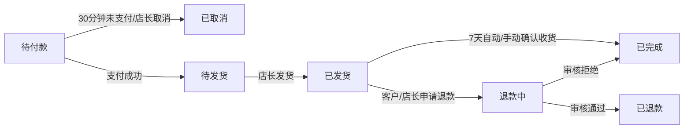
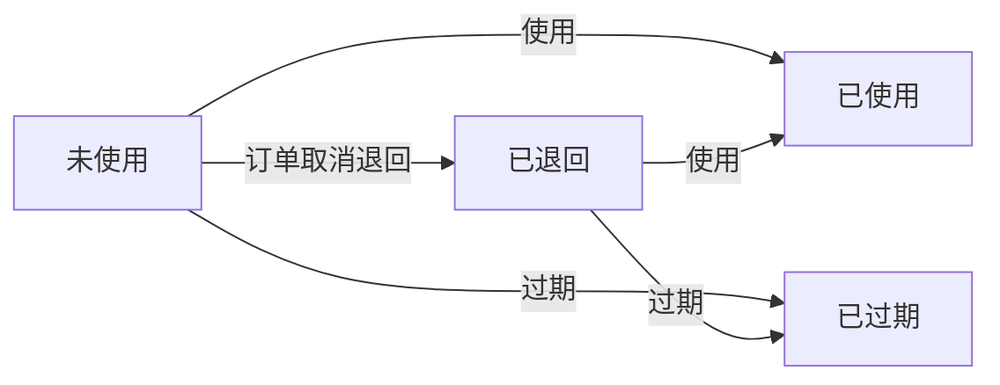

【任务书】
# 童趣优衣童装零售单店全栈系统 - 技术任务书(TASKS.md)

---

## 1. 项目技术规格
### 1.1 技术栈
| 分层 | 技术选型 | 版本要求 |
|------|----------|----------|
| 数据库 | MySQL | 8.0.35（InnoDB存储引擎） |
| 后端 | Spring Boot | 2.7.18 |
| 后端ORM框架 | MyBatis Plus | 3.5.5 |
| 后端接口文档 | Knife4j | 4.4.0（基于Swagger 3.0） |
| 后端身份认证 | JWT | HS256算法 |
| 后端短信服务 | 阿里云短信服务 | 中国大陆通用验证码模板 |
| 后端文件存储 | 阿里云OSS | 支持图片≤5MB、Excel≤100MB上传下载 |
| 后端支付服务 | 微信支付V3（JSAPI）、支付宝沙箱/正式（手机/电脑网站） | —— |
| 前端（管理后台） | Vue 3 | 3.3.11 |
| 前端（管理后台）UI框架 | Element Plus | 2.3.14 |
| 前端（管理后台）状态管理 | Pinia | 2.1.7 |
| 前端（管理后台）路由 | Vue Router 4 | 4.2.5 |
| 前端（管理后台）HTTP请求 | Axios | 1.6.2 |
| 前端（线上商城） | Vue 3 | 3.3.11 |
| 前端（线上商城）UI框架 | Vant 4 | 4.8.0 |
| 前端（线上商城）状态管理 | Pinia | 2.1.7 |
| 前端（线上商城）路由 | Vue Router 4 | 4.2.5 |
| 前端（线上商城）HTTP请求 | Axios | 1.6.2 |

### 1.2 项目结构规范
```
tongquyouyi/
├── back/                     # 后端项目根目录
│   ├── src/main/
│   │   ├── java/com/tongquyouyi/
│   │   │   ├── controller/   # 接口层（分admin和store模块）
│   │   │   ├── service/      # 业务逻辑接口层
│   │   │   ├── service/impl/ # 业务逻辑实现层
│   │   │   ├── mapper/       # 数据访问层（含MyBatis Plus XML）
│   │   │   ├── entity/       # 数据库实体类
│   │   │   ├── dto/          # 数据传输对象（请求参数）
│   │   │   ├── vo/           # 视图对象（响应数据）
│   │   │   ├── config/       # 配置类（JWT、OSS、支付、跨域等）
│   │   │   ├── utils/        # 工具类（BCrypt加密、验证码生成、文件上传等）
│   │   │   └── interceptor/  # 拦截器（JWT身份认证、接口防刷等）
│   │   └── resources/
│   │       ├── mapper/        # MyBatis Plus XML映射文件
│   │       ├── application.yml # 主配置文件
│   │       ├── application-dev.yml # 开发环境配置
│   │       └── application-prod.yml # 生产环境配置
│   ├── pom.xml                # Maven依赖配置
│   └── tongquyouyi.sql        # 数据库初始化脚本
├── front/                     # 前端项目根目录
│   ├── admin/                 # 管理后台前端
│   │   ├── src/
│   │   │   ├── api/           # 接口调用封装
│   │   │   ├── assets/        # 静态资源（图片、图标等）
│   │   │   ├── components/    # 公共组件
│   │   │   ├── router/        # 路由配置
│   │   │   ├── stores/        # Pinia状态管理
│   │   │   ├── utils/         # 工具函数
│   │   │   ├── views/         # 页面组件（按模块划分）
│   │   │   ├── App.vue        # 根组件
│   │   │   └── main.js        # 入口文件
│   │   ├── vite.config.js     # Vite构建配置
│   │   ├── package.json       # 依赖配置
│   │   └── .env.development   # 开发环境变量
│   │   └── .env.production    # 生产环境变量
│   └── store/                 # 线上商城前端
│       ├── src/
│       │   ├── api/           # 接口调用封装
│       │   ├── assets/        # 静态资源
│       │   ├── components/    # 公共组件
│       │   ├── router/        # 路由配置
│       │   ├── stores/        # Pinia状态管理
│       │   ├── utils/         # 工具函数
│       │   ├── views/         # 页面组件（按模块划分）
│       │   ├── App.vue        # 根组件
│       │   └── main.js        # 入口文件
│       ├── vite.config.js     # Vite构建配置
│       ├── package.json       # 依赖配置
│       └── .env.development   # 开发环境变量
│       └── .env.production    # 生产环境变量
```

### 1.3 代码生成规则
- **依赖版本**：严格遵循技术栈中的版本号
- **数据校验**：后端使用`javax.validation`（SpringBoot 2.7.x默认）+ 自定义校验注解；前端使用`Element Plus/Vant`内置表单校验
- **JWT配置**：Token有效期7天，Header为`Authorization`，前缀为`Bearer `；设置自动刷新机制，刷新Token有效期14天
- **分页规则**：后端统一使用`PageHelper`或`MyBatis Plus`的分页插件，默认每页10条，最大每页100条
- **文件上传**：图片重命名为`yyyyMMddHHmmssSSS_随机6位.后缀`，存储路径为`tongquyouyi/{type}/yyyyMMdd/`（type为`product/avatar/order/report`等）
- **接口响应格式**：统一响应格式为`{code: number, msg: string, data: any}`

### 1.4 核心业务领域锚点
【童趣优衣童装零售单店全栈系统】

---

## 2. 前端页面开发清单
### 2.1 B2S管理后台页面（front/admin/src/views/）
| 模块 | 页面路径 | 核心功能 | 必用组件 | 接口调用 | 跳转关系 |
|------|----------|----------|----------|----------|----------|
| 登录/权限 | /login | 账号密码登录、验证码刷新 | ElForm、ElInput、ElButton、ElImage | /api/admin/auth/login、/api/admin/auth/captcha | 登录成功→/dashboard；退出→/login |
| 系统首页 | /dashboard | 销售概览卡片、库存预警列表、待处理订单列表、快捷入口 | ElCard、ElTable、ElBadge、ElStatistic | /api/admin/dashboard/summary、/api/admin/inventory/warning/list、/api/admin/order/list | 快捷入口→对应功能页；预警/订单列表→对应详情页 |
| 商品管理 | /product/list | 商品列表展示、搜索、筛选、上下架、批量操作、新增/编辑/删除 | ElTable、ElSearch、ElTag、ElSwitch、ElButtonGroup | /api/admin/product/list、/api/admin/product/updown、/api/admin/product/delete | 新增→/product/add；编辑→/product/edit/:id；详情→/product/detail/:id |
| 商品管理 | /product/add | 新增商品基础信息、SKU结构设置、SKU库存/条码管理 | ElForm、ElUpload、ElInputNumber、ElSelect、ElCascader、ElTabs | /api/admin/product/save | 保存成功→/product/list |
| 商品管理 | /product/edit/:id | 编辑商品基础信息、下架后修改SKU结构、SKU库存/条码管理 | 同上 | /api/admin/product/update、/api/admin/product/get | 保存成功→/product/list |
| 商品管理 | /product/detail/:id | 查看商品完整信息、SKU库存、操作日志 | ElDescriptions、ElTable、ElTimeline | /api/admin/product/get、/api/admin/product/log | 返回→/product/list |
| 库存管理 | /inventory/stock-in | 普通入库、批量入库、入库单列表/详情 | ElForm、ElUpload、ElTable、ElButton | /api/admin/inventory/stock-in/save、/api/admin/inventory/stock-in/list、/api/admin/inventory/stock-in/template | 详情→/inventory/stock-in/detail/:id |
| 库存管理 | /inventory/stock-out | 手工出库、销售出库/盘点差异出库单列表/详情 | ElForm、ElTable | /api/admin/inventory/stock-out/save、/api/admin/inventory/stock-out/list | 详情→/inventory/stock-out/detail/:id |
| 库存管理 | /inventory/check | 创建盘点单、录入盘点数据、确认盘点结果、盘点单列表/详情 | ElForm、ElTable、ElButtonGroup、ElDialog | /api/admin/inventory/check/create、/api/admin/inventory/check/update、/api/admin/inventory/check/confirm、/api/admin/inventory/check/list | 详情→/inventory/check/detail/:id |
| 库存管理 | /inventory/warning | 预警阈值批量/单个设置、预警消息列表 | ElForm、ElTable、ElDialog | /api/admin/inventory/warning/set、/api/admin/inventory/warning/list | 无 |
| 会员管理 | /member/list | 会员列表展示、搜索、筛选、详情查看 | ElTable、ElSearch、ElTag | /api/admin/member/list、/api/admin/member/get | 详情→/member/detail/:id |
| 会员管理 | /member/detail/:id | 查看会员完整信息、消费/积分/储值/优惠券记录、手动调整积分/储值 | ElDescriptions、ElTabs、ElTable、ElDialog | /api/admin/member/get、/api/admin/member/point/adjust、/api/admin/member/stored-value/adjust | 返回→/member/list |
| 会员管理 | /member/level | 会员等级设置、权益配置 | ElForm、ElTable、ElButtonGroup | /api/admin/member/level/list、/api/admin/member/level/save、/api/admin/member/level/delete | 无 |
| 会员管理 | /member/point-rule | 积分获取/消费规则设置 | ElForm | /api/admin/member/point-rule/get、/api/admin/member/point-rule/save | 无 |
| 会员管理 | /member/stored-activity | 储值活动设置、编辑、删除 | ElForm、ElTable、ElButtonGroup | /api/admin/member/stored-activity/list、/api/admin/member/stored-activity/save、/api/admin/member/stored-activity/delete | 无 |
| 会员管理 | /member/coupon | 优惠券创建、发放、列表/详情 | ElForm、ElTable、ElButtonGroup、ElDialog | /api/admin/member/coupon/save、/api/admin/member/coupon/grant、/api/admin/member/coupon/list | 详情→/member/coupon/detail/:id |
| 订单管理 | /order/list | 全渠道订单列表展示、搜索、筛选、详情查看、取消/发货/确认收货/退款审核 | ElTable、ElSearch、ElTag、ElButtonGroup、ElDialog | /api/admin/order/list、/api/admin/order/get、/api/admin/order/cancel、/api/admin/order/ship、/api/admin/order/confirm-receive、/api/admin/order/refund/audit | 详情→/order/detail/:id |
| 订单管理 | /order/detail/:id | 查看订单完整信息、操作日志 | ElDescriptions、ElTable、ElTimeline | /api/admin/order/get、/api/admin/order/log | 返回→/order/list |
| 订单管理 | /order/offline-add | 快速录入线下订单 | ElForm、ElUpload、ElSelect、ElInputNumber | /api/admin/order/offline/save | 保存成功→/order/list |
| 报表中心 | /report/sales | 销售概览、销售明细报表、商品销售排行、导出Excel | ElCard、ElTable、ElDatePicker、ElSelect、ElButton | /api/admin/report/sales/summary、/api/admin/report/sales/detail、/api/admin/report/sales/rank、/api/admin/report/sales/export | 无 |
| 报表中心 | /report/inventory | 库存概览、库存明细报表、库存变动报表、导出Excel | 同上 | /api/admin/report/inventory/summary、/api/admin/report/inventory/detail、/api/admin/report/inventory/change、/api/admin/report/inventory/export | 无 |
| 报表中心 | /report/member | 会员概览、会员消费排行、会员增长报表、导出Excel | 同上 | /api/admin/report/member/summary、/api/admin/report/member/rank、/api/admin/report/member/growth、/api/admin/report/member/export | 无 |
| 系统管理 | /system/profile | 查看/修改个人信息、修改密码 | ElForm、ElUpload | /api/admin/system/profile/get、/api/admin/system/profile/update、/api/admin/system/profile/password | 无 |
| 系统管理 | /system/store | 查看/修改门店基础信息、常用物流、轮播图、商品排序规则 | ElForm、ElUpload、ElSelect、ElInputNumber | /api/admin/system/store/get、/api/admin/system/store/update | 无 |
| 系统管理 | /system/log | 查看操作日志列表、搜索、筛选 | ElTable、ElSearch、ElDatePicker | /api/admin/system/log/list | 无 |

### 2.2 B2C线上商城页面（front/store/src/views/）
| 模块 | 页面路径 | 核心功能 | 必用组件 | 接口调用 | 跳转关系 |
|------|----------|----------|----------|----------|----------|
| 首页 | / | 轮播图展示、快捷分类展示、新品/热销/清仓专区展示 | VanSwipe、VanGrid、VanGridItem、VanCard、VanTabs | /api/store/index/banner、/api/store/index/category、/api/store/index/product | 分类/标签/商品→商品列表/详情页 |
| 商品列表 | /product/list | 商品展示、筛选、排序、搜索 | VanNavBar、VanSearch、VanFilter、VanPullRefresh、VanList、VanCard | /api/store/product/list、/api/store/product/search | 商品→/product/detail/:id |
| 商品详情 | /product/detail/:id | 商品信息展示、SKU选择、加入购物车、立即购买、收藏/取消收藏 | VanNavBar、VanSwipe、VanGoodsAction、VanGoodsActionIcon、VanGoodsActionButton、VanSku、VanRate | /api/store/product/get、/api/store/cart/add、/api/store/favorite/toggle | 立即购买→/checkout；加入购物车→/cart |
| 购物车 | /cart | 购物车商品管理、全选/取消全选、结算 | VanNavBar、VanCart、VanSubmitBar | /api/store/cart/list、/api/store/cart/update、/api/store/cart/delete、/api/store/cart/selected | 结算→/checkout |
| 结算 | /checkout | 收货地址管理、商品明细展示、优惠明细展示、实付金额计算、支付方式选择、下单确认 | VanNavBar、VanAddressList、VanAddressEdit、VanStepper、VanCouponCell、VanCouponList、VanCheckbox、VanSubmitBar | /api/store/address/list、/api/store/coupon/list、/api/store/cart/selected、/api/store/order/create | 支付成功→/order/detail/:id；支付失败→/order/list?status=0 |
| 个人中心 | /user | 个人信息展示、我的订单入口、我的收藏/积分/储值/优惠券/收货地址入口、退出登录 | VanNavBar、VanUser、VanCell、VanCellGroup | /api/store/user/get、/api/store/auth/logout | 各入口→对应功能页 |
| 我的订单 | /order/list | 订单列表展示、按状态分类、支付/查看物流/申请退款/确认收货 | VanNavBar、VanTabs、VanPullRefresh、VanList、VanOrderCard | /api/store/order/list、/api/store/order/pay、/api/store/order/refund、/api/store/order/confirm-receive | 订单→/order/detail/:id |
| 我的订单 | /order/detail/:id | 订单完整信息展示、物流信息展示 | VanNavBar、VanDescriptions、VanSteps | /api/store/order/get | 返回→/order/list |
| 我的收藏 | /favorite | 收藏商品列表展示、取消收藏、跳转商品详情 | VanNavBar、VanPullRefresh、VanList、VanCard | /api/store/favorite/list、/api/store/favorite/delete | 商品→/product/detail/:id |
| 我的积分 | /point | 积分余额展示、积分获取/消费记录 | VanNavBar、VanCell、VanCellGroup、VanList | /api/store/point/summary、/api/store/point/log | 无 |
| 我的储值 | /stored-value | 储值余额展示、储值/消费记录、参与的储值活动、储值充值 | VanNavBar、VanCell、VanCellGroup、VanList、VanButton | /api/store/stored-value/summary、/api/store/stored-value/log、/api/store/stored-value/activity/list、/api/store/stored-value/recharge | 充值→支付页面 |
| 我的优惠券 | /coupon | 优惠券列表展示、按状态分类、跳转商品列表 | VanNavBar、VanTabs、VanPullRefresh、VanList、VanCoupon | /api/store/coupon/list | 未使用→/product/list |
| 收货地址 | /address | 收货地址列表展示、新增/修改/删除/设置默认 | VanNavBar、VanAddressList、VanAddressEdit | /api/store/address/list、/api/store/address/save、/api/store/address/delete、/api/store/address/default | 无 |
| 个人信息 | /user/profile | 查看/修改个人信息 | VanNavBar、VanForm、VanUploader | /api/store/user/get、/api/store/user/update | 返回→/user |
| 注册/登录 | /login | 手机号+验证码登录/注册 | VanNavBar、VanForm、VanCell、VanButton | /api/store/auth/send-sms、/api/store/auth/login | 登录成功→/；注册成功→/user/profile（首次注册需完善信息） |

---

## 3. 后端接口开发清单
### 3.1 B2S管理后台接口（前缀/api/admin）
| 模块 | URL | 请求方式 | 请求参数 | 响应格式 | 业务逻辑 | 关联数据库表 |
|------|-----|----------|----------|----------|----------|--------------|
| 登录/权限 | /auth/captcha | GET | 无 | {code:200,msg:"成功",data:{captchaKey:"",captchaImg:""}} | 生成图形验证码，缓存captchaKey和验证码值，有效期5分钟 | - |
| 登录/权限 | /auth/login | POST | {username:"",password:"",captchaKey:"",captcha:""} | {code:200,msg:"登录成功",data:{token:"",refreshToken:""}} | 校验验证码、账号密码；校验通过生成JWT Token和刷新Token；首次登录返回`needInit:true` | tqy_admin、tqy_store_info |
| 登录/权限 | /auth/refresh | POST | {refreshToken:""} | {code:200,msg:"刷新成功",data:{token:"",refreshToken:""}} | 校验刷新Token；校验通过生成新的Token和刷新Token | - |
| 登录/权限 | /auth/logout | POST | 无 | {code:200,msg:"退出成功"} | 清除Redis中的Token和刷新Token | - |
| 系统首页 | /dashboard/summary | GET | 无 | {code:200,msg:"成功",data:{todayOrders:0,todaySales:0.00,todayProfit:0.00,pendingOrders:0,pendingWarnings:0}} | 统计今日销售/订单、待处理订单、待处理预警 | tqy_order、tqy_order_item、tqy_sku、tqy_inventory_warning |
| 系统首页 | /dashboard/warning/list | GET | {pageNum:1,pageSize:10} | {code:200,msg:"成功",data:{total:0,list:[]}} | 查询所有待处理的库存预警（按预警时间倒序） | tqy_sku、tqy_inventory_warning |
| 系统首页 | /dashboard/order/list | GET | {pageNum:1,pageSize:10} | {code:200,msg:"成功",data:{total:0,list:[]}} | 查询所有待发货、退款中的订单（按下单时间倒序） | tqy_order、tqy_member |
| 商品管理 | /product/list | GET | {pageNum:1,pageSize:10,keyword:"",categoryId:"",tag:"",status:""} | {code:200,msg:"成功",data:{total:0,list:[]}} | 分页查询商品列表，支持多条件筛选、排序（按上架时间倒序） | tqy_product、tqy_product_category、tqy_product_tag |
| 商品管理 | /product/get | GET | {id:""} | {code:200,msg:"成功",data:{}} | 查询商品完整信息（含SKU列表、分类、标签） | tqy_product、tqy_product_category、tqy_product_tag、tqy_sku |
| 商品管理 | /product/save | POST | {product:{},skuList:[]} | {code:200,msg:"保存成功",data:{id:""}} | 保存商品基础信息、生成/保存SKU列表、关联分类和标签 | tqy_product、tqy_product_category、tqy_product_tag、tqy_sku |
| 商品管理 | /product/update | POST | {product:{},skuList:[]} | {code:200,msg:"修改成功"} | 修改商品基础信息（已上架商品不能改分类、SKU结构）、修改/新增/删除SKU | 同上 |
| 商品管理 | /product/updown | POST | {ids:[],status:""} | {code:200,msg:"操作成功"} | 批量或单个切换商品上下架状态（上架前检查至少1个SKU有库存） | tqy_product、tqy_sku |
| 商品管理 | /product/delete | POST | {ids:[]} | {code:200,msg:"删除成功"} | 批量删除商品（仅允许删除已下架且无库存、无订单记录的商品） | tqy_product、tqy_product_tag、tqy_sku |
| 商品管理 | /product/log | GET | {id:""} | {code:200,msg:"成功",data:{list:[]}} | 查询商品的操作日志 | tqy_operation_log |
| 库存管理 | /inventory/stock-in/save | POST | {stockIn:{},stockInItemList:[]} | {code:200,msg:"入库成功",data:{stockInNo:""}} | 生成入库单（编号RK-YYYYMMDD-XXX）、增加对应SKU的库存、保存操作日志 | tqy_stock_in、tqy_stock_in_item、tqy_sku、tqy_operation_log |
| 库存管理 | /inventory/stock-in/list | GET | {pageNum:1,pageSize:10,keyword:"",startTime:"",endTime:""} | {code:200,msg:"成功",data:{total:0,list:[]}} | 分页查询入库单列表 | tqy_stock_in、tqy_admin |
| 库存管理 | /inventory/stock-in/get | GET | {id:""} | {code:200,msg:"成功",data:{}} | 查询入库单完整信息（含入库明细） | tqy_stock_in、tqy_stock_in_item、tqy_admin |
| 库存管理 | /inventory/stock-in/template | GET | 无 | {code:200,msg:"成功",data:{fileUrl:""}} | 下载批量入库Excel模板 | - |
| 库存管理 | /inventory/stock-in/import | POST | {file:""} | {code:200,msg:"导入成功，成功X条，失败X条",data:{failList:[]}} | 批量导入入库单、校验数据格式、处理成功/失败数据 | 同普通入库 |
| 库存管理 | /inventory/stock-out/save | POST | {stockOut:{},stockOutItemList:[]} | {code:200,msg:"出库成功",data:{stockOutNo:""}} | 生成手工出库单（编号CK-YYYYMMDD-XXX）、减少对应SKU的库存（检查库存是否充足）、保存操作日志 | tqy_stock_out、tqy_stock_out_item、tqy_sku、tqy_operation_log |
| 库存管理 | /inventory/stock-out/list | GET | {pageNum:1,pageSize:10,keyword:"",startTime:"",endTime:"",type:""} | {code:200,msg:"成功",data:{total:0,list:[]}} | 分页查询出库单列表（支持按类型筛选：销售、手工、盘点差异） | tqy_stock_out、tqy_admin |
| 库存管理 | /inventory/stock-out/get | GET | {id:""} | {code:200,msg:"成功",data:{}} | 查询出库单完整信息（含出库明细） | tqy_stock_out、tqy_stock_out_item、tqy_admin |
| 库存管理 | /inventory/check/create | POST | {check:{}} | {code:200,msg:"创建成功",data:{checkNo:""}} | 生成盘点单（编号PD-YYYYMMDD-XXX）、根据盘点范围生成盘点明细（显示系统库存，实际库存为空）、保存操作日志 | tqy_stock_check、tqy_stock_check_item、tqy_sku、tqy_operation_log |
| 库存管理 | /inventory/check/update | POST | {check:{},checkItemList:[]} | {code:200,msg:"修改成功"} | 修改盘点单的盘点明细（录入实际库存） | tqy_stock_check、tqy_stock_check_item |
| 库存管理 | /inventory/check/confirm | POST | {id:""} | {code:200,msg:"确认成功"} | 核对系统库存与实际库存的差异、生成盘点差异入库/出库单、调整对应SKU的库存、变更盘点单状态为已完成、保存操作日志 | 同盘点创建+库存出入库 |
| 库存管理 | /inventory/check/list | GET | {pageNum:1,pageSize:10,keyword:"",startTime:"",endTime:"",status:""} | {code:200,msg:"成功",data:{total:0,list:[]}} | 分页查询盘点单列表 | tqy_stock_check、tqy_admin |
| 库存管理 | /inventory/check/get | GET | {id:""} | {code:200,msg:"成功",data:{}} | 查询盘点单完整信息（含盘点明细） | tqy_stock_check、tqy_stock_check_item、tqy_admin |
| 库存管理 | /inventory/warning/set | POST | {skuList:[],minStock:"",maxStock:""} | {code:200,msg:"设置成功"} | 批量或单个设置SKU的最低/最高库存预警阈值 | tqy_sku |
| 库存管理 | /inventory/warning/list | GET | {pageNum:1,pageSize:10,type:"",categoryId:"",tag:""} | {code:200,msg:"成功",data:{total:0,list:[]}} | 分页查询库存预警列表（支持按类型筛选：缺货、积压） | tqy_sku |
| 会员管理 | /member/list | GET | {pageNum:1,pageSize:10,keyword:"",levelId:"",startTime:"",endTime:"",minConsume:"",maxConsume:""} | {code:200,msg:"成功",data:{total:0,list:[]}} | 分页查询会员列表，支持多条件筛选 | tqy_member、tqy_member_level |
| 会员管理 | /member/get | GET | {id:""} | {code:200,msg:"成功",data:{}} | 查询会员完整信息（含等级、积分、储值、最近5条消费记录） | tqy_member、tqy_member_level |
| 会员管理 | /member/point/adjust | POST | {memberId:"",adjustPoint:"",reason:""} | {code:200,msg:"调整成功"} | 手动调整会员积分、保存积分变动记录、保存操作日志 | tqy_member、tqy_member_point_log、tqy_operation_log |
| 会员管理 | /member/stored-value/adjust | POST | {memberId:"",adjustAmount:"",payType:"",reason:""} | {code:200,msg:"调整成功"} | 手动调整会员储值余额、保存储值变动记录、保存操作日志 | tqy_member、tqy_member_stored_log、tqy_operation_log |
| 会员管理 | /member/level/list | GET | 无 | {code:200,msg:"成功",data:{list:[]}} | 查询所有会员等级列表 | tqy_member_level |
| 会员管理 | /member/level/save | POST | {level:{}} | {code:200,msg:"保存成功",data:{id:""}} | 保存/修改会员等级（普通会员不可删除、不可修改升级条件） | tqy_member_level |
| 会员管理 | /member/level/delete | POST | {id:""} | {code:200,msg:"删除成功"} | 删除会员等级（仅允许删除非普通会员且无会员使用的等级） | tqy_member_level |
| 会员管理 | /member/point-rule/get | GET | 无 | {code:200,msg:"成功",data:{}} | 查询积分获取/消费规则 | tqy_member_point_rule |
| 会员管理 | /member/point-rule/save | POST | {rule:{}} | {code:200,msg:"保存成功"} | 保存/修改积分获取/消费规则 | tqy_member_point_rule |
| 会员管理 | /member/stored-activity/list | GET | {status:""} | {code:200,msg:"成功",data:{list:[]}} | 查询所有储值活动列表（支持按状态筛选：未开始、进行中、已结束） | tqy_member_stored_activity |
| 会员管理 | /member/stored-activity/save | POST | {activity:{}} | {code:200,msg:"保存成功",data:{id:""}} | 保存/修改储值活动（有效期内不可设置重复的储值金额，已结束的活动不可修改） | tqy_member_stored_activity |
| 会员管理 | /member/stored-activity/delete | POST | {id:""} | {code:200,msg:"删除成功"} | 删除储值活动（仅允许删除未开始的活动） | tqy_member_stored_activity |
| 会员管理 | /member/coupon/list | GET | {pageNum:1,pageSize:10,keyword:"",status:""} | {code:200,msg:"成功",data:{total:0,list:[]}} | 查询所有优惠券列表（支持按状态筛选） | tqy_member_coupon_template |
| 会员管理 | /member/coupon/save | POST | {template:{}} | {code:200,msg:"保存成功",data:{id:""}} | 保存/修改优惠券模板、生成优惠券实例 | tqy_member_coupon_template、tqy_member_coupon |
| 会员管理 | /member/coupon/grant | POST | {templateId:"",memberIds:[]} | {code:200,msg:"发放成功"} | 定向为单个/批量会员发放优惠券 | tqy_member_coupon_template、tqy_member_coupon |
| 会员管理 | /member/coupon/get | GET | {id:""} | {code:200,msg:"成功",data:{}} | 查询优惠券模板完整信息（含发放/使用统计） | tqy_member_coupon_template |
| 订单管理 | /order/list | GET | {pageNum:1,pageSize:10,keyword:"",startTime:"",endTime:"",status:"",payType:"",channel:""} | {code:200,msg:"成功",data:{total:0,list:[]}} | 分页查询全渠道订单列表，支持多条件筛选 | tqy_order、tqy_member |
| 订单管理 | /order/get | GET | {id:""} | {code:200,msg:"成功",data:{}} | 查询订单完整信息（含商品明细、优惠明细、操作日志） | tqy_order、tqy_order_item、tqy_order_discount、tqy_operation_log |
| 订单管理 | /order/cancel | POST | {id:"",reason:""} | {code:200,msg:"取消成功"} | 取消订单（仅允许取消待付款、已付款未发货的线上订单）、原路返还积分/优惠券/储值余额、生成退款单（如已付款）、保存操作日志 | tqy_order、tqy_order_discount、tqy_member、tqy_member_coupon、tqy_member_point_log、tqy_member_stored_log、tqy_refund、tqy_operation_log |
| 订单管理 | /order/ship | POST | {id:"",logisticsName:"",trackingNo:""} | {code:200,msg:"发货成功"} | 发货（仅允许处理待发货的线上订单）、变更订单状态为已发货、生成销售出库单、保存操作日志 | tqy_order、tqy_stock_out、tqy_stock_out_item、tqy_sku、tqy_operation_log |
| 订单管理 | /order/confirm-receive | POST | {id:""} | {code:200,msg:"确认收货成功"} | 确认收货（仅允许处理已发货超过7天的线上订单）、变更订单状态为已完成、发放积分（如有）、确认结算、保存操作日志 | tqy_order、tqy_member、tqy_member_point_rule、tqy_member_point_log、tqy_operation_log |
| 订单管理 | /order/refund/audit | POST | {id:"",auditResult:"",auditOpinion:""} | {code:200,msg:"审核成功"} | 审核退款申请（仅允许处理退款中的订单）、审核通过则原路返还、生成退货入库单、变更订单状态为已退款；审核拒绝则变更订单状态为已完成；保存操作日志 | 同取消订单+库存入库 |
| 订单管理 | /order/offline/save | POST | {order:{},orderItemList:[]} | {code:200,msg:"录入成功",data:{orderNo:""}} | 快速录入线下订单（编号XD-YYYYMMDD-XXX）、关联会员（如有）、计算优惠/实付金额、生成销售出库单、保存操作日志 | tqy_order、tqy_order_item、tqy_order_discount、tqy_member、tqy_member_level、tqy_member_coupon、tqy_member_point_rule、tqy_member_point_log、tqy_member_stored_log、tqy_stock_out、tqy_stock_out_item、tqy_sku、tqy_operation_log |
| 订单管理 | /order/log | GET | {id:""} | {code:200,msg:"成功",data:{list:[]}} | 查询订单的操作日志 | tqy_operation_log |
| 报表中心 | /report/sales/summary | GET | {startTime:"",endTime:""} | {code:200,msg:"成功",data:{}} | 统计指定时间段的销售概览 | tqy_order、tqy_order_item、tqy_sku |
| 报表中心 | /report/sales/detail | GET | {pageNum:1,pageSize:10,startTime:"",endTime:""} | {code:200,msg:"成功",data:{total:0,list:[]}} | 查询指定时间段的销售明细报表 | tqy_order、tqy_order_item、tqy_member |
| 报表中心 | /report/sales/rank | GET | {startTime:"",endTime:"",sortBy:"",categoryId:"",tag:""} | {code:200,msg:"成功",data:{list:[]}} | 查询指定时间段的商品销售排行 | tqy_order、tqy_order_item、tqy_product、tqy_product_category、tqy_product_tag |
| 报表中心 | /report/sales/export | GET | {startTime:"",endTime:""} | 二进制流（Excel文件） | 导出指定时间段的销售明细报表Excel | 同销售明细 |
| 报表中心 | /report/inventory/summary | GET | 无 | {code:200,msg:"成功",data:{}} | 统计当前的库存概览 | tqy_sku、tqy_inventory_warning |
| 报表中心 | /report/inventory/detail | GET | {pageNum:1,pageSize:10,categoryId:"",tag:"",hasStock:"",warningType:""} | {code:200,msg:"成功",data:{total:0,list:[]}} | 查询库存明细报表 | tqy_sku、tqy_product |
| 报表中心 | /report/inventory/change | GET | {pageNum:1,pageSize:10,startTime:"",endTime:"",type:""} | {code:200,msg:"成功",data:{total:0,list:[]}} | 查询指定时间段的库存变动报表 | tqy_stock_in、tqy_stock_in_item、tqy_stock_out、tqy_stock_out_item |
| 报表中心 | /report/inventory/export | GET | {startTime:"",endTime:"",type:""} | 二进制流（Excel文件） | 导出指定时间段的库存变动报表Excel | 同库存变动 |
| 报表中心 | /report/member/summary | GET | 无 | {code:200,msg:"成功",data:{}} | 统计当前的会员概览 | tqy_member、tqy_member_level |
| 报表中心 | /report/member/rank | GET | {startTime:"",endTime:"",sortBy:"",levelId:""} | {code:200,msg:"成功",data:{list:[]}} | 查询指定时间段的会员消费排行 | tqy_member、tqy_member_level、tqy_order |
| 报表中心 | /report/member/growth | GET | {startTime:"",endTime:"",groupBy:""} | {code:200,msg:"成功",data:{list:[]}} | 查询指定时间段的会员增长报表 | tqy_member |
| 报表中心 | /report/member/export | GET | {startTime:"",endTime:"",groupBy:""} | 二进制流（Excel文件） | 导出指定时间段的会员增长报表Excel | 同会员增长 |
| 系统管理 | /system/profile/get | GET | 无 | {code:200,msg:"成功",data:{}} | 查询当前登录店长的个人信息 | tqy_admin |
| 系统管理 | /system/profile/update | POST | {profile:{}} | {code:200,msg:"修改成功"} | 修改当前登录店长的个人信息（修改手机号需验证新手机号的验证码） | tqy_admin |
| 系统管理 | /system/profile/password | POST | {oldPassword:"",newPassword:"",confirmPassword:""} | {code:200,msg:"修改成功，请重新登录"} | 修改当前登录店长的密码（BCrypt加密存储） | tqy_admin |
| 系统管理 | /system/store/get | GET | 无 | {code:200,msg:"成功",data:{}} | 查询门店基础信息、常用物流、轮播图、商品排序规则 | tqy_store_info |
| 系统管理 | /system/store/update | POST | {store:{}} | {code:200,msg:"修改成功"} | 修改门店基础信息、常用物流、轮播图、商品排序规则 | tqy_store_info |
| 系统管理 | /system/log/list | GET | {pageNum:1,pageSize:10,operator:"",startTime:"",endTime:"",module:""} | {code:200,msg:"成功",data:{total:0,list:[]}} | 分页查询操作日志列表，支持多条件筛选 | tqy_operation_log |

### 3.2 B2C线上商城接口（前缀/api/store）
| 模块 | URL | 请求方式 | 请求参数 | 响应格式 | 业务逻辑 | 关联数据库表 |
|------|-----|----------|----------|----------|----------|--------------|
| 登录/权限 | /auth/send-sms | POST | {phone:""} | {code:200,msg:"发送成功"} | 发送手机号验证码（频率限制：1分钟1次、1小时5次、1天20次）、缓存验证码，有效期5分钟 | - |
| 登录/权限 | /auth/login | POST | {phone:"",code:""} | {code:200,msg:"登录成功",data:{token:"",refreshToken:"",needInit:false}} | 校验验证码；未注册则自动注册（分配普通会员、赠送初始积分）；已注册则登录；生成JWT Token和刷新Token | tqy_member、tqy_member_level、tqy_member_point_rule |
| 登录/权限 | /auth/refresh | POST | {refreshToken:""} | {code:200,msg:"刷新成功",data:{token:"",refreshToken:""}} | 同管理后台 | - |
| 登录/权限 | /auth/logout | POST | 无 | {code:200,msg:"退出成功"} | 同管理后台 | - |
| 首页 | /index/banner | GET | 无 | {code:200,msg:"成功",data:{list:[]}} | 查询门店设置的轮播图（按排序升序） | tqy_store_info |
| 首页 | /index/category | GET | 无 | {code:200,msg:"成功",data:{list:[]}} | 查询预设的6个商品分类 | tqy_product_category |
| 首页 | /index/product | GET | 无 | {code:200,msg:"成功",data:{newList:[],hotList:[],clearList:[]}} | 查询新品/热销/清仓专区的商品（每个最多10个，按门店设置的排序规则） | tqy_product、tqy_product_tag、tqy_sku |
| 商品列表 | /product/list | GET | {pageNum:1,pageSize:20,categoryId:"",tag:"",minPrice:"",maxPrice:"",color:"",size:"",sortBy:""} | {code:200,msg:"成功",data:{total:0,list:[]}} | 分页查询商品列表，支持多条件筛选、排序 | tqy_product、tqy_product_category、tqy_product_tag、tqy_sku |
| 商品列表 | /product/search | GET | {pageNum:1,pageSize:20,keyword:"",sortBy:""} | {code:200,msg:"成功",data:{total:0,list:[]}} | 搜索商品（匹配商品名称、描述、标签） | 同上 |
| 商品详情 | /product/get | GET | {id:""} | {code:200,msg:"成功",data:{}} | 查询商品完整信息（含SKU列表、评价列表、是否已收藏） | tqy_product、tqy_product_category、tqy_product_tag、tqy_sku、tqy_product_review、tqy_member_favorite |
| 购物车 | /cart/add | POST | {skuId:"",quantity:""} | {code:200,msg:"加入成功"} | 加入购物车（检查库存是否充足，已存在则增加数量） | tqy_member_cart、tqy_sku |
| 购物车 | /cart/list | GET | 无 | {code:200,msg:"成功",data:{list:[]}} | 查询当前登录会员的购物车列表（含商品、SKU信息） | tqy_member_cart、tqy_product、tqy_sku |
| 购物车 | /cart/update | POST | {id:"",skuId:"",quantity:""} | {code:200,msg:"修改成功"} | 修改购物车商品的SKU或数量（检查库存是否充足） | 同上 |
| 购物车 | /cart/delete | POST | {ids:[]} | {code:200,msg:"删除成功"} | 删除购物车商品 | tqy_member_cart |
| 购物车 | /cart/selected | POST | {ids:[]} | {code:200,msg:"操作成功"} | 全选/取消全选购物车商品 | tqy_member_cart |
| 收货地址 | /address/list | GET | 无 | {code:200,msg:"成功",data:{list:[]}} | 查询当前登录会员的收货地址列表（默认地址排第一） | tqy_member_address |
| 收货地址 | /address/save | POST | {address:{}} | {code:200,msg:"保存成功",data:{id:""}} | 保存/修改收货地址（最多保存5个，设置默认则取消其他地址的默认） | tqy_member_address |
| 收货地址 | /address/delete | POST | {id:""} | {code:200,msg:"删除成功"} | 删除收货地址 | tqy_member_address |
| 收货地址 | /address/default | POST | {id:""} | {code:200,msg:"设置成功"} | 设置默认收货地址 | tqy_member_address |
| 优惠券 | /coupon/list | GET | {status:""} | {code:200,msg:"成功",data:{list:[]}} | 查询当前登录会员的优惠券列表（支持按状态筛选：未使用、已使用、已过期） | tqy_member_coupon、tqy_member_coupon_template |
| 结算 | /order/create | POST | {addressId:"",cartIds:[],couponId:"",usePoint:"",pointAmount:"",payType:""} | {code:200,msg:"创建成功",data:{orderNo:"",payParams:{}}} | 创建订单（编号DD-YYYYMMDD-XXX，线上订单）、计算优惠/实付金额、关联会员、冻结优惠券/积分/储值余额、调用支付接口返回支付参数 | tqy_order、tqy_order_item、tqy_order_discount、tqy_member、tqy_member_level、tqy_member_coupon、tqy_member_point_rule、tqy_member_address、tqy_sku |
| 订单 | /order/list | GET | {pageNum:1,pageSize:20,status:""} | {code:200,msg:"成功",data:{total:0,list:[]}} | 查询当前登录会员的订单列表（按状态分类） | tqy_order、tqy_order_item |
| 订单 | /order/get | GET | {id:""} | {code:200,msg:"成功",data:{}} | 查询订单完整信息（含商品明细、优惠明细、物流信息） | tqy_order、tqy_order_item、tqy_order_discount、tqy_member_address |
| 订单 | /order/pay | POST | {id:"",payType:""} | {code:200,msg:"发起支付成功",data:{payParams:{}}} | 重新发起订单支付（仅允许处理待付款的订单） | tqy_order、tqy_member |
| 订单 | /order/refund | POST | {id:"",reason:""} | {code:200,msg:"申请成功"} | 申请退款（仅允许处理待发货、已发货未确认收货的订单）、变更订单状态为退款中 | tqy_order |
| 订单 | /order/confirm-receive | POST | {id:""} | {code:200,msg:"确认收货成功"} | 手动确认收货（仅允许处理已发货的订单） | 同管理后台 |
| 收藏 | /favorite/toggle | POST | {productId:""} | {code:200,msg:"操作成功"} | 收藏/取消收藏商品 | tqy_member_favorite |
| 收藏 | /favorite/list | GET | {pageNum:1,pageSize:20} | {code:200,msg:"成功",data:{total:0,list:[]}} | 查询当前登录会员的收藏商品列表 | tqy_member_favorite、tqy_product、tqy_sku |
| 收藏 | /favorite/delete | POST | {ids:[]} | {code:200,msg:"删除成功"} | 删除收藏商品 | tqy_member_favorite |
| 积分 | /point/summary | GET | 无 | {code:200,msg:"成功",data:{}} | 查询当前登录会员的积分余额 | tqy_member |
| 积分 | /point/log | GET | {pageNum:1,pageSize:20} | {code:200,msg:"成功",data:{total:0,list:[]}} | 查询当前登录会员的积分变动记录 | tqy_member_point_log |
| 储值 | /stored-value/summary | GET | 无 | {code:200,msg:"成功",data:{}} | 查询当前登录会员的储值余额 | tqy_member |
| 储值 | /stored-value/log | GET | {pageNum:1,pageSize:20} | {code:200,msg:"成功",data:{total:0,list:[]}} | 查询当前登录会员的储值变动记录 | tqy_member_stored_log |
| 储值 | /stored-value/activity/list | GET | 无 | {code:200,msg:"成功",data:{list:[]}} | 查询所有进行中的储值活动 | tqy_member_stored_activity |
| 储值 | /stored-value/recharge | POST | {activityId:"",payType:""} | {code:200,msg:"发起充值成功",data:{payParams:{}}} | 发起储值充值、调用支付接口返回支付参数 | tqy_member_stored_activity、tqy_member |
| 用户 | /user/get | GET | 无 | {code:200,msg:"成功",data:{}} | 查询当前登录会员的个人信息 | tqy_member |
| 用户 | /user/update | POST | {user:{}} | {code:200,msg:"修改成功"} | 修改当前登录会员的个人信息 | tqy_member |

---

## 4. 数据库表结构设计
### 4.1 公共表
| 表名 | 字段名 | 数据类型 | 约束 | 默认值 | 注释 |
|------|--------|----------|------|--------|------|
| tqy_admin | id | BIGINT | PRIMARY KEY, AUTO_INCREMENT | - | 管理员ID |
| | username | VARCHAR(20) | NOT NULL, UNIQUE | - | 账号（6-20位字母/数字） |
| | password | VARCHAR(100) | NOT NULL | - | 密码（BCrypt加密） |
| | nickname | VARCHAR(20) | NULL | - | 昵称 |
| | avatar | VARCHAR(255) | NULL | - | 头像URL |
| | phone | VARCHAR(11) | NOT NULL, UNIQUE | - | 手机号 |
| | is_initialized | TINYINT(1) | NOT NULL | 0 | 是否首次初始化（0否1是） |
| | create_time | DATETIME | NOT NULL | CURRENT_TIMESTAMP | 创建时间 |
| | update_time | DATETIME | NOT NULL | CURRENT_TIMESTAMP ON UPDATE CURRENT_TIMESTAMP | 更新时间 |
| tqy_store_info | id | BIGINT | PRIMARY KEY, AUTO_INCREMENT | - | 门店ID（仅1条记录） |
| | name | VARCHAR(50) | NOT NULL | - | 门店名称 |
| | logo | VARCHAR(255) | NULL | - | 门店logo URL |
| | address | VARCHAR(100) | NOT NULL | - | 门店地址 |
| | contact_phone | VARCHAR(20) | NOT NULL | - | 联系电话 |
| | business_hours | VARCHAR(20) | NOT NULL | - | 营业时间（如09:00-21:00） |
| | common_logistics | TEXT | NOT NULL | - | 常用物流（JSON数组） |
| | banners | TEXT | NULL | - | 轮播图（JSON数组） |
| | product_sort_rule | VARCHAR(20) | NOT NULL | 'sales_desc' | 商品排序规则（sales_desc销量倒序、price_asc价格升序、price_desc价格降序、create_time_desc上架时间倒序） |
| | create_time | DATETIME | NOT NULL | CURRENT_TIMESTAMP | 创建时间 |
| | update_time | DATETIME | NOT NULL | CURRENT_TIMESTAMP ON UPDATE CURRENT_TIMESTAMP | 更新时间 |
| tqy_operation_log | id | BIGINT | PRIMARY KEY, AUTO_INCREMENT | - | 操作日志ID |
| | operator_id | BIGINT | NOT NULL | - | 操作人ID |
| | operator_name | VARCHAR(20) | NOT NULL | - | 操作人姓名/昵称 |
| | module | VARCHAR(50) | NOT NULL | - | 操作模块 |
| | content | VARCHAR(255) | NOT NULL | - | 操作内容 |
| | ip | VARCHAR(50) | NULL | - | 操作IP |
| | create_time | DATETIME | NOT NULL | CURRENT_TIMESTAMP | 创建时间 |

### 4.2 商品管理表
| 表名 | 字段名 | 数据类型 | 约束 | 默认值 | 注释 |
|------|--------|----------|------|--------|------|
| tqy_product_category | id | BIGINT | PRIMARY KEY, AUTO_INCREMENT | - | 分类ID |
| | name | VARCHAR(30) | NOT NULL, UNIQUE | - | 分类名称 |
| | sort | INT | NOT NULL | 0 | 排序（升序） |
| | is_preset | TINYINT(1) | NOT NULL | 1 | 是否预设分类（0否1是） |
| | create_time | DATETIME | NOT NULL | CURRENT_TIMESTAMP | 创建时间 |
| | update_time | DATETIME | NOT NULL | CURRENT_TIMESTAMP ON UPDATE CURRENT_TIMESTAMP | 更新时间 |
| tqy_product_tag | id | BIGINT | PRIMARY KEY, AUTO_INCREMENT | - | 标签ID |
| | name | VARCHAR(30) | NOT NULL, UNIQUE | - | 标签名称 |
| | is_preset | TINYINT(1) | NOT NULL | 1 | 是否预设标签（0否1是） |
| | create_time | DATETIME | NOT NULL | CURRENT_TIMESTAMP | 创建时间 |
| tqy_product | id | BIGINT | PRIMARY KEY, AUTO_INCREMENT | - | 商品ID |
| | name | VARCHAR(50) | NOT NULL | - | 商品名称 |
| | main_image | VARCHAR(255) | NOT NULL | - | 商品主图URL |
| | detail_images | TEXT | NULL | - | 商品详情图URL（JSON数组） |
| | category_id | BIGINT | NOT NULL | - | 分类ID |
| | description | TEXT | NULL | - | 商品描述（富文本） |
| | tag_price | DECIMAL(10,2) | NOT NULL | - | 吊牌价 |
| | sale_price | DECIMAL(10,2) | NOT NULL | - | 销售价 |
| | status | TINYINT(1) | NOT NULL | 0 | 上下架状态（0下架1上架） |
| | create_time | DATETIME | NOT NULL | CURRENT_TIMESTAMP | 创建时间 |
| | update_time | DATETIME | NOT NULL | CURRENT_TIMESTAMP ON UPDATE CURRENT_TIMESTAMP | 更新时间 |
| tqy_product_tag_relation | id | BIGINT | PRIMARY KEY, AUTO_INCREMENT | - | 商品标签关联ID |
| | product_id | BIGINT | NOT NULL | - | 商品ID |
| | tag_id | BIGINT | NOT NULL | - | 标签ID |
| tqy_sku | id | BIGINT | PRIMARY KEY, AUTO_INCREMENT | - | SKU ID |
| | product_id | BIGINT | NOT NULL | - | 商品ID |
| | attr1_name | VARCHAR(30) | NULL | - | 属性1名称（如颜色） |
| | attr1_value | VARCHAR(30) | NULL | - | 属性1值（如红色） |
| | attr2_name | VARCHAR(30) | NULL | - | 属性2名称（如尺码） |
| | attr2_value | VARCHAR(30) | NULL | - | 属性2值（如100） |
| | sku_code | VARCHAR(50) | NULL, UNIQUE | - | SKU条码（EAN-13或自定义） |
| | stock | INT | NOT NULL | 0 | 当前库存 |
| | cost_price | DECIMAL(10,2) | NOT NULL | - | 成本价 |
| | min_stock_warning | INT | NOT NULL | 10 | 最低库存预警阈值 |
| | max_stock_warning | INT | NULL | - | 最高库存预警阈值 |
| | create_time | DATETIME | NOT NULL | CURRENT_TIMESTAMP | 创建时间 |
| | update_time | DATETIME | NOT NULL | CURRENT_TIMESTAMP ON UPDATE CURRENT_TIMESTAMP | 更新时间 |
| tqy_product_review | id | BIGINT | PRIMARY KEY, AUTO_INCREMENT | - | 评价ID |
| | product_id | BIGINT | NOT NULL | - | 商品ID |
| | sku_id | BIGINT | NULL | - | SKU ID |
| | content | VARCHAR(500) | NOT NULL | - | 评价内容 |
| | star | TINYINT(1) | NOT NULL | 5 | 评价星级（1-5） |
| | is_anonymous | TINYINT(1) | NOT NULL | 1 | 是否匿名（0否1是） |
| | create_time | DATETIME | NOT NULL | CURRENT_TIMESTAMP | 创建时间 |

### 4.3 库存管理表
| 表名 | 字段名 | 数据类型 | 约束 | 默认值 | 注释 |
|------|--------|----------|------|--------|------|
| tqy_stock_in | id | BIGINT | PRIMARY KEY, AUTO_INCREMENT | - | 入库单ID |
| | stock_in_no | VARCHAR(20) | NOT NULL, UNIQUE | - | 入库单编号（RK-YYYYMMDD-XXX） |
| | type | VARCHAR(20) | NOT NULL | 'NORMAL' | 入库类型（NORMAL普通、IMPORT批量、CHECK盘点差异） |
| | supplier | VARCHAR(50) | NULL | - | 供应商 |
| | remark | VARCHAR(200) | NULL | - | 入库备注 |
| | operator_id | BIGINT | NOT NULL | - | 操作人ID |
| | operator_name | VARCHAR(20) | NOT NULL | - | 操作人姓名 |
| | create_time | DATETIME | NOT NULL | CURRENT_TIMESTAMP | 创建时间 |
| tqy_stock_in_item | id | BIGINT | PRIMARY KEY, AUTO_INCREMENT | - | 入库单明细ID |
| | stock_in_id | BIGINT | NOT NULL | - | 入库单ID |
| | sku_id | BIGINT | NOT NULL | - | SKU ID |
| | sku_name | VARCHAR(100) | NOT NULL | - | SKU名称（商品名+属性组合） |
| | quantity | INT | NOT NULL | - | 入库数量 |
| | cost_price | DECIMAL(10,2) | NOT NULL | - | 入库成本价 |
| tqy_stock_out | id | BIGINT | PRIMARY KEY, AUTO_INCREMENT | - | 出库单ID |
| | stock_out_no | VARCHAR(20) | NOT NULL, UNIQUE | - | 出库单编号（CK-YYYYMMDD-XXX） |
| | type | VARCHAR(20) | NOT NULL | 'SALE' | 出库类型（SALE销售、MANUAL手工、CHECK盘点差异、RETURN退货） |
| | reason | VARCHAR(200) | NULL | - | 出库原因（仅手工/退货出库需要） |
| | remark | VARCHAR(200) | NULL | - | 出库备注 |
| | operator_id | BIGINT | NOT NULL | - | 操作人ID |
| | operator_name | VARCHAR(20) | NOT NULL | - | 操作人姓名 |
| | create_time | DATETIME | NOT NULL | CURRENT_TIMESTAMP | 创建时间 |
| tqy_stock_out_item | id | BIGINT | PRIMARY KEY, AUTO_INCREMENT | - | 出库单明细ID |
| | stock_out_id | BIGINT | NOT NULL | - | 出库单ID |
| | sku_id | BIGINT | NOT NULL | - | SKU ID |
| | sku_name | VARCHAR(100) | NOT NULL | - | SKU名称 |
| | quantity | INT | NOT NULL | - | 出库数量 |
| | cost_price | DECIMAL(10,2) | NOT NULL | - | 出库成本价 |
| tqy_stock_check | id | BIGINT | PRIMARY KEY, AUTO_INCREMENT | - | 盘点单ID |
| | check_no | VARCHAR(20) | NOT NULL, UNIQUE | - | 盘点单编号（PD-YYYYMMDD-XXX） |
| | scope | VARCHAR(20) | NOT NULL | 'ALL' | 盘点范围（ALL全仓、CATEGORY指定分类、TAG指定标签、SKU指定SKU） |
| | scope_value | TEXT | NULL | - | 盘点范围值（JSON数组） |
| | status | TINYINT(1) | NOT NULL | 0 | 盘点状态（0待盘点1已完成） |
| | operator_id | BIGINT | NOT NULL | - | 操作人ID |
| | operator_name | VARCHAR(20) | NOT NULL | - | 操作人姓名 |
| | create_time | DATETIME | NOT NULL | CURRENT_TIMESTAMP | 创建时间 |
| | update_time | DATETIME | NOT NULL | CURRENT_TIMESTAMP ON UPDATE CURRENT_TIMESTAMP | 更新时间 |
| tqy_stock_check_item | id | BIGINT | PRIMARY KEY, AUTO_INCREMENT | - | 盘点单明细ID |
| | check_id | BIGINT | NOT NULL | - | 盘点单ID |
| | sku_id | BIGINT | NOT NULL | - | SKU ID |
| | sku_name | VARCHAR(100) | NOT NULL | - | SKU名称 |
| | system_stock | INT | NOT NULL | - | 系统库存 |
| | actual_stock | INT | NULL | - | 实际库存 |
| | difference | INT | NULL | - | 差异数量（actual_stock - system_stock） |

### 4.4 会员管理表
| 表名 | 字段名 | 数据类型 | 约束 | 默认值 | 注释 |
|------|--------|----------|------|--------|------|
| tqy_member_level | id | BIGINT | PRIMARY KEY, AUTO_INCREMENT | - | 会员等级ID |
| | name | VARCHAR(10) | NOT NULL, UNIQUE | - | 等级名称 |
| | upgrade_condition_type | VARCHAR(20) | NOT NULL | 'AMOUNT' | 升级条件类型（AMOUNT累计消费金额、TIMES累计消费次数） |
| | upgrade_condition_value | DECIMAL(10,2) | NOT NULL | - | 升级条件值 |
| | discount | DECIMAL(3,1) | NOT NULL | 10.0 | 折扣权益（0.1-10.0） |
| | point_rate | DECIMAL(3,1) | NOT NULL | 1.0 | 积分倍率（1.0-10.0） |
| | exclusive_coupon_template_id | BIGINT | NULL | - | 专属优惠券模板ID |
| | sort | INT | NOT NULL | 0 | 排序（升序，等级越高排序越大） |
| | is_preset | TINYINT(1) | NOT NULL | 1 | 是否预设等级（0否1是） |
| | create_time | DATETIME | NOT NULL | CURRENT_TIMESTAMP | 创建时间 |
| | update_time | DATETIME | NOT NULL | CURRENT_TIMESTAMP ON UPDATE CURRENT_TIMESTAMP | 更新时间 |
| tqy_member_point_rule | id | BIGINT | PRIMARY KEY, AUTO_INCREMENT | - | 积分规则ID（仅1条记录） |
| | consume_per_yuan_point | INT | NOT NULL | 1 | 每消费1元获取N积分 |
| | birthday_gift_point | INT | NULL | - | 生日赠送积分 |
| | register_gift_point | INT | NOT NULL | 100 | 注册赠送积分 |
| | point_per_hundred_yuan | DECIMAL(10,2) | NOT NULL | 1.00 | 100积分抵扣N元 |
| | max_deduct_ratio | DECIMAL(3,2) | NOT NULL | 0.20 | 单次订单最高抵扣比例（0.00-1.00） |
| | point_validity_type | VARCHAR(20) | NOT NULL | 'PERMANENT' | 积分有效期类型（PERMANENT永久、MONTHS自获取之日起N个月） |
| | point_validity_months | INT | NULL | - | 积分有效期月数 |
| | create_time | DATETIME | NOT NULL | CURRENT_TIMESTAMP | 创建时间 |
| | update_time | DATETIME | NOT NULL | CURRENT_TIMESTAMP ON UPDATE CURRENT_TIMESTAMP | 更新时间 |
| tqy_member_stored_activity | id | BIGINT | PRIMARY KEY, AUTO_INCREMENT | - | 储值活动ID |
| | stored_amount | DECIMAL(10,2) | NOT NULL | - | 储值金额 |
| | gift_amount | DECIMAL(10,2) | NOT NULL | - | 赠送金额 |
| | gift_point | INT | NULL | - | 赠送积分 |
| | start_time | DATETIME | NULL | - | 活动开始时间 |
| | end_time | DATETIME | NULL | - | 活动结束时间 |
| | status | TINYINT(1) | NOT NULL | 0 | 活动状态（0未开始1进行中2已结束） |
| | create_time | DATETIME | NOT NULL | CURRENT_TIMESTAMP | 创建时间 |
| | update_time | DATETIME | NOT NULL | CURRENT_TIMESTAMP ON UPDATE CURRENT_TIMESTAMP | 更新时间 |
| tqy_member_coupon_template | id | BIGINT | PRIMARY KEY, AUTO_INCREMENT | - | 优惠券模板ID |
| | name | VARCHAR(30) | NOT NULL | - | 优惠券名称 |
| | type | VARCHAR(20) | NOT NULL | 'FULL_REDUCTION' | 优惠券类型（FULL_REDUCTION满减券、DISCOUNT折扣券、NO_THRESHOLD无门槛券） |
| | full_reduction_amount | DECIMAL(10,2) | NULL | - | 满减金额（仅满减券需要） |
| | discount_rate | DECIMAL(3,1) | NULL | - | 折扣率（仅折扣券需要，0.1-10.0） |
| | no_threshold_amount | DECIMAL(10,2) | NULL | - | 无门槛金额（仅无门槛券需要） |
| | use_threshold | DECIMAL(10,2) | NULL | - | 使用门槛（仅满减/折扣券需要） |
| | scope_type | VARCHAR(20) | NOT NULL | 'ALL' | 适用范围类型（ALL全仓、CATEGORY指定分类、TAG指定标签、SKU指定SKU） |
| | scope_value | TEXT | NULL | - | 适用范围值（JSON数组） |
| | validity_type | VARCHAR(20) | NOT NULL | 'FIXED' | 有效期类型（FIXED固定日期、DAYS自领取之日起N天） |
| | validity_start_time | DATETIME | NULL | - | 有效期开始时间（仅固定日期需要） |
| | validity_end_time | DATETIME | NULL | - | 有效期结束时间（仅固定日期需要） |
| | validity_days | INT | NULL | - | 有效期天数（仅自领取之日起N---

## 4. 数据库表结构设计（续）
| 表名 | 字段名 | 数据类型 | 约束 | 默认值 | 注释 |
|------|--------|----------|------|--------|------|
| tqy_member_coupon_template | validity_days | INT | NULL | - | 有效期天数（仅自领取之日起N天需要） |
| | grant_count | INT | NOT NULL | - | 发放数量 |
| | per_limit | INT | NOT NULL | 1 | 每人限领数量（主动领取限制） |
| | grant_type | VARCHAR(20) | NOT NULL | 'ACTIVE' | 领取方式（ACTIVE主动领取、DIRECT定向发放） |
| | status | TINYINT(1) | NOT NULL | 0 | 模板状态（0未开始1进行中2已结束3已暂停） |
| | create_time | DATETIME | NOT NULL | CURRENT_TIMESTAMP | 创建时间 |
| | update_time | DATETIME | NOT NULL | CURRENT_TIMESTAMP ON UPDATE CURRENT_TIMESTAMP | 更新时间 |
| tqy_member | id | BIGINT | PRIMARY KEY, AUTO_INCREMENT | - | 会员ID |
| | phone | VARCHAR(11) | NOT NULL, UNIQUE | - | 手机号 |
| | nickname | VARCHAR(20) | NULL | - | 昵称 |
| | real_name | VARCHAR(20) | NULL | - | 真实姓名 |
| | avatar | VARCHAR(255) | NULL | - | 头像URL |
| | birthday | DATE | NULL | - | 家长生日 |
| | baby_gender | VARCHAR(10) | NULL | '保密' | 宝宝性别（男/女/保密） |
| | baby_age_range | VARCHAR(20) | NULL | - | 宝宝年龄范围（0-6个月/7-12个月/1-2岁/3-5岁/6-8岁/9-12岁/13-16岁） |
| | level_id | BIGINT | NOT NULL | - | 会员等级ID（关联tqy_member_level） |
| | point_balance | INT | NOT NULL | 0 | 积分余额 |
| | stored_balance | DECIMAL(10,2) | NOT NULL | 0.00 | 储值余额 |
| | total_consume_amount | DECIMAL(10,2) | NOT NULL | 0.00 | 累计消费金额 |
| | total_consume_times | INT | NOT NULL | 0 | 累计消费次数 |
| | last_consume_time | DATETIME | NULL | - | 最后消费时间 |
| | register_channel | VARCHAR(20) | NOT NULL | 'OFFLINE' | 注册渠道（ONLINE线上/OFFLINE线下） |
| | create_time | DATETIME | NOT NULL | CURRENT_TIMESTAMP | 创建时间 |
| | update_time | DATETIME | NOT NULL | CURRENT_TIMESTAMP ON UPDATE CURRENT_TIMESTAMP | 更新时间 |
| tqy_member_point_log | id | BIGINT | PRIMARY KEY, AUTO_INCREMENT | - | 积分变动ID |
| | member_id | BIGINT | NOT NULL | - | 会员ID |
| | adjust_point | INT | NOT NULL | - | 调整积分（正增加负减少） |
| | after_balance | INT | NOT NULL | - | 调整后余额 |
| | type | VARCHAR(20) | NOT NULL | 'CONSUME' | 变动类型（CONSUME消费获取/EXCHANGE消费抵扣/REGISTER注册赠送/BIRTHDAY生日赠送/ADJUST手动调整/COUPON优惠券赠送） |
| | related_type | VARCHAR(20) | NULL | - | 关联业务类型（ORDER订单/COUPON优惠券） |
| | related_id | BIGINT | NULL | - | 关联业务ID |
| | reason | VARCHAR(200) | NOT NULL | - | 变动原因 |
| | create_time | DATETIME | NOT NULL | CURRENT_TIMESTAMP | 创建时间 |
| tqy_member_stored_log | id | BIGINT | PRIMARY KEY, AUTO_INCREMENT | - | 储值变动ID |
| | member_id | BIGINT | NOT NULL | - | 会员ID |
| | adjust_amount | DECIMAL(10,2) | NOT NULL | - | 调整金额（正增加负减少） |
| | gift_amount | DECIMAL(10,2) | NULL | 0.00 | 赠送金额 |
| | gift_point | INT | NULL | 0 | 赠送积分 |
| | after_balance | DECIMAL(10,2) | NOT NULL | - | 调整后余额 |
| | type | VARCHAR(20) | NOT NULL | 'RECHARGE' | 变动类型（RECHARGE充值/CONSUME消费抵扣/ADJUST手动调整/REFUND退款返还） |
| | related_type | VARCHAR(20) | NULL | - | 关联业务类型（ORDER订单/STORED_ACTIVITY储值活动） |
| | related_id | BIGINT | NULL | - | 关联业务ID |
| | pay_type | VARCHAR(20) | NULL | - | 支付方式（仅充值需要） |
| | reason | VARCHAR(200) | NULL | - | 变动原因 |
| | operator_id | BIGINT | NULL | - | 操作人ID（仅线下/手动调整需要） |
| | operator_name | VARCHAR(20) | NULL | - | 操作人姓名 |
| | create_time | DATETIME | NOT NULL | CURRENT_TIMESTAMP | 创建时间 |
| tqy_member_coupon | id | BIGINT | PRIMARY KEY, AUTO_INCREMENT | - | 优惠券实例ID |
| | template_id | BIGINT | NOT NULL | - | 优惠券模板ID |
| | member_id | BIGINT | NOT NULL | - | 会员ID |
| | status | TINYINT(1) | NOT NULL | 0 | 优惠券状态（0未使用1已使用2已过期3已退回） |
| | receive_time | DATETIME | NOT NULL | CURRENT_TIMESTAMP | 领取时间 |
| | use_time | DATETIME | NULL | - | 使用时间 |
| | expire_time | DATETIME | NOT NULL | - | 过期时间 |
| | order_id | BIGINT | NULL | - | 使用订单ID |
| | grant_type | VARCHAR(20) | NOT NULL | 'ACTIVE' | 领取方式（同模板） |
| | operator_id | BIGINT | NULL | - | 操作人ID（仅定向发放需要） |
| | operator_name | VARCHAR(20) | NULL | - | 操作人姓名 |
| | create_time | DATETIME | NOT NULL | CURRENT_TIMESTAMP | 创建时间 |
| | update_time | DATETIME | NOT NULL | CURRENT_TIMESTAMP ON UPDATE CURRENT_TIMESTAMP | 更新时间 |
| tqy_member_favorite | id | BIGINT | PRIMARY KEY, AUTO_INCREMENT | - | 收藏ID |
| | member_id | BIGINT | NOT NULL | - | 会员ID |
| | product_id | BIGINT | NOT NULL | - | 商品ID |
| | create_time | DATETIME | NOT NULL | CURRENT_TIMESTAMP | 创建时间 |
| tqy_member_cart | id | BIGINT | PRIMARY KEY, AUTO_INCREMENT | - | 购物车ID |
| | member_id | BIGINT | NOT NULL | - | 会员ID |
| | product_id | BIGINT | NOT NULL | - | 商品ID |
| | sku_id | BIGINT | NOT NULL | - | SKU ID |
| | quantity | INT | NOT NULL | 1 | 数量 |
| | is_selected | TINYINT(1) | NOT NULL | 1 | 是否选中（0否1是） |
| | create_time | DATETIME | NOT NULL | CURRENT_TIMESTAMP | 创建时间 |
| | update_time | DATETIME | NOT NULL | CURRENT_TIMESTAMP ON UPDATE CURRENT_TIMESTAMP | 更新时间 |
| tqy_member_address | id | BIGINT | PRIMARY KEY, AUTO_INCREMENT | - | 收货地址ID |
| | member_id | BIGINT | NOT NULL | - | 会员ID |
| | consignee | VARCHAR(20) | NOT NULL | - | 收货人 |
| | phone | VARCHAR(11) | NOT NULL | - | 联系电话 |
| | province | VARCHAR(20) | NOT NULL | - | 省份 |
| | city | VARCHAR(20) | NOT NULL | - | 城市 |
| | district | VARCHAR(20) | NOT NULL | - | 区县 |
| | detail_address | VARCHAR(100) | NOT NULL | - | 详细地址 |
| | is_default | TINYINT(1) | NOT NULL | 0 | 是否默认地址（0否1是） |
| | create_time | DATETIME | NOT NULL | CURRENT_TIMESTAMP | 创建时间 |
| | update_time | DATETIME | NOT NULL | CURRENT_TIMESTAMP ON UPDATE CURRENT_TIMESTAMP | 更新时间 |
| tqy_order | id | BIGINT | PRIMARY KEY, AUTO_INCREMENT | - | 订单ID |
| | order_no | VARCHAR(20) | NOT NULL, UNIQUE | - | 订单编号（DD-线上/XD-线下+YYYYMMDD-XXX） |
| | channel | VARCHAR(20) | NOT NULL | 'ONLINE' | 订单渠道（ONLINE线上/OFFLINE线下） |
| | member_id | BIGINT | NULL | - | 会员ID（非会员线下订单为空） |
| | total_product_amount | DECIMAL(10,2) | NOT NULL | - | 商品小计总额 |
| | member_discount_amount | DECIMAL(10,2) | NOT NULL | 0.00 | 会员折扣金额 |
| | coupon_discount_amount | DECIMAL(10,2) | NOT NULL | 0.00 | 优惠券折扣金额 |
| | point_deduct_amount | DECIMAL(10,2) | NOT NULL | 0.00 | 积分抵扣金额 |
| | point_deduct_count | INT | NOT NULL | 0 | 积分抵扣数量 |
| | actual_pay_amount | DECIMAL(10,2) | NOT NULL | - | 实付金额 |
| | stored_pay_amount | DECIMAL(10,2) | NOT NULL | 0.00 | 储值支付金额 |
| | third_pay_amount | DECIMAL(10,2) | NOT NULL | 0.00 | 第三方支付金额 |
| | pay_type | VARCHAR(20) | NULL | - | 支付方式（CASH现金/WECHAT微信/ALIPAY支付宝/BANK_CARD银行卡/STORED储值余额/OTHER其他） |
| | pay_time | DATETIME | NULL | - | 支付时间 |
| | status | TINYINT(1) | NOT NULL | 0 | 订单状态（0待付款1待发货2已发货3已完成4已取消5退款中6已退款） |
| | cancel_reason | VARCHAR(200) | NULL | - | 取消原因 |
| | cancel_time | DATETIME | NULL | - | 取消时间 |
| | consignee | VARCHAR(20) | NULL | - | 收货人（仅线上订单需要） |
| | consignee_phone | VARCHAR(11) | NULL | - | 联系电话（仅线上订单需要） |
| | full_address | VARCHAR(200) | NULL | - | 完整收货地址（仅线上订单需要） |
| | logistics_name | VARCHAR(30) | NULL | - | 物流名称（仅已发货/已完成线上订单需要） |
| | tracking_no | VARCHAR(50) | NULL | - | 运单号（仅已发货/已完成线上订单需要） |
| | ship_time | DATETIME | NULL | - | 发货时间 |
| | confirm_receive_time | DATETIME | NULL | - | 确认收货时间 |
| | auto_confirm_time | DATETIME | NULL | - | 自动确认收货时间 |
| | remark | VARCHAR(200) | NULL | - | 订单备注 |
| | operator_id | BIGINT | NULL | - | 操作人ID（仅线下订单/后台操作需要） |
| | operator_name | VARCHAR(20) | NULL | - | 操作人姓名 |
| | create_time | DATETIME | NOT NULL | CURRENT_TIMESTAMP | 创建时间 |
| | update_time | DATETIME | NOT NULL | CURRENT_TIMESTAMP ON UPDATE CURRENT_TIMESTAMP | 更新时间 |
| tqy_order_item | id | BIGINT | PRIMARY KEY, AUTO_INCREMENT | - | 订单明细ID |
| | order_id | BIGINT | NOT NULL | - | 订单ID |
| | product_id | BIGINT | NOT NULL | - | 商品ID |
| | sku_id | BIGINT | NOT NULL | - | SKU ID |
| | product_name | VARCHAR(50) | NOT NULL | - | 商品名称（快照） |
| | main_image | VARCHAR(255) | NOT NULL | - | 商品主图（快照） |
| | sku_attr1_name | VARCHAR(30) | NULL | - | SKU属性1名称（快照） |
| | sku_attr1_value | VARCHAR(30) | NULL | - | SKU属性1值（快照） |
| | sku_attr2_name | VARCHAR(30) | NULL | - | SKU属性2名称（快照） |
| | sku_attr2_value | VARCHAR(30) | NULL | - | SKU属性2值（快照） |
| | tag_price | DECIMAL(10,2) | NOT NULL | - | 吊牌价（快照） |
| | sale_price | DECIMAL(10,2) | NOT NULL | - | 销售价（快照） |
| | cost_price | DECIMAL(10,2) | NOT NULL | - | 成本价（快照） |
| | quantity | INT | NOT NULL | 1 | 数量 |
| | subtotal | DECIMAL(10,2) | NOT NULL | - | 小计 |
| | create_time | DATETIME | NOT NULL | CURRENT_TIMESTAMP | 创建时间 |
| tqy_order_discount | id | BIGINT | PRIMARY KEY, AUTO_INCREMENT | - | 订单优惠明细ID |
| | order_id | BIGINT | NOT NULL | - | 订单ID |
| | type | VARCHAR(20) | NOT NULL | 'MEMBER_DISCOUNT' | 优惠类型（MEMBER_DISCOUNT会员折扣/COUPON优惠券/POINT_DEDUCT积分抵扣） |
| | related_id | BIGINT | NULL | - | 关联业务ID（优惠券ID） |
| | discount_amount | DECIMAL(10,2) | NOT NULL | - | 优惠金额 |
| | discount_point | INT | NULL | 0 | 优惠积分（仅积分抵扣需要） |
| | create_time | DATETIME | NOT NULL | CURRENT_TIMESTAMP | 创建时间 |
| tqy_refund | id | BIGINT | PRIMARY KEY, AUTO_INCREMENT | - | 退款单ID |
| | refund_no | VARCHAR(20) | NOT NULL, UNIQUE | - | 退款单编号（TK-YYYYMMDD-XXX） |
| | order_id | BIGINT | NOT NULL | - | 订单ID |
| | member_id | BIGINT | NULL | - | 会员ID |
| | refund_amount | DECIMAL(10,2) | NOT NULL | - | 退款总金额 |
| | stored_refund_amount | DECIMAL(10,2) | NOT NULL | 0.00 | 储值退款金额 |
| | third_refund_amount | DECIMAL(10,2) | NOT NULL | 0.00 | 第三方退款金额 |
| | refund_reason | VARCHAR(200) | NOT NULL | - | 退款原因 |
| | apply_time | DATETIME | NOT NULL | CURRENT_TIMESTAMP | 申请时间 |
| | audit_result | TINYINT(1) | NULL | - | 审核结果（0拒绝1通过） |
| | audit_opinion | VARCHAR(200) | NULL | - | 审核意见 |
| | audit_time | DATETIME | NULL | - | 审核时间 |
| | operator_id | BIGINT | NULL | - | 操作人ID |
| | operator_name | VARCHAR(20) | NULL | - | 操作人姓名 |
| | status | TINYINT(1) | NOT NULL | 0 | 退款状态（0待审核1审核通过待退款2退款成功3审核拒绝） |
| | create_time | DATETIME | NOT NULL | CURRENT_TIMESTAMP | 创建时间 |
| | update_time | DATETIME | NOT NULL | CURRENT_TIMESTAMP ON UPDATE CURRENT_TIMESTAMP | 更新时间 |

### 4.4 索引设计
| 表名 | 索引名 | 索引类型 | 索引字段 | 注释 |
|------|--------|----------|----------|------|
| tqy_product | idx_category_status | 普通索引 | category_id, status | 分类+状态查询优化 |
| tqy_product | idx_create_time | 普通索引 | create_time DESC | 上架时间倒序查询优化 |
| tqy_sku | idx_product_id | 普通索引 | product_id | 商品SKU查询优化 |
| tqy_sku | idx_sku_code | 唯一索引 | sku_code | 条码查询优化 |
| tqy_sku | idx_stock_warning | 普通索引 | stock, min_stock_warning, max_stock_warning | 库存预警查询优化 |
| tqy_member | idx_phone | 唯一索引 | phone | 手机号登录/查询优化 |
| tqy_member | idx_level_id | 普通索引 | level_id | 会员等级查询优化 |
| tqy_member_coupon | idx_member_status_expire | 普通索引 | member_id, status, expire_time | 会员优惠券查询优化 |
| tqy_member_cart | idx_member_sku | 唯一索引 | member_id, sku_id | 购物车去重/查询优化 |
| tqy_order | idx_order_no | 唯一索引 | order_no | 订单编号查询优化 |
| tqy_order | idx_member_status_create | 普通索引 | member_id, status, create_time DESC | 会员订单查询优化 |
| tqy_order | idx_channel_status_create | 普通索引 | channel, status, create_time DESC | 渠道订单查询优化 |
| tqy_order_item | idx_order_id | 普通索引 | order_id | 订单明细查询优化 |
| tqy_stock_in | idx_stock_in_no | 唯一索引 | stock_in_no | 入库单查询优化 |
| tqy_stock_in | idx_create_time | 普通索引 | create_time DESC | 入库时间倒序查询优化 |
| tqy_stock_out | idx_stock_out_no | 唯一索引 | stock_out_no | 出库单查询优化 |
| tqy_stock_out | idx_create_time | 普通索引 | create_time DESC | 出库时间倒序查询优化 |
| tqy_stock_check | idx_check_no | 唯一索引 | check_no | 盘点单查询优化 |
| tqy_stock_check | idx_status_create | 普通索引 | status, create_time DESC | 盘点单状态查询优化 |
| tqy_operation_log | idx_operator_module_create | 普通索引 | operator_id, module, create_time DESC | 操作日志查询优化 |

---

## 5. 业务逻辑规则
### 5.1 核心业务流程
#### 5.1.1 童装商品上下架流程
1. **上架前检查**：商品必须有至少1个SKU的库存≥1，且商品主图、分类、吊牌价、销售价已填写完整
2. **上架操作**：店长点击「上架」按钮，系统二次确认后变更商品状态为「上架」，线上商城实时可见
3. **下架操作**：店长点击「下架」按钮，系统二次确认后变更商品状态为「下架」，线上商城不可见（不影响已下单未发货的订单）
4. **特殊情况处理**：已上架商品的某个SKU库存变为0时，线上商城该SKU自动显示「已售罄」，不可加入购物车/购买，但商品本身仍可见

#### 5.1.2 全渠道订单流程
**线上订单流程**：
1. 客户选择商品→加入购物车/立即购买→填写收货地址→选择优惠/支付方式→提交订单（生成订单号，状态「待付款」，冻结优惠券/积分/储值余额）
2. 「待付款」状态保留30分钟，30分钟未支付自动取消（解冻资源）
3. 客户支付成功→系统解冻资源→扣除积分/优惠券/储值余额→生成支付记录→订单状态变更为「待发货」
4. 店长点击「发货」→填写物流信息→系统生成销售出库单→减少对应SKU库存→订单状态变更为「已发货」
5. 「已发货」状态超过7天自动确认收货；客户也可手动确认收货→订单状态变更为「已完成」→发放消费积分→确认结算

**线下订单流程**：
1. 店长扫描/选择商品SKU→选择数量→关联/不关联会员→选择优惠/支付方式→提交订单（生成订单号，状态「已付款」，关联会员则扣除积分/优惠券/储值余额）
2. 系统自动生成销售出库单→减少对应SKU库存→确认结算

#### 5.1.3 库存盘点流程
1. 店长选择盘点范围（全仓/指定分类/指定标签/指定SKU）→创建盘点单（状态「待盘点」，生成盘点明细，显示系统库存）
2. 店长录入/扫码枪扫描录入每个SKU的实际库存→系统自动计算差异
3. 店长核对差异→点击「确认盘点结果」→系统二次确认后生成「盘点差异入库单」（差异>0）或「盘点差异出库单」（差异<0）→调整对应SKU库存→盘点单状态变更为「已完成」

#### 5.1.4 会员等级自动调整流程
1. 系统每日凌晨2点自动触发等级调整任务
2. 遍历所有会员→计算累计消费金额/次数（根据会员等级的升级条件类型）
3. 若会员满足更高等级的升级条件→调整会员等级→发放该等级的专属优惠券（若有）→发送短信通知（可选）
4. **规则限制**：仅支持等级升级，不支持自动降级

### 5.2 数据校验规则
#### 5.2.1 商品管理校验
- 商品名称：必填，2-50字符，不可包含特殊字符（如<、>、&等，XSS过滤）
- 商品主图：必填，1张，JPG/PNG，≤5MB，宽高比1:1（误差≤5%）
- 商品吊牌价：必填，≥0.01元，保留2位小数
- 商品销售价：必填，≥0.01元且≤吊牌价，保留2位小数
- SKU库存：必填，≥0整数
- SKU成本价：必填，≥0.01元，保留2位小数

#### 5.2.2 会员管理校验
- 手机号：必填，中国大陆11位有效手机号（正则匹配^1[3-9]\d{9}$）
- 储值活动储值金额：同一有效期内不可设置重复的储值金额
- 积分调整：调整后余额≥0，必填调整原因
- 优惠券发放数量：≥1整数，每人限领数量≥1整数

#### 5.2.3 订单管理校验
- 线上订单待付款取消：仅允许取消「待付款」「已付款未发货」状态的订单
- 手工出库数量：≤对应SKU的当前库存
- 退款申请：仅允许「待发货」「已发货未确认收货」状态的订单申请

### 5.3 状态流转规则
#### 5.3.1 订单状态流转


#### 5.3.2 优惠券状态流转


### 5.4 异常处理规则
1. **库存不足异常**：
    - 线上加入购物车/购买：返回提示「所选SKU库存不足，请选择其他SKU或联系店长补货」
    - 手工出库/批量导入入库/出库：返回具体错误行及原因「SKU XXX库存不足，当前库存为X」
2. **支付超时异常**：
    - 线上订单30分钟未支付：自动取消订单，解冻优惠券/积分/储值余额，发送短信通知（可选）
3. **退款失败异常**：
    - 第三方支付退款失败：记录日志，变更退款状态为「审核通过待退款」，通知店长处理
4. **文件上传失败异常**：
    - 返回具体原因：「文件格式不正确，请上传JPG/PNG格式的图片」「文件大小超限，请上传≤5MB的图片」「网络连接失败，请稍后再试」
5. **数据导出失败异常**：
    - 返回提示「导出失败，请稍后再试或联系管理员」，记录日志

---

## 6. 开发执行顺序
阶段1：数据库设计与初始化，阶段任务：1. 创建童趣优衣MySQL数据库（字符集utf8mb4，排序规则utf8mb4_general_ci）；2. 初始化所有业务表和公共表（含索引设计）；3. 插入预设数据（童装预设分类：新生儿装、婴儿装、幼童装、中大童装、配饰；童装预设标签：新品、热销、清仓、联名；预设会员等级：普通会员、银卡会员、金卡会员、钻石会员；预设积分规则；预设门店信息；预设管理员账号：admin/初始密码：Tqy@2024），依赖阶段：无
阶段2：后端项目底座搭建，阶段任务：1. 初始化SpringBoot 2.7.18项目（back目录）；2. 配置核心依赖（MyBatis Plus 3.5.5、Knife4j 4.4.0、JWT、阿里云OSS、阿里云短信、微信支付V3 SDK、支付宝SDK、MySQL 8.0驱动）；3. 配置公共环境（数据库、Redis、JWT、跨域、文件上传、支付）；4. 开发公共工具类（BCrypt加密、JWT生成/解析、图形验证码生成、EAN-13条码生成、文件上传/下载、EasyExcel导入/导出、阿里云短信发送、微信/支付宝支付参数生成/回调处理）；5. 开发公共拦截器（JWT身份认证、接口IP防刷、XSS过滤）；6. 开发公共响应类和全局异常处理类；7. 配置Knife4j接口文档（分组：管理后台、线上商城），依赖阶段：阶段1
阶段3：前端项目底座搭建，阶段任务：1. 初始化管理后台Vue3项目（front/admin目录，Vite 5+Element Plus 2.3.14+Pinia 2.1.7+Vue Router 4.2.5+Axios 1.6.2）；2. 初始化线上商城Vue3项目（front/store目录，Vite 5+Vant 4.8.0+Pinia 2.1.7+Vue Router 4.2.5+Axios 1.6.2）；3. 配置公共环境（开发/生产环境变量、跨域代理、路由权限拦截器、Axios请求/响应拦截器）；4. 开发公共组件（管理后台：Layout布局、登录页布局、404页面、二次确认弹窗、图片裁剪上传组件；线上商城：TabBar底部导航、Layout布局、404页面、图片裁剪上传组件）；5. 开发Pinia状态管理（管理后台：用户信息、门店信息、操作日志状态；线上商城：用户信息、购物车、收货地址状态），依赖阶段：无
阶段4：公共模块开发（B2S+B2C），阶段任务：1. 管理后台登录/权限模块（接口、页面：账号密码登录、验证码刷新、退出登录、权限拦截）；2. 线上商城登录/权限模块（接口、页面：手机号+验证码发送/登录、退出登录、权限拦截）；3. 管理后台系统管理模块（接口、页面：个人信息查看/修改、密码修改、门店基础信息查看/修改、操作日志查看/搜索/筛选）；4. 文件上传接口和组件联调，依赖阶段：阶段2、阶段3
阶段5：商品管理模块开发（B2S优先，再B2C），阶段任务：1. 商品分类/标签管理（B2S接口、页面：新增、编辑、删除、排序）；2. 商品基础信息管理（B2S接口、页面：新增、编辑、删除、上下架、搜索/筛选、批量操作）；3. SKU管理（B2S接口、页面：SKU结构设置、库存/成本价/条码管理）；4. 商品评价管理（B2S接口、页面：手动添加、删除、查看）；5. 商品展示模块（B2C接口、页面：首页轮播图/快捷分类/专区、商品列表页（筛选/排序/搜索）、商品详情页（SKU选择/加入购物车/立即购买/收藏）），依赖阶段：阶段4
阶段6：库存管理模块开发（B2S），阶段任务：1. 入库管理（接口、页面：普通入库、批量入库（含模板下载）、入库单列表/详情）；2. 出库管理（接口、页面：手工出库、出库单列表/详情（含销售出库、盘点差异出库））；3. 盘点管理（接口、页面：创建盘点单、录入盘点数据（含扫码枪适配）、确认盘点结果、盘点单列表/详情）；4. 库存预警管理（接口、页面：预警阈值批量/单个设置、预警消息列表/处理），依赖阶段：阶段5
阶段7：会员管理模块开发（B2S优先，再B2C），阶段任务：1. 会员等级/权益/积分规则/储值活动/优惠券模板管理（B2S接口、页面）；2. 会员注册/录入/查询/统计（B2S接口、页面）；3. 会员积分/储值手动调整（B2S接口、页面）；4. 优惠券定向发放（B2S接口、页面：单个/批量发放，含会员筛选）；5. 会员个人中心相关（B2C接口、页面：个人信息查看/修改、我的积分/储值/优惠券、收货地址管理），依赖阶段：阶段4
阶段8：订单管理模块开发（B2S优先，再B2C），阶段任务：1. 全渠道订单统一管理（B2S接口、页面：订单列表/详情、取消、发货、确认收货、退款审核、搜索/筛选）；2. 线下订单快速录入（B2S接口、页面：扫码枪适配、优惠计算）；3. 购物车模块（B2C接口、页面：加入购物车、修改SKU/数量、删除、全选/取消全选、结算）；4. 订单创建/支付/查询/申请退款（B2C接口、页面：优惠计算、支付方式选择、物流信息查看），依赖阶段：阶段6、阶段7
阶段9：报表中心模块开发（B2S），阶段任务：1. 销售报表（接口、页面：销售概览、销售明细报表、商品销售排行、导出Excel）；2. 库存报表（接口、页面：库存概览、库存明细报表、库存变动报表、导出Excel）；3. 会员报表（接口、页面：会员概览、会员消费排行、会员增长报表、导出Excel），依赖阶段：阶段8
阶段10：系统联调与测试，阶段任务：1. B2S管理后台全模块联调；2. B2C线上商城全模块联调；3. 全渠道数据同步联调；4. 性能测试（页面加载、并发查询、数据导出）；5. 安全测试（身份认证、密码加密、接口防刷、SQL注入/XSS过滤）；6. 修复测试发现的bug；7. 编写部署文档，依赖阶段：阶段9

---

## 7. 代码生成规范
### 7.1 命名规范
#### 7.1.1 后端命名规范
- **项目包名**：`com.tongquyouyi`
- **实体类名**：`Tqy` + 业务名称（驼峰），如`TqyProduct`、`TqySku`、`TqyMember`
- **控制器类名**：
    - 管理后台：`TqyAdmin` + 业务名称 + `Controller`，如`TqyAdminProductController`
    - 线上商城：`TqyStore` + 业务名称 + `Controller`，如`TqyStoreProductController`
- **业务逻辑接口名**：`Tqy` + 业务名称 + `Service`，如`TqyProductService`
- **业务逻辑实现类名**：`Tqy` + 业务名称 + `ServiceImpl`，如`TqyProductServiceImpl`
- **数据访问层接口名**：`Tqy` + 业务名称 + `Mapper`，如`TqyProductMapper`
- **请求参数DTO类名**：`Tqy` + 业务名称 + `Req`，如`TqyProductSaveReq`
- **响应数据VO类名**：`Tqy` + 业务名称 + `Resp`，如`TqyProductListResp`
- **接口URL前缀**：
    - 管理后台：`/api/admin`
    - 线上商城：`/api/store`
- **接口URL**：小写字母 + 下划线分隔，如`/api/admin/product/save`、`/api/store/product/list`
- **表名**：`tqy` + 下划线分隔的业务名称，如`tqy_product`、`tqy_sku`、`tqy_member`
- **字段名**：小写字母 + 下划线分隔，如`product_name`、`sku_code`、`member_id`

#### 7.1.2 前端命名规范
- **页面组件路径/文件名**：小写字母 + 中划线分隔，如`front/admin/src/views/product/list.vue`
- **业务组件路径/文件名**：大写字母开头的驼峰，如`front/admin/src/components/ProductSkuDialog.vue`
- **变量名/函数名**：小写字母开头的驼峰，如`productList`、`handleSaveProduct`
- **常量名**：大写字母 + 下划线分隔，如`PRODUCT_STATUS_ON`、`PRODUCT_STATUS_OFF`
- **Pinia状态管理文件名**：小写字母 + 中划线分隔，如`front/admin/src/stores/user.ts`
- **Pinia状态管理函数名**：`use` + 业务名称 + `Store`，如`useUserStore`
- **接口调用封装文件名**：小写字母 + 中划线分隔，如`front/admin/src/api/product.ts`

### 7.2 错误码定义
错误码前缀为**TQY**（童趣优衣缩写），共6位，前3位为模块标识，后3位为具体错误标识：
| 模块标识 | 模块名称 | 示例错误码 | 示例错误信息 |
|----------|----------|------------|--------------|
| 000 | 公共模块 | TQY_000001 | 参数校验失败 |
| | | TQY_000002 | 系统异常 |
| | | TQY_000003 | 未授权访问 |
| 001 | 管理后台登录/权限 | TQY_001001 | 账号不存在 |
| | | TQY_001002 | 密码错误 |
| | | TQY_001003 | 验证码失效 |
| 002 | 商品管理 | TQY_002001 | 商品库存不足，不可上架 |
| | | TQY_002002 | 已上架商品不可修改分类/SKU结构 |
| | | TQY_002003 | 仅允许删除已下架且无库存、无订单记录的商品 |
| 003 | 库存管理 | TQY_003001 | SKU库存不足 |
| | | TQY_003002 | 仅允许修改「待盘点」状态的盘点单 |
| | | TQY_003003 | 仅允许确认「待盘点」状态的盘点单 |
| 004 | 会员管理 | TQY_004001 | 手机号已注册 |
| | | TQY_004002 | 储值余额不足 |
| | | TQY_004003 | 普通会员不可删除/修改升级条件 |
| 005 | 订单管理 | TQY_005001 | 订单状态不允许操作 |
| | | TQY_005002 | 优惠券已使用/已过期 |
| | | TQY_005003 | 积分抵扣比例超过系统设置的最高比例 |
| 006 | 支付模块 | TQY_006001 | 支付失败 |
| | | TQY_006002 | 退款失败 |

### 7.3 注释规范
#### 7.3.1 后端注释规范
- **类注释**：使用JavaDoc，包含类的功能描述、作者、创建时间，如：
  ```java
  /**
   * 童装商品管理控制器
   * @author tongquyouyi
   * @since 2024-01-01
   */
  ```
- **方法注释**：使用JavaDoc，包含方法的功能描述、请求参数、响应数据、业务规则，如：
  ```java
  /**
   * 新增童装商品
   * @param req 商品保存请求参数
   * @return 商品ID
   * @throws TqyException 商品库存不足/参数校验失败等异常
   */
  ```
- **字段注释**：使用单行注释，包含字段的功能描述、业务规则，如：
  ```java
  /**
   * 童装商品名称
   * 必填，2-50字符，XSS过滤
   */
  private String productName;
  ```

#### 7.3.2 前端注释规范
- **组件注释**：使用Vue3的`<script setup>`注释，包含组件的功能描述、作者、创建时间，如：
  ```vue
  <script setup>
  /**
   * 童装商品列表页
   * @author tongquyouyi
   * @since 2024-01-01
   */
  </script>
  ```
- **函数注释**：使用单行注释或JSDoc，包含函数的功能描述、请求参数、响应数据，如：
  ```js
  /**
   * 新增童装商品
   * @param {TqyProductSaveReq} req - 商品保存请求参数
   * @returns {Promise<string>} 商品ID
   */
  const handleSaveProduct = async (req) => {
    // ...
  }
  ```

### 7.4 代码风格规范
- **后端代码**：严格遵循《阿里巴巴Java开发手册（嵩山版）》
- **前端代码**：严格遵循《Vue3官方风格指南》
- **代码缩进**：使用2个空格缩进（前端）、4个空格缩进（后端）
- **代码格式**：使用Prettier（前端）、Google Java Format（后端）自动格式化
- **Git提交规范**：使用Conventional Commits规范，提交信息格式为`type(scope): subject`，其中type为`feat`（新功能）、`fix`（修复bug）、`docs`（文档）、`style`（代码格式）、`refactor`（重构）、`test`（测试）、`chore`（构建/工具）


【当前阶段】
阶段2：后端项目底座搭建阶段任务：1. 初始化SpringBoot 2.7.18项目（back目录）；2. 配置核心依赖（MyBatis Plus 3.5.5、Knife4j 4.4.0、JWT、阿里云OSS、阿里云短信、微信支付V3 SDK、支付宝SDK、MySQL 8.0驱动）；3. 配置公共环境（数据库、Redis、JWT、跨域、文件上传、支付）；4. 开发公共工具类（BCrypt加密、JWT生成/解析、图形验证码生成、EAN-13条码生成、文件上传/下载、EasyExcel导入/导出、阿里云短信发送、微信/支付宝支付参数生成/回调处理）；5. 开发公共拦截器（JWT身份认证、接口IP防刷、XSS过滤）；6. 开发公共响应类和全局异常处理类；7. 配置Knife4j接口文档（分组：管理后台、线上商城）


请根据任务书的阶段任务开始提供代码文件。

【已开发文件】
无（这是本阶段的第一次开发）

【开发指令】
1. 请先理解任务书内容
2. 按照TASKS.md第6章阶段2的要求生成代码
3. 【重要】每个文件必须严格按以下格式输出：
   ===FILE:文件路径（不允许出现中文）===
   ```
   代码内容
   ```
   【正确格式示例】
   ===FILE:src/main/java/com/example/User.java===
   ```java
   public class User {}
   ```
   【错误格式示例 - 禁止这样写】
   ```java
   -- ===FILE:src/main/java/com/example/User.java===  【错误：代码块在===FILE:前面】
   public class User {}
   ```
4. 每个文件必须完整，不要截断
5. 确保代码可直接编译运行

【重要提醒】
- 目标产出：back/pom.xml, back/src/main/resources/application.yml, back/src/main/resources/application-dev.yml, back/src/main/resources/application-prod.yml, back/src/main/java/com/tongquyouyi/config/*.java, back/src/main/java/com/tongquyouyi/utils/*.java, back/src/main/java/com/tongquyouyi/interceptor/*.java, back/src/main/java/com/tongquyouyi/common/*.java, back/src/main/java/com/tongquyouyi/TongquyouyiApplication.java
- 关键词：SpringBoot 2.7.18, MyBatis Plus 3.5.5, Knife4j 4.4.0, JWT HS256, 阿里云OSS, 阿里云短信, 微信支付V3 JSAPI, 支付宝沙箱/正式, Redis, 跨域配置, 公共工具类, 公共拦截器, 公共响应类, 全局异常处理, Knife4j接口文档分组
- 注意：===FILE:必须单独一行，且在代码块```之前，绝不能放在代码块内部或前面加--注释
